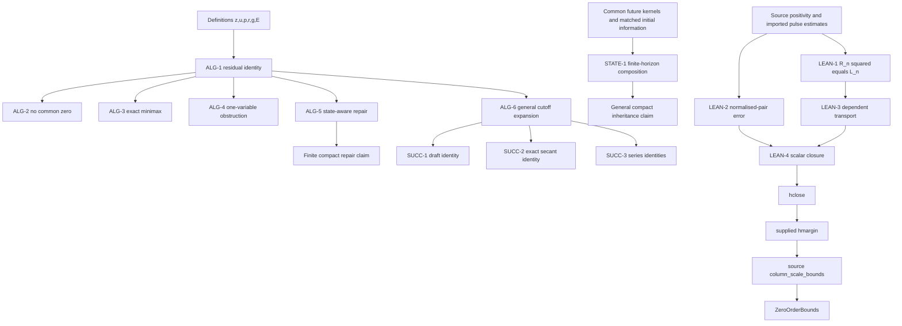

# Proof skeleton and obligation ledger

## Audit identity and scope

- Audit: one bounded pre-submission mathematical proof review.
- Reviewer: fresh Codex reviewer for this task; no earlier audit, project state, status summary, or research memory was read.
- Independence: `same-family`.
- Acceptance: `provisional` pending any desired cross-family semantic overlay.
- Source policy: manuscript claims are judged at their stated scope. The retained Lean source is treated source-relatively; imported modules and the full Navier–Stokes construction are not silently promoted into claims of this manuscript.
- Mutation boundary: no manuscript, source, experiment, publication object, or project state was changed.

Path aliases used below:

- `M`: `/home/amd/下载/MAOFIELD_NATURE_RESTORED_V8_R2_20260923/SUBMISSION/manuscript.md`
- `S`: `/home/amd/下载/MAOFIELD_NATURE_RESTORED_V8_R2_20260923/SUBMISSION/supplementary_information.md`
- `X`: `/home/amd/下载/MAOFIELD_NATURE_PRESUBMISSION_V8_20260922/REPRODUCIBILITY/math/exact_checks.py`
- `HX`: `/home/amd/下载/MAOFIELD_NATURE_PRESUBMISSION_V8_20260922/REPRODUCIBILITY/experiment/math_checks.py`
- `P`: `/home/amd/下载/MAOFIELD_NATURE_PRESUBMISSION_V8_20260922/INTERNAL/RAW_HCLOSE/10_CURRENT_RUN/history/workspace/NavierStokes/PrimaryCovarianceBounds.lean`
- `N`: `/home/amd/下载/MAOFIELD_NATURE_PRESUBMISSION_V8_20260922/INTERNAL/RAW_HCLOSE/10_CURRENT_RUN/history/public/Checkpoint/NodeGoal.lean`
- `I`: `/home/amd/下载/MAOFIELD_NATURE_PRESUBMISSION_V8_20260922/REPRODUCIBILITY/successor/inputs`

## Typed symbol table

| Symbol | Type/domain | Definition and dependence | Scope note |
|---|---|---|---|
| `z` | real scalar | actual amplitude relative to the fixed base | finite coefficient witness only |
| `u` | real scalar | `u = z - 1` | outer rectangle `[-1/4,1/4]` for the repair |
| `p` | real scalar | target squared amplitude | in the two-state witness, `p_± = z_±² + r` |
| `r` | real scalar | residual readout `p-z²` | minimax: `0 < r <= 1/4`; repair: `|r| <= 1/2` |
| `g` | real scalar | applied increment | minimax optimises over every `g in R` |
| `E` | real scalar | complete residual `(z+g)²-p` | distinct from Lean coefficient `E`/paper `e` |
| `v` | positive real scalar | separation of states `z_±=1±v` | `0 < v <= 1/8` |
| `F(g)` | non-negative real | `max(|E_+(g)|,|E_-(g)|)` | deterministic readout-only policy |
| `z_±` | real | `1±v` | both positive on the stated domain |
| `p_±` | positive real | `z_±²+r` | targets deliberately differ |
| `Phi` | smooth real function on `R²` | product cutoff, one on the inner rectangle and zero outside the outer rectangle | exactness is claimed only where `Phi=1` |
| `w` | positive real | `sqrt(z²+r)` | outer radicand is at least `1/16` |
| `B_*` | real analytic local function | `-1/[2z(w+z)²]` | defined on an open neighbourhood of the outer rectangle |
| `C_*` | real analytic local function | `-1/(2z)` | same local domain |
| `a,b` | fixed real expansion coefficients | `u=a tau+...`, `r=b tau²+...` or exact `u=a tau,r=b tau³` | no uniformity in `a,b` is presently declared |
| `tau` | real asymptotic parameter | tends to zero | direction and constant dependence should be stated explicitly (issue PA-02) |
| `x` | full causal state | abstract state in the continuation proposition | requires a measurable/state-space specification for a formal stochastic theorem |
| `C(x)` | compact continuation state | statistic used by future kernels | not the coefficient function `C(r,u)` |
| `F_regime` | declared future regime | duties, tools, permissions, resources, inputs and policies | the matching of exogenous inputs/history is under-specified (PA-01) |
| `R_n` | positive real | Lean `slotRadius r0 h n` | `R_n²=L_n` by `slotRadius_sq` |
| `L_n` | positive real | Lean `ChartScales.slotLength r0 h n` | source hypothesis representation |
| `Hbar(P)` | `2 x 2` real matrix | Lean `normalizedPair P` | local integral matrix |
| `H0(xi),T0(xi)` | `2 x 2` matrix and length-2 vector | reference matrix and target | continuous over compact `K` in the outer theorem |
| `e,d` | non-negative reals | Lean coefficients `E,D` | paper uses lowercase to avoid collision with residual `E` |
| `c` | real | `concentrationConstant a A b B` | no sign assumption is needed |
| `Q` | non-negative real | `e+d|c|` | may equal zero |
| `rho,delta,M` | reals | uniform tolerance, positive cone margin, entry bound | selected before `n,p,P,zeta` |
| `zeta` | non-negative real | target multiplier | zero is admitted; strict positivity is not claimed there |
| `s_n` | positive real | `sqrt(ChartScales.S n)` | column normalisation scale |
| `c_j` | positive reals | column mass factors | distinct from concentration constant `c` |

## Canonical quantified statements and verdicts

### ALG-1: exact residual decomposition

For every `z,p,g in R`, if `r=p-z²` and `u=z-1`, then

`(z+g)²-p = (2g+g²-r)+2ug`.

- Evidence: `M:L39-L45`; `S:L33-L37`; deterministic check `X:L18`.
- Verdict: **PROVED** by direct expansion.

### ALG-2: no common exact readout-only correction

For every `r in (0,1/4]` and `v in (0,1/8]`, set `z_±=1±v` and `p_±=z_±²+r`. There is no `g in R` for which both residuals

`E_±=g²+2(1±v)g-r`

vanish.

- Evidence: `M:L47-L53`; `S:L41-L49`; `X:L19-L23`.
- Verdict: **PROVED**. Subtraction yields `4vg=0`; positivity of `v` yields `g=0`; positivity of `r` gives the contradiction.

### ALG-3: exact two-state minimax value

For every `r in (0,1/4]` and `v in (0,1/8]`,

`min_{g in R} max(|E_+(g)|,|E_-(g)|) = 2v(sqrt(1+r)-1) > 0`.

- The manuscript writes `inf`; the proof shows it is attained at `g0=sqrt(1+r)-1`.
- Evidence: `M:L53-L60`; `S:L51-L73`.
- Verdict: **PROVED**. All three real branches `g>=0`, `-2<=g<=0`, and `g<=-2` are covered.

### ALG-4: obstruction for the one-variable interface

Let `B` be fixed and smooth near zero and let the cutoff equal one near zero. If, as `tau -> 0`,

`u=a tau+O(tau²)` and `r=b tau²+O(tau³)`,

then for `g=r/2+r²B(r)`,

`E=ab tau³+O(tau⁴)`.

- Evidence: `S:L75-L85`.
- Verdict: **PROVED FOR FIXED DATA**, with the missing explicit asymptotic/uniformity declaration recorded as PA-02.

### ALG-5: state-aware exact repair

For every `(r,u)` in the outer rectangle `[-1/2,1/2] x [-1/4,1/4]`, let `z=1+u`, `w=sqrt(z²+r)`,

`C_*=-1/(2z)`, `B_*=-1/[2z(w+z)²]`.

Then `z>=3/4`, `z²+r>=1/16`, and both core functions are analytic on an open neighbourhood of the rectangle. If `Phi=1` (in particular on `|r|<=1/4, |u|<=1/8`),

`g=r/2+r²B_*+urC_* = w-z`, hence `E=0`.

With a global smooth cutoff supported in the outer rectangle, the product patches smoothly to `g=r/2` off the support.

- Evidence: `M:L62-L75`; `S:L87-L101`; `X:L26-L31`.
- Verdict: **PROVED**. The worst radicand corner is exactly `1/16`; `r=0` and `u=0` are non-singular.

### ALG-6: general cutoff-family residual and local coefficient

For fixed smooth `B,C`, `h=r²B+urC`, and `g=r/2+Phi h`,

`E=ur+r²/4+Phi(2+2u+r)h+Phi²h²`.

Under the fixed-data scaling in ALG-4 and `Phi=1` near zero,

`E=ab[1+2C(0,0)]tau³+O(tau⁴)`.

- Evidence: `S:L103-L111`; `X:L30-L31`.
- Verdict: **PROVED FOR FIXED DATA**, subject only to PA-02's explicit limit/uniformity wording.

### REP-1: compatible basis rescaling

The displayed algebra proves `r'=d'/y'=d/y` and `H' y'=H y` under non-zero componentwise `lambda`, with positivity/smooth multiplier conditions stated in prose.

- Evidence: `S:L119-L123`; exact target identity checked at `X:L35-L37`.
- Verdict: **PARTIALLY FORMALISED**. The “corresponding amplitude transformation” and physical action are not defined in the statement (PA-03); the claim is ancillary and has no downstream theorem edge.

### STATE-1: finite-horizon sufficient-state composition

Intended statement: for every finite horizon `H`, two systems with equal initial sufficient records and common matched input, policy, observation/cost and successor-state kernels have the same joint finite-horizon law.

- Evidence: `M:L79-L83`; `S:L125-L139`.
- Verdict: **UNDERSTATED AS WRITTEN**. Equality of initial `C` alone does not ensure the same initial visible history or exogenous future-input law. A literal counterexample exists; see PA-01.

### LEAN-1: scale identity

For every `r0>0`, real `h`, and natural `n`, `slotRadius(r0,h,n)²=slotLength(r0,h,n)`.

- Evidence: `P:L163-L175`; declaration repeated at `S:L324-L327`.
- Verdict: **SOURCE-PROVED / SOUND MODULO IMPORTS**. The displayed proof is `Real.sq_sqrt` using source positivity.

### LEAN-2: imported normalised-pair error bound

For the exact parameters and hypotheses in `P:L321-L329`, the source theorem gives

`|normalizedPair(P)_{ij}-H0_{ij}| <= [e+d c]/R`.

- Evidence/proof body: `P:L321-L333`; declaration repeated at `S:L334-L344`.
- Verdict: **SOURCE-PROVED / SOUND MODULO IMPORTS**. The proof delegates to the imported `averagedDirection_error_order`; the manuscript expressly treats those source estimates as premises.

### LEAN-3: dependent premise transport

Given `R_n²=L_n`, a hypothesis quantified over `v in [0,L_n]` with every denominator and centre written using `L_n` can be transformed into the predicate required by LEAN-2 with every occurrence written using `R_n²`.

- Evidence: `S:L168-L177`; successful body `S:L417-L423`; failed final control body demonstrates the missing conclusion transport at `S:L467-L474`.
- Verdict: **PROVED SEMANTICALLY**. Membership transport alone is insufficient because the conclusion predicate depends on the scale expression.

### LEAN-4: scalar closure

For `d>=0`, `R_n>0`, `Q=e+d|c|`, and supplied `Q/R_n<=rho`,

`(e+d c)/R_n <= Q/R_n <= rho`.

- Evidence: `M:L105-L114`; `S:L179-L189`; successful body `S:L423-L435`; positivity source `P:L170-L175`.
- Verdict: **PROVED**, including `Q=0` and negative `c`.

### LEAN-5: construction and consumption of `hclose`

Under the full outer theorem quantifiers, LEAN-1 through LEAN-4 construct

`hclose : forall i j, |normalizedPair(P) i j-H0(p) i j| <= rho`,

which is passed to the supplied `hmargin`; fixed column scaling then constructs `ZeroOrderBounds`.

- Quantifier source: `N:L10-L29`; shared template: `S:L258-L309`.
- Immediate consumer: `S:L191-L198` and `S:L297-L307`.
- Column theorem: `P:L99-L140`.
- Verdict: **SEMANTICALLY VALID / SOURCE-RELATIVE / NO FRESH KERNEL RUN**. No `sorry`, `admit`, or local axiom declaration occurs in the two supplied Lean files. Lean/Lake were unavailable in the review environment, so the manuscript's deliberately narrower “retained compilation acceptance” wording is preserved.

### SUCC-1: first revision, exact draft residual

With `s=sqrt(1+r)`, retained `B0=-1/[2(1+s)²]`, and `C1=-1/[s(1+s)]`,

`g=s-1-u(s-1)/s` and `E=-u²r/(1+r)`.

- Evidence: `M:L89-L91`; `S:L598-L610`; program text `I/A/stages/P00_s0_W1/result_00.json:L1-L5`.
- Verdict: **PROVED** by exact simplification.

### SUCC-2: first revision, exact final secant rule

With `w=sqrt((1+u)²+r)` and the recorded `C2` in `S:L612-L615`,

`urC2=w-s-u`, `g=w-(1+u)`, and `E=0` on the core. The formula has no division by `u` or `r` and extends over `u=0` and `r=0`.

- Evidence: `S:L612-L623`; recorded program `I/A/stages/P00_s0_W1/artifact.json:L3-L10`; inherited unchanged by the next duty at `I/A/stages/P00_s0_W2/parent_snapshot.json:L2-L18` and `artifact.json:L3-L10`.
- Verdict: **PROVED**; the saved `~1.8e-71` residual is finite-precision roundoff, not reclassified as symbolic zero.

### SUCC-3: second revision series

For `B=-1/8`,

`C0=-1/2`, `C1=-1/2+u/2`, `C2=-1/2+u/2-u²/2`,

and exact `u=a tau`, `r=b tau³`, the three expansions in `S:L631-L637` are correct:

- `E_C0=-a²b tau^5+O(tau^7)`;
- `E_C1= a³b tau^6+O(tau^7)`;
- `E_C2=-(a^4b+3ab²/4)tau^7+O(tau^8)`.

- Program evidence: `I/B/stages/P07_W0/artifact.json:L3-L10`, `P07_W1/artifact.json:L3-L10`, `P07_s0_W2/artifact.json:L3-L10`.
- Verdict: **PROVED FOR FIXED `a,b`**. The source response's positive-sign prose error for the `ur²` term is real, and the manuscript correctly reports rather than adopts it (`S:L639-L641`).

## Dependency DAG

No dependency cycle was found. The conceptual correspondence between the finite witness and `hclose` is not used as a proof edge; the manuscript explicitly keeps them separate (`S:L208-L210`). Empirical successor records instantiate the residual algebra but do not prove the minimax theorem or the full PDE construction.

## Hypothesis-discharge ledger

| Application | Required hypothesis | Discharge/evidence | Result |
|---|---|---|---|
| max identity in ALG-3 | real `A,B` | all residual terms are real | discharged |
| positive-branch derivative | `g>=0`, `0<v<=1/8` | `S:L57-L64` | discharged |
| comparison of negative middle branch | `r>2vg0` | `r=g0(g0+2)`, `g0>0`, `2v<=1/4<2` at `S:L65` | discharged |
| negative outer reflection | `h=-g-2>=0` | `g<=-2`; exact equality at `S:L65-L67` | discharged |
| state-aware square root | `z²+r>0` | minimum `9/16-1/2=1/16` (`S:L93`) | discharged |
| `C_*` denominator | `z!=0` | `z>=3/4` | discharged |
| `B_*` denominator | `z!=0`, `w+z!=0` | `w>=1/4`, `z>=3/4`, hence `w+z>=1` | discharged |
| smooth global patch | cutoff smooth, supported where core is defined on a neighbourhood | stated at `S:L89-L97`; standard bump-function existence | discharged, standard fact |
| ALG-4/6 Taylor use | fixed smooth `B,C`, cutoff one near zero | `S:L77-L89`, `S:L103-L109` | mathematically discharged; uniformity wording open (PA-02) |
| first step of STATE-1 induction | equal action laws | requires equal initial visible history or a policy that factors through `C`; absent literally | **unverified (PA-01)** |
| exogenous inputs in STATE-1 | matched future input value/kernel | not included in conclusion hypotheses | **unverified (PA-01)** |
| stochastic induction | common measurable joint kernels | described informally but spaces/kernels not declared | **unverified (PA-01)** |
| `slotRadius_sq` | `r0>0` | `P:L166-L175`; outer theorem `N:L17-L18` | discharged |
| `normalizedPair_entry_error` | `hP`, `hE`, `hD`, transported `hratio` | outer template `S:L264-L272`, transport `S:L417-L423` | discharged modulo imported source theorem |
| numerator comparison | `d>=0`, `c<=|c|` | `hD`; `le_abs_self`; `S:L426-L433` | discharged |
| division comparison | `R_n>0` | `P:L170-L175`; `S:L429-L433` | discharged |
| final `Q/R_n<=rho` | chosen scale threshold | `S:L284-L296` | discharged |
| `Q=0` edge | no division by `Q` | chain only divides by positive `R_n`; `M:L114`, `S:L189` | discharged |
| column determinant/entry/weight bounds | positive `R,lo,hi,delta`, non-negative `zeta`, column scale interval | theorem statement and proof `P:L99-L140` | discharged modulo imports |
| P00 exact root | outer radicands positive | `S:L621`; same outer rectangle as ALG-5 | discharged |
| P00 `u=0` or `r=0` | no `1/u` or `1/r` | recorded formula `S:L614-L621` | discharged |

## Micro-claim inventory

| ID | Sequent-style obligation | Rule/justification | Status |
|---|---|---|---|
| MC-01 | `r=p-z², u=z-1 |- E=(2g+g²-r)+2ug` | ring expansion | proved |
| MC-02 | `A,B real |- max(|A+B|,|A-B|)=|A|+|B|` | two sign cases / triangle identity | proved |
| MC-03 | `r>0 |- g0=sqrt(1+r)-1>0` | monotonicity of square root | proved |
| MC-04 | `0<g<g0, v<=1/8 |- F'(g)<0` | derivative and bounds | proved |
| MC-05 | `g>g0 |- F'(g)>0` | derivative | proved |
| MC-06 | `-2<=g<=0 |- F(g)>=r>2vg0` | sign of `g²+2g`, parameter bound | proved |
| MC-07 | `g<=-2, h=-g-2 |- F(g)=F(h)+4v` | substitution | proved |
| MC-08 | all three branches `|- min F=2vg0` | exhaustive partition of `R` | proved |
| MC-09 | outer rectangle `|- z>=3/4, z²+r>=1/16` | endpoint minimisation | proved |
| MC-10 | positive radicand `|- w-z=r/(w+z)` | difference of squares | proved |
| MC-11 | MC-09, MC-10 `|- g_*=w-z` | exact rationalisation | proved |
| MC-12 | `g_*=w-z |- E=0` | substitution `z+g=w` | proved |
| MC-13 | local analytic core + smooth compact cutoff `|- global smooth patched operation` | standard smooth extension by zero of cutoff product | proved |
| MC-14 | general `B,C` `|-` residual polynomial at `S:L105` | ring expansion | proved |
| MC-15 | fixed-data Taylor hypotheses `|-` ALG-4/6 leading terms | local smooth Taylor/order arithmetic | proved; wording PA-02 |
| MC-16 | equal `C0` `|-` equal first-step action laws | policy kernel | **missing matched initial history in STATE-1** |
| MC-17 | equal state/action `|-` equal observation/cost laws | common joint kernel | **under-specified in STATE-1** |
| MC-18 | equal state/action/observation `|-` equal successor-state laws | common update kernel | **under-specified measurable kernel** |
| MC-19 | finite-horizon step equality `|-` next-step equality | induction | valid after MC-16–18 are repaired |
| MC-20 | `R_n²=L_n`, `v in [0,R_n²] |- v in [0,L_n]` | equality transport | proved |
| MC-21 | source ratio conclusion in `L_n` `|-` conclusion in `R_n²` | dependent rewrite of the entire predicate | proved |
| MC-22 | LEAN-2 hypotheses `|- d_ij<=(e+dc)/R_n` | imported source theorem application | sound modulo imports |
| MC-23 | `d>=0, c<=|c| |- e+dc<=e+d|c|` | order-preserving multiplication/addition | proved |
| MC-24 | MC-23, `R_n>0` `|-` quotient inequality | division by positive scalar | proved |
| MC-25 | hclose `|- hmargin` outputs | direct supplied function application | source-level use observed |
| MC-26 | column scale hypotheses `|- ZeroOrderBounds` | source theorem `column_scale_bounds` | source-proved modulo imports |
| MC-27 | retained `B0,C1` `|- E=-u²r/(1+r)` | exact simplification | proved |
| MC-28 | retained secant `C2` `|- urC2=w-s-u` | two rationalisations | proved |
| MC-29 | MC-28 `|- g=w-(1+u), E=0` | substitution | proved |
| MC-30 | three P07 programs `|-` displayed `tau` expansions | exact polynomial expansion | proved; wording PA-02 |
| MC-31 | displayed rescaling `|- r'=r, H'y'=Hy` | componentwise cancellation | proved |
| MC-32 | “represented physical action unchanged” | needs explicit amplitude/action definition | **unclear (PA-03)** |

## Limit-order and uniformity map

| Claim | Limit/order | Fixed quantities | Uniformity actually established | Audit result |
|---|---|---|---|---|
| ALG-3 minimax | no limit; exact for every stated `r,v` | none | uniform formula on the stated rectangle, but lower bound approaches zero at excluded boundaries | complete |
| ALG-4 | `tau -> 0` | `a,b`, chosen smooth `B`, cutoff | pointwise/fixed-data; no uniform class of `B` or unbounded `a,b` established | text should say this (PA-02) |
| ALG-6 | `tau -> 0` | `a,b`, chosen smooth `B,C`, cutoff | pointwise/fixed-data | text should say this (PA-02) |
| SUCC-3 | `tau -> 0` with exact `u=a tau,r=b tau³` | fixed `a,b` and one of three polynomials | coefficients exact; `O` constants polynomially depend on fixed `a,b` | text should say this (PA-02) |
| alternative `r=b tau²` | `tau -> 0` | fixed `a,b` | “generally” correctly excludes coefficient cancellations | complete after PA-02 wording |
| STATE-1 | every fixed finite horizon | common kernels/regime | no infinite-horizon or uniform-in-duty claim | finite horizon only; hypotheses PA-01 |
| outer Lean theorem | `n>=N` | constants selected from compact input data before `n,p,P,zeta` | uniform in all later quantified `n,p,P,zeta` under the exact hypotheses | quantifier order verified at `N:L19-L29` |

No expectation/integral/derivative/limit interchange is performed in the manuscript proofs. The imported source lemma internally handles the integral estimate and is used as a premise; this audit does not invent a new domination or Fubini argument for it. No probability-mode upgrade (almost sure, in probability, expectation, or high probability) occurs. STATE-1 is a finite-dimensional distribution claim once its kernels are made explicit.

## Degenerate and adversarial cases

| Attempt | Outcome |
|---|---|
| `r=0` in ALG-3 | lower bound becomes zero and `g=0` closes both states; this is outside the strict `r>0` hypothesis and confirms its necessity |
| `v=0` in ALG-3 | states coincide and the separation vanishes; outside the strict `v>0` hypothesis |
| `g in [-2,0]` or `g<=-2` | cannot beat `g0`; the piecewise proof covers both branches |
| outer corner `(r,u)=(-1/2,-1/4)` | radicand is exactly `1/16`, `w=1/4`, `z=3/4`, `w+z=1`; no denominator failure |
| `u=0` or `r=0` in the exact secant program | formula remains defined and the identity holds without cancellation by division |
| negative concentration constant `c` | scalar closure still holds because `c<=|c|` and `d>=0` |
| `Q=0` | no division by `Q`; closure remains valid |
| `zeta=0` | ZeroOrderBounds lower weight is zero, exactly as claimed; strict-cone positivity is not inferred from this edge case |
| matched `C` but future inputs `0` versus `1`, observation equal to input | literal counterexample to STATE-1 without a matched input mechanism (PA-01) |
| matched `C` but initial visible histories end in `0` versus `1`, policy chooses last bit | literal counterexample to STATE-1 without matched initial history or policy factorisation (PA-01) |
| special `a=0`, `b=0`, or coefficient cancellation in SUCC-3 | leading term may vanish; the manuscript's “generally”/vanishing-coefficient boundary is correct |
| remove the implied amplitude transformation in REP-1 | basis rescaling can change represented action; this motivates making the transformation explicit (PA-03) |

