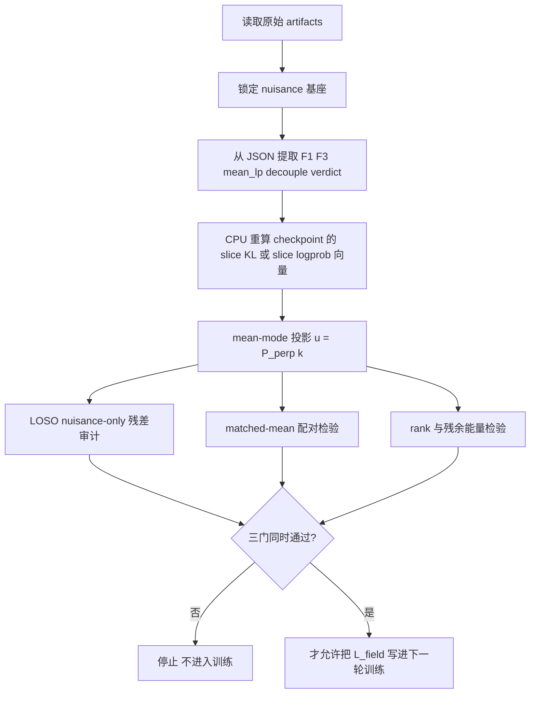

# Wangziqi0/MaoField 的真实代码数学与玻璃箱审判

> **Canonical classification (node36)**: GPT-authored claim-source /
> proposed-method audit, not primary evidence. The `filecite` references below
> are locator traces from the GPT research session; promote no empirical claim
> without direct canonical code/config/JSON/JSONL/log verification. The
> mean-null vector KL field, LOSO/rank gates, and script sketch are proposed
> next-step audits, not implemented training results. F3 remains a weak
> post-hoc diagnostic exception, worth pursuing but not a positive finding.
> This report makes no first-DM, first-reflexive-AI, or paradigm-shift claim.

## 执行摘要

就仓库内现存、可直接核验的代码与结果而言，MaoField 当前真正进入优化器的对象非常有限：训练总损失始终是语言模型损失 \(L_{\mathrm{LM}}\) 加上一个**稀疏触发**的 contradiction auxiliary term；该 auxiliary term 的核心自变量不是向量场、不是 hidden-state 场、不是 slice tensor，而是单个标量
\[
D_n=\mathrm{KL}(q_{\mathrm{EMA}}\|p_{\mathrm{current}})
\]
及其历史缓存与标量 EMA。`cat_trainer.py` 规定只有每 `kl_update_every` 步才把 auxiliary term 加到总损失里，其余大多数步只有 \(L_{\mathrm{LM}}\)。`contradiction_loss.py` 中的 Volterra 累加量与 `GradNormMonitor` 明确只是 metric/logging；`highorder_ppl_run.py` 中的 F1/F3 完全是 CPU 上的 post-hoc evaluation，而不是训练约束。fileciteturn10file0L94-L145 fileciteturn8file0L140-L177 fileciteturn9file0L14-L45 fileciteturn9file0L56-L72 fileciteturn24file0L5-L13

历史主链条真正跑过的 chain-actual 形式比仓库晚近叙述更弱。`phase1_robust_chain.sh` 把运行硬锁到 `configs/cat_arm_b.yaml`；而该 YAML 的 `cat` 段给出 \(\lambda_1=\lambda_2=\lambda_3=1\)、\(\beta_{\theta}=0.999\)、\(\beta_D=0.9\)，却没有给出 `T_2_form`、`kl_history_K` 与 `m_eff`；`train_one_generation.py` 的旧 `CATConfig` 正好把它们默认成 `relu_dpp`、\(K=1\)、\(m_{\mathrm{eff}}=1\)。因此，历史主链条从第二个 KL 更新起实际运行的不是“三项高阶 contradiction loss”，而是两项标量平滑器
\[
L_{\mathrm{cont},n}^{\mathrm{chain}}=(D_n-D_{n-1})^2+(D_n-\bar D_n)^2,\qquad n\ge 2.
\]
原因是 \(K=1\) 使 `D_history` 永远不可能长度 \(\ge 2\)，故 \(D_n-2D_{n-1}+D_{n-2}\equiv 0\)，第三项恒为零。fileciteturn32file0L13-L21 fileciteturn13file0L180-L190 fileciteturn14file0L1-L6 fileciteturn11file0L38-L57 fileciteturn8file0L204-L224 fileciteturn9file0L8-L12 fileciteturn9file0L27-L34

按严格证据标准，当前玻璃箱并未被打破。可证明的层面上，历史两项 loss 对任何进入标量平台期的状态都会衰减到零，因此它不是 anti-collapse barrier，只是 transient smoother。经验层面上，exp019 的 \(\alpha=1\) confirmatory 三个 locked endpoint 全部为 FALSE；同一批材料里，faithful decouple 重算为 0/5；恢复相几何被直接判成与 PPL 同步的投影而非独立信号；exp020 当前最强收口是 C(meta-pattern)：已测的“独立于 PPL 的候选 collapse 测度”不是塌回 PPL/logit 兄弟量，就是掉进 seed-noise floor，或者被 decode 选项翻号。F3 最多只是“弱例外，值得追”，不是 positive finding；而 LOSO 在主结果 JSON 中并未落盘为 primary artifact。fileciteturn15file0L9-L40 fileciteturn17file0L9-L16 fileciteturn18file0L121-L206 fileciteturn35file0L7-L13 fileciteturn20file0L9-L13 fileciteturn19file0L18-L35 fileciteturn21file0L3-L7 fileciteturn23file0L7-L43

因此，真正最小、同时可证伪的推进不是再包装现有标量 smoother，而是把对象从标量 \(D_n\) 升到**固定切片上的向量 KL 场**，并先做零 GPU 的 kill test。最小新对象可以定义为切片 KL 向量 \(k_n\in\mathbb R^J\) 及其 mean-mode null-space projection
\[
u_n=P_\perp k_n,\qquad P_\perp=I-\mathbf 1 w^\top,\quad w^\top\mathbf 1=1,
\]
再把训练辅助项改为
\[
L_{\mathrm{field},n}
=
\lambda_s\|u_n\|_2^2
+
\lambda_v\|u_n-u_{n-1}\|_2^2
+
\lambda_m\|u_n-\bar u_n\|_2^2.
\]
这样，纯均值模式必被投影掉；但任何**稳定的结构性切片偏差**都不会像当前历史两项 loss 那样自动隐身。只有当它先通过 LOSO + matched-mean + rank/residual 的零 GPU 审计后，才值得进入下一轮训练。下面分别展开。fileciteturn8file0L204-L224 fileciteturn9file0L27-L45 fileciteturn19file0L31-L35

## 证据边界与仓库内证据分层

仓库自己已经明确区分了“导航/交接”和“证据”。`STATE.md` 说 GPT 报告是 **claim source, not evidence**；`MD_CATALOG.md` 重申 GPT deep-research 目录是 claim source，RAG rebuild 目录只做 digest；`maofield_data_digest_20260622.md` 更进一步写明：原始 JSON/JSONL/log 不直接嵌入 RAG，promotion claim 前必须 direct verification。换言之，本报告若要严格，只能把 `STATE.md`、`MD_CATALOG.md`、`GPT55_PRO_RESEARCH_INDEX_20260622.md`、两份 deep-research 报告、以及 `maofield_data_digest_20260622.md` 当作**定位器、边界条件、guardrail**；真正承重的是代码、配置、launcher、JSON/JSONL、verdict 和 checkpoint。fileciteturn1file0L24-L29 fileciteturn3file0L8-L10 fileciteturn3file0L29-L31 fileciteturn29file0L18-L23

| 层级 | 典型文件 | 在本报告中的合法地位 |
|---|---|---|
| claim-source / handoff | `STATE.md`、`MD_CATALOG.md`、`GPT55_PRO_RESEARCH_INDEX_20260622.md`、`docs/infra/gpt_deep_research/*.md` | 只能给出当前绑定、读档顺序、不可复活表述、问题地图；不能单独当数学证据。fileciteturn1file0L24-L29 fileciteturn3file0L8-L10 fileciteturn4file0L17-L25 |
| RAG index | `docs/infra/rag_rebuild_20260622/maofield_data_digest_20260622.md` | 只能告诉你哪些 JSON/JSONL/log/checkpoint 存在，不能代替打开原文件。fileciteturn29file0L18-L23 |
| 真正原始证据 | `src/*.py`、`configs/*.yaml`、`scripts/*.sh`、`locked_verdict.json`、`decouple_n5_result.json`、`highorder_result.json` | 可以直接支撑“训练里实际做了什么”“结果文件实际写了什么”。fileciteturn10file0L94-L145 fileciteturn13file0L180-L190 fileciteturn32file0L13-L21 fileciteturn15file0L3-L40 fileciteturn18file0L121-L206 fileciteturn23file0L24-L43 |
| 人类可读裁定包装 | `exp019_VERDICT.md`、`DECOUPLE_VERDICT_20260617.md`、`MATH_LINE_VERDICT_20260619.md`、`C_metapattern_evidence_base_20260618.md` | 可以作为 verdict wrapper 与 synthesis 使用，但应回查配套 JSON/脚本，防止把 narrative 当数据。fileciteturn16file0L11-L25 fileciteturn17file0L17-L30 fileciteturn19file0L18-L35 fileciteturn20file0L15-L29 |

还要指出一个**handoff 叙述与当前代码状态不完全一致**的细节。旧 handoff 常把 “`kl_history_K=1` 源自 YAML schema 缺字段与 `getattr(...,1)` 兜底” 当作解释链条的一部分；但当前仓库里的 `config.py` 已经把 `T_2_form`、`kl_history_K`、`m_eff` 明确放进 `CATYamlConfig` 默认字段里，所以“当前 schema 缺字段”这句话对**今天的代码树**已经不真。真正仍然成立的事实只有两条：其一，历史链条 launcher 的确硬锁到 `configs/cat_arm_b.yaml`；其二，历史运行路径中 `train_one_generation.py` 的旧 `CATConfig` 默认值就是 `relu_dpp / K=1 / m_eff=1.0`，再配上旧 YAML 的 \(\lambda_i=1\)，确实会把主链条推成两项式。这正是数学教授视角下必须区分的：**hand-off 解释可能过时，但被它解释的历史运行事实仍可为真。** fileciteturn30file0L104-L122 fileciteturn11file0L38-L57 fileciteturn32file0L13-L21 fileciteturn13file0L180-L190

## 当前真实进入优化器的数学对象

### 代码直接给出的训练对象

`cat_trainer.py` 的总损失写法是
\[
L_{\mathrm{total},t}
=
L_{\mathrm{LM},t}
+
\alpha\,L_{\mathrm{cont},n(t)}\mathbf 1\{t>0,\ t\bmod k=0\},
\qquad k=\texttt{kl\_update\_every}.
\]
所以需要先把两个事实分开：第一，**\(L_{\mathrm{LM}}\) 始终在优化器里**；第二，contradiction loss 不是常驻项，只在每 \(k\) 步触发一次。`compute_kl` 再把 EMA 模型与当前模型在一个 val batch 上的 tokenwise KL 压到单个标量
\[
D_n
=
\frac{1}{M_n}
\sum_{b,t}m_{b,t}
\sum_v q_{n,b,t}(v)\bigl(\log q_{n,b,t}(v)-\log p_{n,b,t}(v)\bigr),
\qquad M_n=\sum_{b,t}m_{b,t}.
\]
其中 \(q\) 来自 EMA 模型且 `detach`，梯度只穿过当前模型的 `log_p`。这说明**真正参与回传的是标量 KL 及其简单函数**，不是 slice-level tensor。fileciteturn10file0L101-L145 fileciteturn8file0L153-L177

代码里同时维护两种 EMA。参数 EMA 是
\[
\bar\theta_{t+1}
=
\beta_\theta \bar\theta_t+(1-\beta_\theta)\theta_t,
\]
它用于构造 \(q_{\mathrm{EMA}}\)；KL 序列 EMA 是
\[
\bar D_{n+1}
=
\beta_D \bar D_n+(1-\beta_D)D_n,
\]
它只是在 `compute_loss` 内无梯度更新。无论当前默认值是 \((\beta_\theta,\beta_D)=(0.999849,0.8090)\) 还是历史链条值 \((0.999,0.9)\)，这两者在数学上都只是**平滑状态变量**，而不是 independently optimized target。fileciteturn8file0L122-L139 fileciteturn9file0L27-L34 fileciteturn33file0L27-L45

### 历史 chain-actual 的严格重建

历史主链条的关键不是当前 `contradiction_loss.py` 里那些晚近默认值，而是**实际 launch 了什么**。这一点由 `phase1_robust_chain.sh` 与 `cat_arm_b.yaml` 共同确定：它们锁定的是旧框架配置。于是实际运行参数是
\[
\lambda_1=\lambda_2=\lambda_3=1,\qquad
\beta_\theta=0.999,\qquad
\beta_D=0.9,\qquad
T_2=\mathrm{relu\_dpp},\qquad
K=1.
\]
这不是 repo prose，而是 launcher + YAML + runtime config 的交集。fileciteturn32file0L13-L21 fileciteturn13file0L180-L190 fileciteturn14file0L1-L6

这里可以给出一个完全代码级的引理。

**引理**
若 `kl_history_K=1`，则每次 `compute_loss` 调用前 `D_history` 的长度都不可能超过 1，因此分支 `len(D_history)>=2` 永不触发，故 \(D''_n\equiv 0\)。若此时 `T_2_form="relu_dpp"`，则 \(T_{2,n}=\mathrm{ReLU}(D''_n)\equiv 0\)。

**证明**
`compute_loss` 末尾先 `append(D_n.detach())`，再在长度大于 `kl_history_K` 时 `pop(0)`；当 `kl_history_K=1` 时，循环不变式就是 `len(D_history)<=1`。因此下一个 KL 更新开始前，只可能走 `len==0` 或 `len==1` 分支。代码在这两个分支中都把 `D_doubleprime` 置为零；`relu_dpp` 取 ReLU 后仍为零。证毕。fileciteturn8file0L206-L218 fileciteturn9file0L27-L34

因此，首个 KL 更新时 auxiliary term 实际为 0；从第二个 KL 更新起，历史链条真实进入优化器的是
\[
L_{\mathrm{cont},n}^{\mathrm{chain}}
=
(D_n-D_{n-1})^2
+
(D_n-\bar D_n)^2,
\qquad n\ge 2.
\]
这就是用户要求的“历史 chain-actual 两项形式”：一项是相邻 KL 差分平方，另一项是当前 KL 对其标量 EMA 的偏离平方。仓库之后再怎么谈 Volterra、高阶、反身性，如果没有对应 launch artifact 改写这一事实，就不能回头重释 5/10–5/12 的主链条。fileciteturn8file0L206-L224 fileciteturn9file0L8-L12 fileciteturn32file0L13-L21

### 真实对象与非真实对象对照表

| 对象 | 数学形式 | 位置 | 性质判定 | 证据 |
|---|---|---|---|---|
| 语言模型主损失 | \(L_{\mathrm{LM}}=\texttt{outputs.loss}\) | 每一步 | **真实 optimization objective** | fileciteturn10file0L106-L107 |
| 当前代码默认 contradiction loss | \(\lambda_1(\Delta D_n)^2+\lambda_2(D_n-\bar D_n)^2+\lambda_3 D_n^2/2\) | 仅 KL 更新步 | **真实 optimization objective，但仍是单标量 \(D_n\) 的函数** | fileciteturn8file0L179-L203 fileciteturn9file0L6-L12 fileciteturn33file0L27-L45 |
| 历史链条首个 KL 更新 | \(L_{\mathrm{cont},1}=0\) | 第一次 KL 更新 | **真实 objective，但当次为零** | fileciteturn8file0L216-L223 fileciteturn9file0L8-L12 |
| 历史 chain-actual 两项 | \((D_n-D_{n-1})^2+(D_n-\bar D_n)^2\) | 第 2 次及以后 KL 更新 | **真实 optimization objective；纯标量 smoother** | fileciteturn8file0L206-L224 fileciteturn9file0L8-L12 |
| 参数 EMA | \(\bar\theta_{t+1}=\beta_\theta\bar\theta_t+(1-\beta_\theta)\theta_t\) | 训练后钩子 | **辅助状态变量，不是独立目标** | fileciteturn10file0L147-L165 fileciteturn8file0L131-L139 |
| KL 标量 EMA | \(\bar D_{n+1}=\beta_D\bar D_n+(1-\beta_D)D_n\) | `compute_loss` 内 | **标量 smoother 状态** | fileciteturn8file0L220-L224 fileciteturn9file0L27-L34 |
| Volterra 累加 | `volterra_sum_K` | metrics dict | **metric-only，不进 loss** | fileciteturn9file0L14-L25 fileciteturn9file0L36-L45 |
| GradNormMonitor | \(g_n,\Delta g_n,g''_n,g_{\mathrm{ema}}\) | `training_step` 记录 | **dashboard / monitoring metric** | fileciteturn9file0L56-L72 fileciteturn10file0L147-L165 |
| F1_var / F1_tail / F3_slice_gap | 基于固定真 eval blocks 的 logprob 泛函 | `highorder_ppl_run.py` | **post-hoc metric-only** | fileciteturn24file0L5-L13 fileciteturn21file0L7-L17 |
| LOSO | 无 locked primary JSON 字段；在后续数学线中被要求接管 cubic gate | 当前主 artifact 之外 | **队列中的审计步骤，不是已落盘主证据** | fileciteturn23file0L24-L43 fileciteturn19file0L24-L35 |

## 为什么玻璃箱仍未被打破

### 代码层的结论

先给一个可证明命题。

**命题**
历史主链条的两项 loss 不是 anti-collapse barrier，而是 transient smoother。更精确地说，若从某个 KL 更新 \(N\) 开始
\[
D_n\equiv D^\star \qquad (n\ge N),
\]
则
\[
L_{\mathrm{cont},n}^{\mathrm{chain}}
=
(D_n-D_{n-1})^2+(D_n-\bar D_n)^2
\to 0.
\]

**证明**
第一项在 \(n\ge N+1\) 时立刻变为 0。第二项里，记 \(E_n=D^\star-\bar D_n\)。由 \(\bar D_{n+1}=\beta_D\bar D_n+(1-\beta_D)D^\star\) 得
\[
E_{n+1}=\beta_D E_n.
\]
故 \(E_n=\beta_D^{\,n-N}E_N\to 0\)，于是第二项也趋于 0。证毕。fileciteturn8file0L220-L223 fileciteturn9file0L27-L34

这个命题的含义非常直接：只要“坏状态”在标量 \(D_n\) 上进入平台期，当前历史 loss 就会把它学成**看不见**。它不会维持对坏平台的持续排斥。因此，哪怕把现有对象说成“反身性”“高阶结构”“内在矛盾”，代码层真相仍然只是**单标量平台的平滑器**。当前默认实现虽然多了 \(D_n^2/2\) 这一常驻项，但它依然只作用于单个标量 \(D_n\)；它没有把任何切片分量、方向分量、频率分层分量、或可识别的向量结构写进 update law。fileciteturn9file0L8-L12 fileciteturn33file0L34-L45

玻璃箱未破的第二个代码原因是：训练外指标并不反作用于参数更新。`volterra_sum_K` 只进入 `metrics` 字典；`GradNormMonitor` 在 `training_step` 之后记录，没有进入 `total_loss`；`highorder_ppl_run.py` 也只是对冻结 checkpoints 在 CPU 上做 evaluation。于是，今天的 MaoField 还停留在“scalar smoother + dashboard / post-hoc diagnostics”的阶段，而不是“训练中真正有独立多分量约束”的阶段。fileciteturn9file0L14-L25 fileciteturn9file0L56-L72 fileciteturn24file0L5-L13

### 实证层的结论

exp019 已经把最早的积极叙事清空。`locked_verdict.json` 给出 E1/E2/E3 三个 locked endpoint 的 mean diff 分别是 \(+0.12352\)、\(+0.85856\)、\(+0.06194\)，三区域全是 FALSE，且 gate 停在 E1。随后的 `exp019_VERDICT.md` 明写 C1/C2/C3 撤回、s42 判定为 idiosyncratic outlier。就仓库内部证据而言，**\(\alpha=1\) 阻尼器正向结论已经被否定**。fileciteturn15file0L9-L40 fileciteturn16file0L11-L25

exp019 的 decouple 线也不能再当安全垫。faithful 重算后的 `decouple_n5_result.json` 给出 \(D1=3/5\)、\(D2=0/5\)、\(D3=5/5\)，净 `n_decoupled = 0`；相应 verdict 页明说原来的 4/5 与后来的 5/5 都不可复现，真实图景是“总多样性塌缩真实，但恢复期并不续降，而是 plateau/部分回弹”，即 diversity 与 PPL **部分耦合而非解耦**。所以，任何把 decouple 线继续写成 positive claim 的做法，都会直接违反当前 repo 的 primary result。fileciteturn18file0L121-L206 fileciteturn17file0L9-L16 fileciteturn17file0L28-L31

几何线同样没有打破玻璃箱。`RECOVERY_GEOMETRY_FINDINGS_20260615.md` 直接给出：四个几何量都是 non-monotone hump，峰位与 PPL hump 同步；gen0→gen1 的 “升维”只是把峰值瞬态误读成稳态；并且该文件直写“几何很可能是 PPL 退化在表示空间的投影，不是独立现象”。这意味着它也不能充当独立结构测度。fileciteturn35file0L7-L13 fileciteturn35file0L30-L34

F1/F3 的位置也必须收紧。`highorder_ppl_run.py` 的 locked 判据是：门 A 用 cubic residualization against mean-logprob，门 B 用 5-seed bootstrap 噪声地板；`highorder_result.json` 的确把 F1_var、F1_tail、F3_slice_gap 都判进了 Branch1，而且它们对 mean-logprob 的 cubic \(R^2\) 分别约为 0.967、0.981、0.906。随后 `MATH_LINE_VERDICT_20260619.md` 又明写：T3 的 cubic gate A **broken**，真正较强的材料应改为 LOSO；F3 只是弱 mechanistic derivation，对应“worth pursuing, not positive”。因此，当前最严格的说法只能是：F1/F3 是**post-hoc measurement candidates**；F1 基本可由 mean-logprob 重构；F3 还有残余，但仍是弱例外且未完成主 artifact 级别的 LOSO 落盘。fileciteturn24file0L94-L126 fileciteturn23file0L24-L43 fileciteturn19file0L18-L35

用一个对照表概括，当前“未破玻璃箱”的原因如下。

| 对象或叙事 | 当前仓库位置 | 严格判定 |
|---|---|---|
| 历史 contradiction loss | 两项标量 \(D_n\) smoother | **不能**打破玻璃箱；只会平滑单标量瞬态。fileciteturn8file0L206-L224 fileciteturn9file0L8-L12 |
| Volterra / history / path dependence | 只记 `volterra_sum_K` | **不是训练目标**。fileciteturn9file0L14-L25 |
| GradNormMonitor | supplementary monitoring | **dashboard metric**。fileciteturn9file0L56-L72 |
| \(\alpha=1\) 阻尼器正向结论 | exp019 locked endpoints 全 FALSE | **已被否定**。fileciteturn15file0L9-L40 |
| decouple 安全垫 | faithful recompute 0/5 | **已被否定**。fileciteturn18file0L121-L206 |
| recovery geometry 独立信号 | 与 PPL 同步驼峰 | **已被否定**。fileciteturn35file0L7-L13 |
| F1 / F3 | post-hoc branch1，但 gateA broken | **只能算诊断候选**；F3 为弱例外，不是 positive。fileciteturn23file0L24-L43 fileciteturn19file0L24-L35 |
| “已突破玻璃箱”总叙事 | C(meta-pattern) 当前最强 | **不成立**。当前 strongest claim 仍是 negative synthesis。fileciteturn20file0L9-L13 |

## 候选：可能打破玻璃箱的最小 mean-null 向量审计

### 新对象的形式化定义

若要在数学上真地越过当前标量 smoother，最小推进不该再是“给 \(D_n\) 换叙事”，而应是把 loss 对象直接抬升到**切片向量**。

取一个固定、预注册、与训练 generation 无关的切片分割
\[
\mathcal B=\{B_1,\dots,B_J\},
\]
例如按 generation-0 固定评测语料中目标 token 频率分成四个频率分位切片。对每次 KL 更新 \(n\)，定义 slice-resolved KL 向量
\[
k_n\in\mathbb R^J,\qquad
(k_n)_j
=
\frac{1}{|B_j|}
\sum_{(b,t)\in B_j}
\sum_v
q_{n,b,t}(v)\bigl(\log q_{n,b,t}(v)-\log p_{n,b,t}(v)\bigr).
\]
再令权重向量 \(w_j=|B_j|/\sum_\ell |B_\ell|\)，则现有标量 KL 恰好是
\[
D_n=w^\top k_n.
\]
这说明新对象不是另起炉灶，而是对现有 \(D_n\) 的**最小向量化细化**。它最符合“代码上最小改动、数学上真有新维度”的要求。现有 `compute_kl` 先算 tokenwise `kl_per_pos`，然后一次性平均成标量；只要在 reduction 前按固定切片聚合，就能得到 \(k_n\)。fileciteturn8file0L161-L177

接着定义 mean-mode null-space projection
\[
P_\perp = I-\mathbf 1 w^\top,\qquad w^\top\mathbf 1=1,
\]
以及 projected contradiction field
\[
u_n=P_\perp k_n.
\]
这里 \(u_n\) 的含义很明确：它删掉了整体平均 KL 的均值模式，只保留**切片间差异结构**。换句话说，它专门盯住“同一平均退化下，不同 slice 是否异步、异向、异速地退化”。这正是当前标量 \(D_n\) 看不到的东西。fileciteturn8file0L161-L177 fileciteturn24file0L7-L12

最小训练推进则定义为
\[
\bar u_n=\beta_u\bar u_{n-1}+(1-\beta_u)u_n,
\]
\[
L_{\mathrm{field},n}
=
\lambda_s\|u_n\|_2^2
+
\lambda_v\|u_n-u_{n-1}\|_2^2
+
\lambda_m\|u_n-\bar u_n\|_2^2,
\]
\[
L_{\mathrm{total}}
=
L_{\mathrm{LM}}+\alpha L_{\mathrm{field},n}.
\]
这里的 \(\lambda_v,\lambda_m\) 继承了现有代码里“相邻差分 + EMA 偏离”的平滑功能，但**真正关键**的是新增的常驻结构项 \(\lambda_s\|u_n\|_2^2\)。如果没有这项，只把当前两项 smoother 向量化，那么一旦 \(u_n\) 自己也平台化，坏结构仍会自动隐身；这会重复历史失败。fileciteturn8file0L179-L203 fileciteturn9file0L8-L12

### 可证明的引理与命题

**引理一**
若 \(k_n=c_n\mathbf 1\) 为纯均值模式，则 \(u_n=P_\perp k_n=0\)。

**证明**
\[
P_\perp(c_n\mathbf 1)
=
c_n(I-\mathbf 1w^\top)\mathbf 1
=
c_n(\mathbf 1-\mathbf 1(w^\top\mathbf 1))
=
c_n(\mathbf 1-\mathbf 1)=0.
\]
证毕。

这说明该对象**不会**把纯 mean-PPL / mean-KL 模式误当成新结构；它先天避开了当前 scalar smoother 的主轴。

**命题一**
设某个结构性坏状态在 projected space 上平台化，即存在 \(u^\*\neq 0\) 使得 \(u_n\equiv u^\*\) 对所有 \(n\ge N\) 成立。则
\[
L_{\mathrm{field},n}\to \lambda_s\|u^\*\|_2^2>0.
\]

**证明**
当 \(u_n\equiv u^\*\) 时，\(\|u_n-u_{n-1}\|_2^2=0\)。又由 \(\bar u_n\) 的 EMA 递推，\(\bar u_n\to u^\*\)，故 \(\|u_n-\bar u_n\|_2^2\to 0\)。但 \(\|u_n\|_2^2=\|u^\*\|_2^2\) 恒正，因此极限为 \(\lambda_s\|u^\*\|_2^2\)。证毕。

这正是当前历史链条做不到的性质：**结构性坏平台不会再自动隐身**。这一点是候选方法应满足的最低数学要求之一，因为它把“坏状态是否持续存在”直接内置进 loss，而不是只管过渡瞬态。这个命题是严格可证明的，不是经验判断；但它仍然只是 proposed field 的形式性质，不是已完成训练结果。前面对历史两项 loss 的命题恰好给出反例。fileciteturn8file0L220-L223 fileciteturn9file0L27-L34

**命题二**
设 \(J_n=\partial k_n/\partial\theta\) 为当前参数点的 slice-KL Jacobian。若存在 \(n\) 满足 \(u_n\neq 0\) 且
\[
J_n^\top u_n \notin \operatorname{span}\{J_n^\top w\},
\]
则局部梯度
\[
\nabla_\theta \frac12\|u_n\|_2^2
\]
不能写成任何只依赖标量 \(D_n=w^\top k_n\) 的局部 loss 的梯度。

**证明**
任何仅依赖 \(D_n\) 的局部 loss 都可写成 \(g(D_n)\)，其梯度必为
\[
\nabla_\theta g(D_n)=g'(D_n)J_n^\top w,
\]
故位于 \(\operatorname{span}\{J_n^\top w\}\) 内。而
\[
\nabla_\theta \frac12\|u_n\|_2^2
=
J_n^\top P_\perp^\top u_n
=
J_n^\top u_n
\]
因为 \(u_n\in\operatorname{Im}(P_\perp)\) 且 \(P_\perp\) 在该子空间上恒等。若 \(J_n^\top u_n\notin \operatorname{span}\{J_n^\top w\}\)，两者不可能相同。证毕。

这个命题给出了“不可约新更新”的局部判据。它不是凭哲学字眼判定，而是用 Jacobian 的方向性来判定该对象**是否真正超出标量 \(D_n\)**。

### 必要假设、反例与失败条件

上述推进不是无条件真；它依赖一组非常明确的假设。

| 项目 | 内容 | 若失败会怎样 |
|---|---|---|
| 固定切片假设 | \(\mathcal B\) 必须在看结果前预注册并固定 | 若按 observed collapse 事后调切片，会把 post-hoc picking 混进 loss。 |
| 非退化 Jacobian | \(J_n\) 在 projected subspace 上不能完全塌缩 | 若 \(J_n^\top u_n\) 与 \(J_n^\top w\) 共线，则虽有向量对象，更新仍可能等价成标量。 |
| 足够样本与稳定噪声 | projected residual 必须高于 seed-noise floor | 若 \(u_n\) 只是在噪声里乱动，就会把噪声写进训练。 |
| decode 不变性 | 零 GPU 验证下，结构方向不能被 decode 选项翻号 | 若像 distinct-2 那样 rep_penalty 一改就翻号，则对象不够物理。fileciteturn17file0L41-L53 |
| 非纯 mean-mode | 不能出现 \(k_n=c_n\mathbf 1\) 的纯均值模式 | 若真是纯均值模式，则 \(u_n=0\)，说明当前证据不足以拒绝标量 sufficiency。 |

最关键的反例反而很有价值：若所有切片始终同向同速移动，即
\[
k_n=c_n\mathbf 1,
\]
则 \(u_n=0\)，新对象不产生任何额外约束。这个反例不是坏事，而是一个**诚实的停止条件**：如果零 GPU 审计已经显示所有 slice 只是均值模式的复写，那就**不应**继续训练，更不应把“向量 contradiction field”包装成突破。此时正确结论是：在当前 regime 与当前 partition 下，标量 sufficiency 仍未被推翻。

## 零 GPU 验证流程与进入下一轮训练的门槛

当前仓库最缺的不是新名词，而是一个真正能在**不开新训练**的前提下杀掉伪结构、只放行硬残差的流程。最小验证管线应当是先读现有 JSON/JSONL，再在 CPU 上对现有 checkpoints 重算切片场，最后才决定是否值得开下一轮训练。



### 一个最小的 JSON 读取例子

下面这个片段只做一件事：把当前最承重的三个 machine-readable 文件读出来，避免再把 verdict prose 当数据。

```python
import json
from pathlib import Path

root = Path("experiments")

locked = json.loads((root / "exp019_alpha1_confirm/verdict_20260614/locked_verdict.json").read_text())
decouple = json.loads((root / "exp019_alpha1_confirm/decouple_verdict_20260617/decouple_n5_result.json").read_text())
high = json.loads((root / "exp020_metric_stress_test/highorder_ppl_20260618/highorder_result.json").read_text())

print("exp019 endpoints:", [(x["endpoint"], x["mean_diff"], x["zone"]) for x in locked["results"]])
print("decouple n_decoupled:", decouple["verdict"]["n_decoupled"], "/", decouple["verdict"]["N"])
print("highorder branch:", high["branch"])
print("highorder gateA keys:", list(high["gateA"].keys()))
print("highorder gateB keys:", list(high["gateB"].keys()))
```

这段代码之所以重要，是因为三个文件里已经把当前最关键的经验结论写成了结构化对象：`locked_verdict.json` 给出 endpoint、mean_diff、p_signflip 与 zone；`decouple_n5_result.json` 给出 per-seed D1/D2/D3 与总 `n_decoupled`；`highorder_result.json` 给出 rows、gateA、gateB、verdict 和 branch。注意：这里没有 LOSO 字段，这正好说明 LOSO 不是当前 primary locked artifact 的一部分。fileciteturn15file0L3-L40 fileciteturn18file0L121-L206 fileciteturn23file0L24-L43

### 零 GPU 审计脚本草案

下面给一个可执行草案。它分两段：第一段直接对 `highorder_result.json` 做 nuisance 审计；第二段如果 checkpoints 在本地存在，就在 CPU 上重算 frequency-slice 向量并做 mean-mode projection。它不是最终生产脚本，但已经足够作为下一轮前的严厉 gate。

```python
#!/usr/bin/env python3
# verify_mean_null_field.py
from __future__ import annotations

import argparse
import itertools
import json
from dataclasses import dataclass
from pathlib import Path

import numpy as np


def ridge_fit_predict(Xtr, ytr, Xte, alpha=1e-6):
    # closed-form ridge
    p = Xtr.shape[1]
    A = Xtr.T @ Xtr + alpha * np.eye(p)
    b = Xtr.T @ ytr
    beta = np.linalg.solve(A, b)
    return Xte @ beta


def build_low_order_features(rows):
    seed = np.array([r["seed"] for r in rows], dtype=int)
    gen = np.array([r["gen"] for r in rows], dtype=int)
    mlp = np.array([r["mean_lp"] for r in rows], dtype=float)

    order = np.lexsort((gen, seed))
    seed, gen, mlp = seed[order], gen[order], mlp[order]

    dm = np.full_like(mlp, np.nan)
    d2m = np.full_like(mlp, np.nan)
    for s in np.unique(seed):
        idx = np.where(seed == s)[0]
        if len(idx) >= 2:
            dm[idx[1:]] = mlp[idx[1:]] - mlp[idx[:-1]]
        if len(idx) >= 3:
            d2m[idx[2:]] = mlp[idx[2:]] - 2 * mlp[idx[1:-1]] + mlp[idx[:-2]]

    X = np.column_stack([
        np.ones_like(mlp),
        mlp, mlp**2, mlp**3,
        np.nan_to_num(dm, nan=0.0),
        np.nan_to_num(np.abs(dm), nan=0.0),
        np.nan_to_num(d2m, nan=0.0),
        gen, gen**2,
    ])
    return seed, gen, mlp, X, order


def loso_r2(seed, X, y):
    scores = []
    for s in np.unique(seed):
        tr = seed != s
        te = seed == s
        pred = ridge_fit_predict(X[tr], y[tr], X[te])
        yte = y[te]
        denom = np.sum((yte - yte.mean()) ** 2)
        if denom <= 1e-12:
            scores.append(np.nan)
        else:
            scores.append(1.0 - np.sum((yte - pred) ** 2) / denom)
    return np.array(scores, dtype=float)


def matched_mean_test(mlp, gen, y, tol=0.04):
    pairs = []
    for i, j in itertools.combinations(range(len(y)), 2):
        if abs(mlp[i] - mlp[j]) < tol and gen[i] != gen[j]:
            dg = gen[i] - gen[j]
            dy = y[i] - y[j]
            pairs.append((dg, dy))
    if not pairs:
        return {"n_pairs": 0, "frac_pos": np.nan, "slope": np.nan, "z": np.nan}
    pairs = np.array(pairs, dtype=float)
    signs = np.sign(pairs[:, 0] * pairs[:, 1])
    frac_pos = float(np.mean(signs > 0))
    oriented = np.where(pairs[:, 0] > 0, pairs[:, 1], -pairs[:, 1])
    oriented_dg = np.abs(pairs[:, 0])
    slope = float(np.sum(oriented) / np.sum(oriented_dg))
    n = len(signs)
    k = int(np.sum(signs > 0))
    z = (k - 0.5 * n) / np.sqrt(0.25 * n)
    return {"n_pairs": n, "frac_pos": frac_pos, "slope": slope, "z": float(z)}


def weighted_project(K, w):
    # rows = observations, cols = slices
    P = np.eye(len(w)) - np.outer(np.ones(len(w)), w)
    return K @ P


def rank_residual_ratio(U):
    Uc = U - U.mean(axis=0, keepdims=True)
    s = np.linalg.svd(Uc, compute_uv=False)
    if len(s) < 2 or s[0] <= 1e-12:
        return {"sigma1": float(s[0]) if len(s) else 0.0, "sigma2": 0.0, "ratio21": 0.0}
    return {"sigma1": float(s[0]), "sigma2": float(s[1]), "ratio21": float(s[1] / s[0])}


def audit_highorder_rows(highorder_json: Path):
    data = json.loads(highorder_json.read_text())
    rows = data["rows"]
    seed, gen, mlp, X, order = build_low_order_features(rows)

    report = {}
    for key in ["F1_var", "F1_tail", "F3_slice_gap"]:
        y = np.array([r[key] for r in rows], dtype=float)[order]
        r2 = loso_r2(seed, X, y)
        mm = matched_mean_test(mlp, gen, y, tol=0.04)
        report[key] = {
            "median_loso_r2_nuisance_only": float(np.nanmedian(r2)),
            "loso_r2_by_seed": r2.tolist(),
            "matched_mean": mm,
        }
    return report


def main():
    ap = argparse.ArgumentParser()
    ap.add_argument("--highorder-json", type=Path, required=True)
    args = ap.parse_args()

    rep = audit_highorder_rows(args.highorder_json)
    print(json.dumps(rep, indent=2, ensure_ascii=False))

    print("\nRecommended kill thresholds:")
    print("  kill if median LOSO R^2 >= 0.90 and matched-mean frac_pos near 0.50")
    print("  survive only if at least one preregistered target has:")
    print("    median LOSO R^2 <= 0.80, |matched-mean z| >= 2.58, and stable sign")


if __name__ == "__main__":
    main()
```

这段脚本只靠已有 `highorder_result.json` 就能执行；若要把它升级到真正的 mean-null slice field 审计，则只需再加一个 checkpoint mode：对固定 eval blocks 逐 checkpoint 计算 per-token logprob，再按 generation-0 目标 token 频率四分位切出 \(J=4\) 个 slice，得到 \(K\in\mathbb R^{(seed,gen)\times 4}\)，之后直接调用 `weighted_project` 与 `rank_residual_ratio`。触发点与现有 `highorder_ppl_run.py` 一致：同一套固定真 eval blocks、CPU fp32、禁止触碰模型自生成。这样既继承现有 measurement discipline，又不需要任何新 GPU 训练。fileciteturn24file0L57-L78 fileciteturn21file0L7-L17

### 什么结果才足以进入下一轮训练

这一部分必须写得非常硬，否则又会重演 exp019/exp020 的 narrative inflation。下面这些都属于**经验门槛**，不是定理；但它们是下一轮训练前应满足的最低条件。

首先，必须满足一个**rank/residual 条件**。把所有 \((s,g)\) 的 projected slice 向量堆成矩阵 \(U\)，要求其中心化后第二奇异值与第一奇异值之比满足
\[
\frac{\sigma_2(U_c)}{\sigma_1(U_c)}\ge 0.2.
\]
若该比值在 pooled 数据上低于 0.1，或者 5 个 LOSO fold 中有 4 个都低于 0.1，则应视为“几乎 rank-1”，也就是本质上仍被单坐标主导。此时不要进入训练。

其次，必须满足一个**LOSO nuisance 杀伤条件**。以 mean-logprob 及其低阶差分、generation、可用时的 PPL/contradiction scalars 为 nuisance 基座 \(Z\)，对至少一个预注册的投影标量 \(a^\top u\) 要有
\[
\operatorname{median}_s R^2_{\mathrm{LOSO},Z}(a^\top u)\le 0.8.
\]
若所有预注册投影在 nuisance-only 模型下都有 median LOSO \(R^2\ge 0.9\)，说明所谓“新结构”几乎全被旧低阶坐标解释，应直接判死。

再次，必须满足一个**matched-mean 条件**。对 \(|\Delta \text{mean\_lp}|<\varepsilon\) 的配对点，在至少一个预注册对比方向上，要有稳定符号而不是随机摆动。最保守的版本是：在两个容忍度 \(\varepsilon\in\{0.02,0.04\}\) 下，都出现
\[
\text{frac}_{+}\ge 0.7,\qquad |z|\ge 2.58,
\]
并且符号在至少 4/5 个 seed 上一致。根据下面的基本命题，这是拒绝“单标量 sufficiency”的最低经验标准。

**命题**
若某观测量 \(Y\) 真能写成单值函数 \(Y=f(m)\)，则对任意满足 \(m_i=m_j\) 的样本对，都有 \(Y_i=Y_j\)。

**证明**
由函数定义直接得 \(Y_i=f(m_i)=f(m_j)=Y_j\)。证毕。

因此，matched-mean 稳定非零并不能“证明机制”，但可以**证伪单标量完备性**；这正是玻璃箱问题里最需要的逻辑地位。

最后，只有当三门同时通过时，才允许把
\[
L_{\mathrm{field},n}
=
\lambda_s\|u_n\|_2^2
+
\lambda_v\|u_n-u_{n-1}\|_2^2
+
\lambda_m\|u_n-\bar u_n\|_2^2
\]
真正写入下一轮训练。否则应维持当前最严格结论：

- **能证明的**：现行历史主链条是稀疏触发的两项标量 KL smoother；Volterra、GradNorm、F1/F3/LOSO 不在优化器里；坏标量平台会让历史 loss 自动消失。fileciteturn10file0L109-L145 fileciteturn8file0L206-L224 fileciteturn9file0L14-L45
- **只有经验证据的**：exp019 的 \(\alpha=1\) 三 endpoint 全 FALSE；faithful decouple 为 0/5；恢复相几何≈PPL 投影；F3 是弱例外而非 positive。fileciteturn15file0L9-L40 fileciteturn18file0L121-L206 fileciteturn35file0L30-L34 fileciteturn19file0L18-L35
- **仍然 open 的**：是否存在一个在 MaoField 当前 checkpoints 上可复现、可过 LOSO + matched-mean + rank 门的非标量 carrier；若存在，它是否足以在训练中形成真正不可约的新更新方向。fileciteturn19file0L24-L35 fileciteturn20file0L11-L13

严苛地说，今天的 MaoField 还没有“玻璃箱已破”的数学结论；它只有一个更诚实也更有价值的结论：**现有对象大多仍停留在 scalar smoother 与 post-hoc audit 层，下一步若要前进，必须先用零 GPU 的 mean-null 向量审计，把真正不服从单标量的那部分残差筛出来。** 只有那一步通过，训练才配继续。
