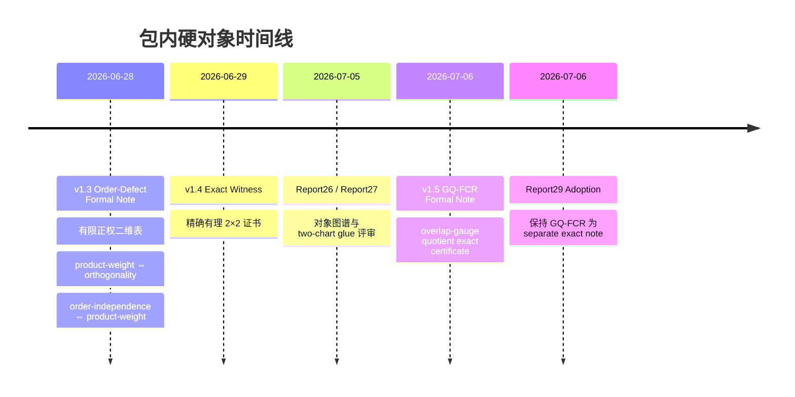

# MaoField 指标对象同一性、非同一性、统一性与下一精确数学对象决策审查报告

## Executive Summary

本地证据包支持一个**窄而硬**的数学判断：原始“non-identity / unity”概念链条，已经有了**有效但尚不完备**的数学落点；这个落点不是“大而全的 MaoField 总理论”，而是以有限对象为核心的三层结构：其一，**同 carrier 上**的有限正权二维表、加性 nuisance 子空间、投影顺序缺陷与精确有理 `2×2` 见证；其二，**相邻两 chart** 的 declared-gauge overlap quotient，也就是已经单独落成的 v1.5 GQ-FCR 狭义精确 note；其三，仍处于定义层或可立即整理层的 chart identity / transport / defect-certificate 语法。包内安全状态同时明确：这不是经验正结果，不是 broad ANOVA / projection / sheaf / contextuality 理论，不是对当前 Zenodo V2.5 预印本的补丁，Mode B 仍是 `insufficient_artifact`，duplicate risk 仍是 `MEDIUM`。因此，本轮最稳妥的总判断应是 **TRANSLATION_CORRECT_BUT_INCOMPLETE**，而下一动作应服从 D706 已冻结的分支：**KEEP_GQ_FCR_AS_SEPARATE_NOTE_AND_WRITE_INDEX**，同时把 OI 的受限算子等价命题保留为“可立即写成短札”的伴随对象，而不是跳去三 chart cocycle、support-rank ANOVA 或任何“动态崩溃理论”升级。 （证据：`PACKAGE_README.md:30-50`；`from_repo/STATE.md:22-28,85-88`；`from_repo/docs/infra/debranded_residual_transport/FORMAL_NOTE_V1_3_ORDER_DEFECT_20260628.md:41-227,241-369`；`from_repo/docs/infra/debranded_residual_transport/EXACT_WITNESS_V1_4_20260629.md:1-66`；`from_repo/docs/infra/debranded_residual_transport/FORMAL_NOTE_V1_5_GAUGE_QUOTIENTED_CONSISTENCY_RADIUS_20260706.md:1-153,160-277`；`from_repo/docs/infra/debranded_residual_transport/README.md:20-41`；`from_repo/docs/infra/gpt_deep_research/D706_GQ_FCR_POST_IMPL_PREPRINT_INTEGRATION_REPORT29_ADOPTION_NOTE_20260706.md:10-30,90-95`）



## Verdict On The Original Claim-Chain

**Verdict: `TRANSLATION_CORRECT_BUT_INCOMPLETE`**

这个 verdict 的含义非常具体。包内已经明确把原始概念链条压缩为一个“serious mathematical translation”：

```text
measurement-object identity / metric-object identity /
metric-form fetishism / defect certificate
```

但同一份边界说明同时强调：这**还不是 complete broad theory**；目前真正完成的硬对象只有“order-defect spine + exact witness + separate GQ-FCR exact note”。这正对应“正确落地，但还不能广推”的状态。 （证据：`PACKAGE_README.md:43-50`）

这个翻译之所以**正确**，是因为它已经不是抽象口号，而是能在有限对象上落到可证的形式。v1.3 formal note 把最小环境固定为有限正权二维表 `X=Q×B`、带权内积、加性 nuisance 子空间 `N_add=C⊕A⊕B0`、加权正交投影 `P_C,P_A,P_B0,P_N`、两种顺序剥离算子 `R_{Q→B}, R_{B→Q}` 与顺序缺陷算子 `D_w`，并正式证明了：

```text
product weights
⇔ A ⟂ B0
⇔ D_w = 0
⇔ R_{Q→B} = R_{B→Q}.
```

这已经给出“什么条件下可以把两个 procedure outputs 当成同一对象”的精确最小版本。 （证据：`from_repo/docs/infra/debranded_residual_transport/FORMAL_NOTE_V1_3_ORDER_DEFECT_20260628.md:41-100,104-227`）

这个翻译之所以仍然**不完备**，是因为包内一再要求把 claim 收缩在“有限 exact artifact”边界内。programme note 只是给出了 chart、metric object、transport、defect certificate 的理论骨架；adoption note 也明确写明这些内容必须被翻译成有限对象，但当前 order-defect theorem 只是**first finite exact certificate**，不是 completed general theory。GQ-FCR 虽然已经作为相邻两 chart overlap-gauge quotient 的精确 note 落地，但 report29 与 adoption note 明确要求它保持为**separate exact note**，不并入现有 V2.5 预印本，也不升级成 broad consistency-radius / sheaf / contextuality / projection theory。 （证据：`from_repo/docs/infra/MAOFIELD_METRIC_IDENTITY_PROGRAMME_20260704.md:42-90,663-718,740-790`；`from_repo/docs/infra/MAOFIELD_METRIC_IDENTITY_PROGRAMME_ADOPTION_NOTE_20260704.md:38-95`；`from_repo/docs/infra/debranded_residual_transport/FORMAL_NOTE_V1_5_GAUGE_QUOTIENTED_CONSISTENCY_RADIUS_20260706.md:1-15,229-277`；`from_repo/docs/infra/debranded_residual_transport/README.md:30-41`；`from_repo/docs/infra/gpt_deep_research/D706_GQ_FCR_POST_IMPL_PREPRINT_INTEGRATION_REPORT29_ADOPTION_NOTE_20260706.md:12-22,90-95`）

就“non-identity / unity”本身而言，包内已经给出一个可接受的数学转译。**unity** 不是先验绝对相等，而是“在已声明 transport / invariance / projection 条件下的条件同一性”；**non-identity** 不是修辞，而是 exact defect、intertwining failure 或 overlap incompatibility 的证书化失败；**metric-form fetishism** 则被 programme note 明确定义为：把异质测量关系，经由 score-form 或 ranking-form，偷渡成 chart-free 的模型内在属性。这个落点是有效的，但包内没有给出三 chart cocycle、动态 chart 序列、support-rank ANOVA 或任何“循环崩溃理论”的正式 note，因此这些更远的延伸现在都不能被视作“已落地”。 （证据：`from_repo/docs/infra/MAOFIELD_METRIC_IDENTITY_PROGRAMME_20260704.md:134-175,177-215,320-358,692-718`；`from_repo/docs/infra/gpt_deep_research/deep_research_metric_identity_phaseii_report25_20260705.md:40-118,149-180`；`from_repo/STATE.md:27-28`）

## Safe Mathematical Core

下表给出包内可安全使用的分级。这里的判定标准是：
`PROVEN_IN_PACKAGE` = 已有 formal note 内定理级证明；
`CERTIFICATE_COMPLETE` = 已有 exact script + JSON + Markdown 证书闭环；
`COMPLETE_LOCAL_DRAFT` = 本地 draft 已较完整，但未成为最终窄口径 canonical theorem note；
`FORMALIZABLE_NOW` = 定义与论证已足够，整理即可成短札；
`PACKAGE_SUPPORTED_DIRECTION` = 包内支持为下一步方向，但未完成；
`SPECULATIVE` = 只有候选方向或外部扫描建议，尚无本地硬对象；
`FORBIDDEN` = 包内硬边界明确禁止升级。 （证据：`PACKAGE_README.md:30-50`；`from_repo/STATE.md:27-28`）

| 项目 | 分级 | 依据与说明 |
|---|---|---|
| finite positive weighted two-way table | `PROVEN_IN_PACKAGE` | v1.3 formal note 已完整定义 `Q,B,X=Q×B,w>0`、归一化权重、带权内积与后续全部对象的环境空间。 （`FORMAL_NOTE_V1_3_ORDER_DEFECT_20260628.md:41-53`） |
| additive nuisance subspace | `PROVEN_IN_PACKAGE` | `C,A,B0,N_add=C⊕A⊕B0` 已正式定义，并成为真加性残差与 procedure artifact 区分的基底。 （`FORMAL_NOTE_V1_3_ORDER_DEFECT_20260628.md:64-84`） |
| product-weight iff main-effect orthogonality | `PROVEN_IN_PACKAGE` | v1.3 Proposition 1 已给出完整命题与证明。 （`FORMAL_NOTE_V1_3_ORDER_DEFECT_20260628.md:104-148`） |
| order-independence iff product weights | `PROVEN_IN_PACKAGE` | v1.3 Proposition 2 已正式证明 `D_w=0 iff w product` 与 `R_{Q→B}=R_{B→Q} iff w product`。 （`FORMAL_NOTE_V1_3_ORDER_DEFECT_20260628.md:154-227`） |
| exact 2×2 order-defect witness | `CERTIFICATE_COMPLETE` | v1.4 exact witness note、JSON、脚本闭环给出主见证与对称见证；都用 `fractions.Fraction`。 （`EXACT_WITNESS_V1_4_20260629.md:30-66`；`FORMAL_NOTE_V1_3_ORDER_DEFECT_20260628.md:285-323`） |
| deterministic harness | `COMPLETE_LOCAL_DRAFT` | harness 完整存在并通过四个 block，但包内反复声明它只是 regression support，不是 theorem proof。 （`FORMAL_NOTE_V1_3_ORDER_DEFECT_20260628.md:337-369`；`PACKAGE_README.md:39-41`） |
| metric-object identity definition | `FORMALIZABLE_NOW` | programme note 与 report25 已给出 chart、carrier、raw table、metric object 的有限骨架，但未作为独立 formal note 定稿。 （`MAOFIELD_METRIC_IDENTITY_PROGRAMME_20260704.md:663-718`；`deep_research_metric_identity_phaseii_report25_20260705.md:40-70`） |
| chart transport / intertwining condition | `FORMALIZABLE_NOW` | programme note 与 report25 已写出 `U_{c→c'}` / `T_{c→c'}` 和 intertwining 条件；GQ-FCR 给出相邻两 chart overlap quotient 的窄实现。 （`MAOFIELD_METRIC_IDENTITY_PROGRAMME_20260704.md:692-718`；`deep_research_metric_identity_phaseii_report25_20260705.md:74-118`；`FORMAL_NOTE_V1_5_GAUGE_QUOTIENTED_CONSISTENCY_RADIUS_20260706.md:17-153`） |
| defect certificate tuple | `FORMALIZABLE_NOW` | report25 已把一般 defect certificate 写成有限 witness quadruple；v1.3 / v1.4 提供同 carrier 特例。 （`deep_research_metric_identity_phaseii_report25_20260705.md:107-122`；`FORMAL_NOTE_V1_3_ORDER_DEFECT_20260628.md:154-227`） |
| audit-order instability index `OI` | `FORMALIZABLE_NOW` | programme/adoption note提出 `OI`；report25 进一步说明无下标的 `||D_w||` 不够诚实，推荐受限算子版与点态版；report26 将 `OI_N^{op}(w)=0 iff product` 评为 `PROVABLE_NOW`。 （`MAOFIELD_METRIC_IDENTITY_PROGRAMME_20260704.md:742-759`；`MAOFIELD_METRIC_IDENTITY_PROGRAMME_ADOPTION_NOTE_20260704.md:75-82`；`deep_research_metric_identity_phaseii_report25_20260705.md:124-147`；`deep_research_metric_identity_object_atlas_glue_report26_20260705.md:96-108`） |
| two-chart gluing obstruction | `PACKAGE_SUPPORTED_DIRECTION` | report27 认为可以立刻设计 primitive two-chart overlap obstruction certificate，但 D706 最终落地成更窄的 GQ-FCR。 generic “two-chart gluing obstruction” 尚未以独立 canonical note 完成。 （`deep_research_finite_glue_certificate_report27_20260705.md:15-39,220-232,352-358`；`FORMAL_NOTE_V1_5_GAUGE_QUOTIENTED_CONSISTENCY_RADIUS_20260706.md:229-243`） |
| GQ-FCR | `CERTIFICATE_COMPLETE` | v1.5 formal note、exact JSON、脚本、exact markdown、README 与 report29 adoption 已闭环；但须保持 separate exact note，不补丁 V2.5。 （`FORMAL_NOTE_V1_5_GAUGE_QUOTIENTED_CONSISTENCY_RADIUS_20260706.md:1-153,160-277`；`EXACT_GQ_FCR_V1_5_20260706.md:1-94`；`README.md:20-41`；`D706_GQ_FCR_POST_IMPL_PREPRINT_INTEGRATION_REPORT29_ADOPTION_NOTE_20260706.md:12-22`） |
| three-chart cocycle | `SPECULATIVE` | external scan 有候选对象，但 state 与 D706 决策都明确写明本轮不要扩到 three-chart cocycle。 （`EXTERNAL_MATH_OBJECT_SCAN_D706_20260706.md:45-79,144-173`；`from_repo/STATE.md:27-28`） |
| support-rank ANOVA | `SPECULATIVE` | external scan 列为候选对象，但包内边界禁止 broad ANOVA / dependent-input theory，本轮也明确不转向该对象。 （`EXTERNAL_MATH_OBJECT_SCAN_D706_20260706.md:45-79,144-173`；`PACKAGE_README.md:39-41`；`from_repo/STATE.md:27-28`） |
| Mode B empirical MaoField residual field | `FORBIDDEN` | package README、state、v1.3、v1.5 一致禁止把这些局部 exact objects升级成 observed residual/transport/holonomy/gluing field；Mode B 仍为 `insufficient_artifact`。 （`PACKAGE_README.md:35-41`；`from_repo/STATE.md:27,85-88`；`FORMAL_NOTE_V1_3_ORDER_DEFECT_20260628.md:360-369`；`FORMAL_NOTE_V1_5_GAUGE_QUOTIENTED_CONSISTENCY_RADIUS_20260706.md:264-277`） |

## Non-Identity/Unity Formalization

### 有限定义

**定义 A：evaluation chart**

包内 programme 骨架和 report25 的公共形式都支持把一个评测 chart 写成

\[
c=(P,T,J,R,D,w,A_g,N),
\]

其中 `P` 是 prompt / protocol 分布，`T` 是任务或 benchmark 轴，`J` 是 judge，`R` 是 rubric，`D` 是 decoding 规则，`w` 是权重表，`A_g` 是 aggregation chart，`N` 或 `S` 是 nuisance / residualization scheme。这个定义的关键不在“名称完整”，而在于：**一个 metric output 必须被 chart 索引化**。 （证据：`MAOFIELD_METRIC_IDENTITY_PROGRAMME_20260704.md:667-689`；`MAOFIELD_METRIC_IDENTITY_PROGRAMME_ADOPTION_NOTE_20260704.md:62-73`；`deep_research_metric_identity_phaseii_report25_20260705.md:41-47`）

**定义 B：finite carrier \(I_c\)**

对每个冻结后的 chart，选取一个有限 cell index set \(I_c\)。report25 特别强调，它应当是 prompt × task × judge × model-slot × seed × stratum 一类的**有限索引集合**，而不是“所有可能文本”的无限空间。其数学作用是把“对象讨论”从含混语义收缩到 exact audit carrier。 （证据：`deep_research_metric_identity_phaseii_report25_20260705.md:48-52`）

**定义 C：raw audit table \(K_c(\sigma)\)**

对系统 \(\sigma\)，定义

\[
K_c(\sigma)\in \mathbb R^{I_c},
\]

表示在该 chart 下冻结后的原始 score tensor 或 raw audit table。所有后续对象都先从 \(K_c(\sigma)\) 出发，而不是直接从一个终态 scalar 出发。 （证据：`deep_research_metric_identity_phaseii_report25_20260705.md:48-52`）

**定义 D：chart-dependent metric object \(M_c(\sigma)\)**

令

\[
\Phi_c:\mathbb R^{I_c}\to \mathcal O_c
\]

为由 chart 的权重、汇总、投影、剥离、排序等共同决定的有限可审计处理算子。则 chart-dependent metric object 定义为

\[
M_c(\sigma):=(c,\Phi_c(K_c(\sigma))).
\]

这与“一个数就是对象”不同：\(\mathcal O_c\) 可以是向量、残差对象、排序前 summary，只有在额外施加 \(A_g:\mathcal O_c\to\mathbb R\) 时才退化成单标量。对于 ranking，report25 进一步要求单独写成依赖 roster 的对象，而不要与单模型对象混同。 （证据：`deep_research_metric_identity_phaseii_report25_20260705.md:54-70`）

**定义 E：identity transport \(U_{c\to c'}\) 与 \(T_{c\to c'}\)**

若要比较两个 chart \(c,c'\)，需分别声明：

\[
U_{c\to c'}:\mathbb R^{I_c}\to \mathbb R^{I_{c'}},
\qquad
T_{c\to c'}:\mathcal O_c\to \mathcal O_{c'}.
\]

\(U\) 作用在原始 audit table 层，\(T\) 作用在 processed object 层。只有在声明好的 admissible class 上，这两个 transport 才可被谈论。 （证据：`deep_research_metric_identity_phaseii_report25_20260705.md:74-85`；`MAOFIELD_METRIC_IDENTITY_PROGRAMME_20260704.md:692-704`）

**定义 F：invariance / intertwining condition**

包内最自然的正式条件是

\[
T_{c\to c'}\Phi_c(K)
=
\Phi_{c'}(U_{c\to c'}K),
\qquad K\in\mathcal K_{c,c'}.
\]

若该条件成立，才可以说两个 chart 下的对象是在声明 transport 下的“同一对象”；若失败，则立刻进入 defect certificate，而不能默认它们只是“写法不同”。 （证据：`deep_research_metric_identity_phaseii_report25_20260705.md:74-116`；`MAOFIELD_METRIC_IDENTITY_PROGRAMME_20260704.md:694-718`）

**定义 G：unity 的 coherence 条件**

包内还没有三 chart canonical note，所以这里只能给出**定义级**而非 theorem 级的 coherence 条件。最小要求应是：

\[
U_{c\to c}=\mathrm{id}, \quad T_{c\to c}=\mathrm{id},
\]
\[
U_{c'\to c''}\circ U_{c\to c'} = U_{c\to c''},
\quad
T_{c'\to c''}\circ T_{c\to c'} = T_{c\to c''},
\]

并在可比较类上满足 pairwise intertwining。对 “unity” 而言，这意味着：**统一性不是静态恒等，而是声明 transport 后的条件兼容性与合成一致性**。programme note 直接把这种思想与“conditional, temporary, relative unity”联系起来。 （证据：`MAOFIELD_METRIC_IDENTITY_PROGRAMME_20260704.md:320-358,692-718`）

**定义 H：identity failure 的 defect certificate**

包内最干净的一般定义是 report25 的有限 witness quadruple：

\[
\mathcal C=(c,c',K,\Delta),
\qquad
\Delta:=T_{c\to c'}M_c(K)-M_{c'}(U_{c\to c'}K).
\]

当 \(\Delta\neq 0\) 时，就得到 exact intertwining failure。对当前最小 same-carrier 情形，\(U=T=\mathrm{id}\)，且两 chart 只差 residualization order，于是 defect certificate 退化成

\[
(c,c',K,D_wK).
\]

这正是 v1.3 / v1.4 order-defect 证书的本质。 （证据：`deep_research_metric_identity_phaseii_report25_20260705.md:107-122`；`FORMAL_NOTE_V1_3_ORDER_DEFECT_20260628.md:154-227`）

```mermaid
flowchart LR
    Kc["K_c(σ) ∈ R^{I_c}"] -->|Φ_c| Mc["M_c(σ) ∈ O_c"]
    Kc -->|U_{c→c'}| Kcp["K_{c'}(σ) ∈ R^{I_{c'}}"]
    Mc -->|T_{c→c'}| Mcp["O_{c'}"]
    Kcp -->|Φ_{c'}| Mcp2["M_{c'}(σ)"]
    Mcp --> D["Δ = T M_c - M_{c'} U K"]
    Mcp2 --> D
```

### 投影与顺序剥离算子的包内精确定义

在 v1.3 的 same-carrier 有限二维表设定中，令 \(X=Q\times B\)，\(w(q,b)>0\)，\(\sum_{q,b}w(q,b)=1\)，带权内积为

\[
\langle f,g\rangle_w = \sum_{q,b} w(q,b)f(q,b)g(q,b).
\]

定义边际

\[
w_Q(q)=\sum_b w(q,b),\qquad w_B(b)=\sum_q w(q,b),
\]

以及子空间

\[
C=\operatorname{span}\{1\},
\quad
A=\{a(q): \sum_q w_Q(q)a(q)=0\},
\quad
B_0=\{b(b): \sum_b w_B(b)b(b)=0\}.
\]

设 \(N_{\text{add}}=C\oplus A\oplus B_0\)。记加权正交投影为 \(P_C,P_A,P_{B_0},P_N\)。v1.3 还给出了标准公式：

\[
P_Cf=\mu_f,\qquad
P_Af=\mathbb E_w[f\mid q]-\mu_f,\qquad
P_{B_0}f=\mathbb E_w[f\mid b]-\mu_f.
\]

顺序剥离算子定义为

\[
R_{Q\to B}=(I-P_{B_0})(I-P_A)(I-P_C),
\]
\[
R_{B\to Q}=(I-P_A)(I-P_{B_0})(I-P_C),
\]

顺序缺陷算子为

\[
D_w=R_{Q\to B}-R_{B\to Q}
=(P_{B_0}P_A-P_AP_{B_0})(I-P_C)
=
P_{B_0}P_A-P_AP_{B_0}.
\]

这些定义在包内是正式 theorem spine 的一部分，而不是自由发挥。 （证据：`FORMAL_NOTE_V1_3_ORDER_DEFECT_20260628.md:41-100,154-175`）

### 定理与证明：product-weight 与 OI 的等价

**定义：受限算子型 OI**

按照 report25 的修正，当前最诚实的 OI 不是无下标 \(\|D_w\|\)，而是

\[
OI^{\mathrm{op}}_{N_{\mathrm{add}}}(w)
:=
\big\|D_w\!\restriction_{N_{\mathrm{add}}}\big\|_{L^2(w)\to L^2(w)}.
\]

它测量的是：**从本应被视为 addtive nuisance 的成分中，procedure order 最多能制造多大的假残差**。这与 capability score 完全不同。 （证据：`deep_research_metric_identity_phaseii_report25_20260705.md:124-147`）

**定理：**

\[
OI^{\mathrm{op}}_{N_{\mathrm{add}}}(w)=0
\iff
w(q,b)=w_Q(q)w_B(b)\ \forall(q,b).
\]

**证明：**

先证“\(\Leftarrow\)”。若 \(w\) 是 product form，则 v1.3 Proposition 1 给出 \(A\perp B_0\)，Proposition 2 进一步给出

\[
D_w=0,\qquad R_{Q\to B}=R_{B\to Q}=I-P_N.
\]

因此 \(D_w\) 在整个空间上都恒为零，当然其在 \(N_{\text{add}}\) 上的 restriction 也为零，于是

\[
OI^{\mathrm{op}}_{N_{\mathrm{add}}}(w)=0.
\]

再证“\(\Rightarrow\)”。若

\[
OI^{\mathrm{op}}_{N_{\mathrm{add}}}(w)=0,
\]

则对所有 \(K\in N_{\text{add}}\) 都有 \(D_wK=0\)。反设 \(w\) 非 product form。则 v1.3 Proposition 3 保证存在纯主效应见证 \(K\in A\) 或 \(K\in B_0\subset N_{\text{add}}\)，满足

\[
(I-P_N)K=0,
\]

且两种顺序剥离中一个输出为零，另一个非零。于是

\[
D_wK = R_{Q\to B}K-R_{B\to Q}K \neq 0,
\]

这与 \(D_w\) 在 \(N_{\text{add}}\) 上恒零矛盾。故 \(w\) 必为 product form。证毕。 （证据：`FORMAL_NOTE_V1_3_ORDER_DEFECT_20260628.md:104-148,154-227,241-283`；`deep_research_metric_identity_phaseii_report25_20260705.md:124-147`；`deep_research_metric_identity_object_atlas_glue_report26_20260705.md:96-108`）

这个定理很重要，因为它把 programme note 中的 “OI” 从一个 loose slogan，压成了一个 package-safe 的 finite operator corollary。也因此，它更适合作为**下一张一页短札**，而不是被夸大成“广义 metric instability theory”。 （证据：`MAOFIELD_METRIC_IDENTITY_PROGRAMME_ADOPTION_NOTE_20260704.md:75-82`；`deep_research_metric_identity_object_atlas_glue_report26_20260705.md:96-108`）

### 定理与证明：精确 `2×2` order-defect 见证

**定理：** 令 row-major 次序为 \((q_1,b_1),(q_1,b_2),(q_2,b_1),(q_2,b_2)\)，并取非 product 权重

\[
w=\frac1{11}
\begin{bmatrix}
1 & 2\\
3 & 5
\end{bmatrix},
\quad
w_Q=\left(\frac3{11},\frac8{11}\right),
\quad
w_B=\left(\frac4{11},\frac7{11}\right).
\]

取纯 \(b\)-only 零均值见证

\[
K=\left(\frac7{11},-\frac4{11},\frac7{11},-\frac4{11}\right)\in B_0.
\]

则有

\[
(I-P_N)K=0,
\qquad
R_{B\to Q}K=0,
\]
\[
R_{Q\to B}K=
\left(
\frac1{32},
\frac5{168},
-\frac1{96},
-\frac1{84}
\right),
\qquad
\|R_{Q\to B}K\|_w^2=\frac{61}{177408}>0.
\]

因此该非零输出是 exact wrong-order residual-like artifact，而不是真加性残差。 （证据：`FORMAL_NOTE_V1_3_ORDER_DEFECT_20260628.md:285-323`；`EXACT_WITNESS_V1_4_20260629.md:44-52`）

**证明：**

因为 \(K\in B_0\subset N_{\text{add}}\)，所以

\[
(I-P_N)K=0.
\]

且 \(K\) 的加权均值为零，故 \(P_CK=0\)。因此

\[
R_{B\to Q}K=(I-P_A)(I-P_{B_0})(I-P_C)K=0,
\]

因为 \((I-P_{B_0})K=0\)。这是包内 Proposition 3 的一般论证在本例中的具体化。 （证据：`FORMAL_NOTE_V1_3_ORDER_DEFECT_20260628.md:257-283,311-321`）

下面计算 \(R_{Q\to B}K\)。先算 \(P_AK\)。在 \(q_1\) 行上的条件均值为

\[
\frac{\frac1{11}\cdot \frac7{11}+\frac2{11}\cdot\left(-\frac4{11}\right)}{\frac3{11}}
=
-\frac1{33},
\]

在 \(q_2\) 行上的条件均值为

\[
\frac{\frac3{11}\cdot \frac7{11}+\frac5{11}\cdot\left(-\frac4{11}\right)}{\frac8{11}}
=
\frac1{88}.
\]

于是

\[
P_AK=
\left(
-\frac1{33},
-\frac1{33},
\frac1{88},
\frac1{88}
\right).
\]

再对 \(P_AK\) 做 \(b\)-axis 投影。第一列的条件均值为

\[
\frac{\frac1{11}\cdot\left(-\frac1{33}\right)+\frac3{11}\cdot\frac1{88}}{\frac4{11}}
=
\frac1{1056},
\]

第二列的条件均值为

\[
\frac{\frac2{11}\cdot\left(-\frac1{33}\right)+\frac5{11}\cdot\frac1{88}}{\frac7{11}}
=
-\frac1{1848}.
\]

故

\[
P_{B_0}P_AK=
\left(
\frac1{1056},
-\frac1{1848},
\frac1{1056},
-\frac1{1848}
\right).
\]

由

\[
R_{Q\to B}K=(I-P_{B_0})(I-P_A)K
=-(I-P_{B_0})P_AK
=-P_AK+P_{B_0}P_AK,
\]

逐分量相减便得

\[
R_{Q\to B}K=
\left(
\frac1{32},
\frac5{168},
-\frac1{96},
-\frac1{84}
\right).
\]

最后计算带权平方范数：

\[
\|R_{Q\to B}K\|_w^2
=
\frac1{11}\left(\frac1{32}\right)^2
+\frac2{11}\left(\frac5{168}\right)^2
+\frac3{11}\left(-\frac1{96}\right)^2
+\frac5{11}\left(-\frac1{84}\right)^2
=
\frac{61}{177408}>0.
\]

于是同一个 \(K\) 在真残差层为零，却在错误顺序下产生严格正的 residual-like output。这正是 exact defect。证毕。 （证据：`FORMAL_NOTE_V1_3_ORDER_DEFECT_20260628.md:257-283,285-323`；`EXACT_WITNESS_V1_4_20260629.md:44-52`）

### 平实解释

在这个 package 内，**unity** 的严格含义不是“到处都是同一个对象”，而是“在已声明的 transport / projection / gauge 条件下，可以把两个 charted objects 视为同一对象”。 **non-identity** 的严格含义也不是“哲学上不一样”，而是：出现了 exact defect、intertwining failure、order defect，或者 overlap incompatibility。 **metric-form fetishism** 则是：在这些条件尚未被证明之前，就把异质 chart 产生的 outputs 直接压扁成“模型内在属性”。这正是 programme note 要防止的“未经许可的 quotienting”。 （证据：`MAOFIELD_METRIC_IDENTITY_PROGRAMME_20260704.md:177-215,692-718,764-790`；`deep_research_metric_identity_phaseii_report25_20260705.md:149-160`）

## Next Exact Object Decision

**Chosen action: `KEEP_GQ_FCR_AS_SEPARATE_NOTE_AND_WRITE_INDEX`**

这是当前包最严格，也最符合 node36 已采纳状态的动作。原因不是 GQ-FCR 数学上不成立，恰恰相反：它已经成立到足以作为单独 exact note 冻结；但 report29 adoption、debranded README 与 state 都一致要求：**不要在本轮把它补进现有 Zenodo V2.5 preprint，不要顺势抬升到 broad theory，不要在 GQ-FCR 之上再跳向 three-chart cocycle 或 support-rank ANOVA。** （证据：`from_repo/STATE.md:24-28`；`from_repo/docs/infra/debranded_residual_transport/README.md:30-41`；`from_repo/docs/infra/gpt_deep_research/D706_GQ_FCR_POST_IMPL_PREPRINT_INTEGRATION_REPORT29_ADOPTION_NOTE_20260706.md:12-22,90-95`）

### 该动作对应的精确有限对象

冻结对象就是 v1.5 formal note 中的 **Gauge-Quotiented Finite Consistency Radius**。给定有限集 \(I_1,I_2,O_{12}\)，向量空间

\[
H_i=\mathbb Q^{I_i},
\qquad
V_{12}=\mathbb Q^{O_{12}},
\]

线性 restriction maps

\[
\rho_i:H_i\to V_{12},
\]

严格正 overlap 权重 \(w_{12}\)，以及 declared overlap gauge 子空间 \(\Gamma_{12}\subseteq V_{12}\)。对 local sections \(s_1,s_2\)，定义 raw overlap mismatch

\[
m_{12}(s_1,s_2)=\rho_1s_1-\rho_2s_2,
\]

并定义证书值

\[
\Delta^2_{12}(s_1,s_2;\Gamma_{12})
=
\min_{\gamma\in\Gamma_{12}}
\|m_{12}(s_1,s_2)-\gamma\|_w^2
=
\|(I-P_\Gamma)m_{12}(s_1,s_2)\|_w^2.
\]

这就是本轮应被冻结、索引并交叉链接的 exact object。 （证据：`FORMAL_NOTE_V1_5_GAUGE_QUOTIENTED_CONSISTENCY_RADIUS_20260706.md:17-76`）

### 应保留的 theorem 与 no-go 边界

应保留的核心 theorem 是：

\[
\Delta^2_{12}(s_1,s_2;\Gamma_{12})=0
\iff
\rho_1s_1-\rho_2s_2\in \Gamma_{12}.
\]

这是“compatibility modulo declared overlap gauge”的 finite linear-algebra 版本。应保留的第二条 theorem 是 gauge monotonicity：

\[
\Gamma_{12}\subseteq \Gamma'_{12}
\Longrightarrow
\Delta^2_{12}(s_1,s_2;\Gamma'_{12})
\le
\Delta^2_{12}(s_1,s_2;\Gamma_{12}).
\]

必须同时保留一个 no-go 边界：**如果没有额外的 local gauge parameter spaces 与 transfer maps \(\lambda_1,\lambda_2\)，则不能把 \(\Delta^2>0\) 解释成更强的“realized-gauge local sections 不存在”**。这正是 report28 / report29 强调的 theorem–corollary split。 （证据：`FORMAL_NOTE_V1_5_GAUGE_QUOTIENTED_CONSISTENCY_RADIUS_20260706.md:81-108,110-153`；`deep_research_d706_gq_fcr_implementation_gate_report28_20260706.md:3-14,213-223`；`D706_GQ_FCR_POST_IMPL_PREPRINT_INTEGRATION_REPORT29_ADOPTION_NOTE_20260706.md:24-30`）

### 证明义务

| 证明义务 | 当前状态 | 说明 |
|---|---|---|
| `Δ^2=0 iff m∈Γ` | 已完成 | formal note 已给出直接线性代数证明。 （`FORMAL_NOTE_V1_5_GAUGE_QUOTIENTED_CONSISTENCY_RADIUS_20260706.md:81-108`） |
| gauge monotonicity | 已完成 | formal note 已证明较大 gauge 子空间只会降低证书值。 （`FORMAL_NOTE_V1_5_GAUGE_QUOTIENTED_CONSISTENCY_RADIUS_20260706.md:140-155,213-219`） |
| theorem / corollary split | 已完成但需索引强调 | realized-gauge pasting 需要额外 transfer data，不可与核心 theorem 混写。 （`FORMAL_NOTE_V1_5_GAUGE_QUOTIENTED_CONSISTENCY_RADIUS_20260706.md:110-138`；`deep_research_d706_gq_fcr_implementation_gate_report28_20260706.md:11-14`） |
| 与 v1.3/v1.4 的关系边界 | 已完成 | relation 是 adjacency，不是 identity，也不是 broad projection generalization。 （`FORMAL_NOTE_V1_5_GAUGE_QUOTIENTED_CONSISTENCY_RADIUS_20260706.md:229-243`） |
| preprint integration 决策 | 已完成 | Report29 adoption 已冻结“separate exact note, do not patch V2.5 now”。 （`README.md:30-41`；`D706_GQ_FCR_POST_IMPL_PREPRINT_INTEGRATION_REPORT29_ADOPTION_NOTE_20260706.md:12-22`） |

### 最小有理见证与控制设计

| 控制类型 | 最小设计 | 期望结果 |
|---|---|---|
| overlap 次序 | `[(q1,b1),(q1,b2),(q2,b1),(q2,b2)]` | manifest 固定，避免坐标漂移。 （`FORMAL_NOTE_V1_5_GAUGE_QUOTIENTED_CONSISTENCY_RADIUS_20260706.md:160-166`） |
| overlap 权重 | `w=(1/4,1/4,1/4,1/4)` | 严格正，带权内积正定。 （同上 `168-172`） |
| declared gauge | `Γ=span{one,q,b}` | additive overlap gauge。 （同上 `174-181`） |
| 正控 | `m_plus=(1,2,3/2,5/2)=(7/4)one+(1/4)q+(1/2)b` | `Δ^2=0`。 （同上 `184-189`） |
| 负控 | `m_minus=(1,-1,-1,1)` | 与 `one,q,b` 正交，因此 `Δ^2=1`。 （同上 `193-211`） |
| 单调性控 | `Γ'=span{one,q,b,m_minus}` | `Δ^2(m_minus;Γ')=0 ≤ 1=Δ^2(m_minus;Γ)`。 （同上 `213-219`） |

### script / JSON requirements

本轮不需要新数学，只需要把现有 v1.5 note 与 exact artifact 做**索引化、可检索化、可复算化**。脚本和 JSON 应延续现有 exact discipline：全部有理数用字符串表示，运行时算术必须显示为 `fractions.Fraction`，载体 manifest、restriction matrices、gauge basis、Gram matrix、projection matrix、controls、checks、runtime metadata 与 sha256 都应保留。现有 exact JSON 已经体现了这套风格。 （证据：`FORMAL_NOTE_V1_5_GAUGE_QUOTIENTED_CONSISTENCY_RADIUS_20260706.md:70-78,221-227`；`EXACT_GQ_FCR_V1_5_20260706.md:1-94`）

#### 最小 RAG ingestion schema

```json
{
  "artifact": "string",
  "object_kind": "order_defect_witness | gq_fcr_certificate",
  "status": "string",
  "formal_note_path": "string",
  "script_path": "string",
  "json_path": "string",
  "carrier_manifest": {
    "name": "string",
    "labels": ["string"]
  },
  "weights_row_major": ["fraction_as_string"],
  "basis": {
    "names": ["string"],
    "vectors_row_major": [["fraction_as_string"]]
  },
  "restriction_matrices_row_major": {
    "rho_1": [["fraction_as_string"]],
    "rho_2": [["fraction_as_string"]]
  },
  "witness_or_controls": {
    "positive_control": {"vector": ["fraction_as_string"]},
    "negative_control": {"vector": ["fraction_as_string"]},
    "main_witness": {"vector": ["fraction_as_string"]}
  },
  "exact_outputs": {
    "projection_matrix_row_major": [["fraction_as_string"]],
    "residual_or_mismatch": ["fraction_as_string"],
    "delta_squared": "fraction_as_string",
    "norm_squared": "fraction_as_string"
  },
  "checks": {
    "all_checks_passed": true
  },
  "runtime": {
    "arithmetic": "fractions.Fraction",
    "python": "string"
  },
  "boundary": {
    "mode_b_status": "insufficient_artifact",
    "forbidden_writing": ["string"]
  }
}
```

#### 最小 `2×2` order-defect 见证 JSON 例子

```json
{
  "artifact": "exact_witness_v1_4_20260629",
  "object_kind": "order_defect_witness",
  "status": "synthetic_only_exact_fraction_certificate",
  "formal_note_path": "from_repo/docs/infra/debranded_residual_transport/FORMAL_NOTE_V1_3_ORDER_DEFECT_20260628.md",
  "script_path": "from_repo/scripts/debranded_residual_transport_exact_witness_v1_4.py",
  "json_path": "from_repo/docs/infra/debranded_residual_transport/exact_witness_v1_4_20260629.json",
  "carrier_manifest": {
    "name": "QxB_row_major",
    "labels": ["q1_b1", "q1_b2", "q2_b1", "q2_b2"]
  },
  "weights_row_major": ["1/11", "2/11", "3/11", "5/11"],
  "witness_or_controls": {
    "main_witness": {
      "space": "B0",
      "vector": ["7/11", "-4/11", "7/11", "-4/11"]
    }
  },
  "exact_outputs": {
    "true_residual": ["0", "0", "0", "0"],
    "R_B_then_Q": ["0", "0", "0", "0"],
    "R_Q_then_B": ["1/32", "5/168", "-1/96", "-1/84"],
    "norm_squared": "61/177408"
  },
  "checks": {
    "all_checks_passed": true
  },
  "runtime": {
    "arithmetic": "fractions.Fraction"
  },
  "boundary": {
    "mode_b_status": "insufficient_artifact"
  }
}
```

### 负控与禁止措辞

本动作的关键不是“再扩展”，而是“严守边界”。因此必须保留负控与 forbidden wording。formal note v1.5 已明确禁止：broad consistency-radius theory、broad sheaf/contextuality theory、broad dependent-input ANOVA、broad noncommuting projection theory、MaoField empirical positive result、observed residual/transport/holonomy/gluing field、full panel / training / inference / new loss、paper-ready / peer-reviewed / arXiv / journal status、proof by JSON floats or deterministic harness。 （证据：`FORMAL_NOTE_V1_5_GAUGE_QUOTIENTED_CONSISTENCY_RADIUS_20260706.md:264-277`）

### prior-art risk

对本动作，安全结论仍是：**可做，但 duplicate risk 不下调，仍至少是 `MEDIUM`**。原因不是找到了 exact duplicate，而是这一对象极易滑向已被占据的 broader theory 叙事。也因此，正确动作是“separate exact note + cross-index”，而不是“把对象扩大以追求更强新颖性”。 （证据：`from_repo/docs/infra/debranded_residual_transport/BIBLIOGRAPHY_AND_POSITIONING_V1_5_20260629.md:67-80`；`from_repo/docs/infra/external_math_search/EXTERNAL_MATH_OBJECT_SCAN_D706_20260706.md:45-79,144-173`；`deep_research_d706_gq_fcr_post_impl_preprint_integration_report29_20260706.md:44-55`）

### 与动态项目方向的关系

结合你前面对“动态 / 递归 / collapse-object identity”的关切，本地包当前**还不支持**把 GQ-FCR 或 OI 直接升级成动态理论。最安全的说法只是：当前 static spine 已经证明了“同 carrier 顺序程序可制造 residual-like object”，而相邻 chart overlap quotient 已经证明了“两个 local sections 的 declared-gauge compatibility 可被 exact certification”；如果未来要进入 chart 序列、iterative transport 或 collapse-curve identity，那将是**新的 formal note 任务**，不是本轮包内已完成对象。state 也明确要求：本动作不要扩张到 three-chart cocycle 或 support-rank ANOVA。 （证据：`FORMAL_NOTE_V1_3_ORDER_DEFECT_20260628.md:241-323`；`FORMAL_NOTE_V1_5_GAUGE_QUOTIENTED_CONSISTENCY_RADIUS_20260706.md:229-243`；`from_repo/STATE.md:27-28`）

## Strict Prior-Art And Duplicate-Risk Check

安全结论维持不变：

```text
duplicate risk = MEDIUM
```

包内 bibliography/positioning 与 D706 external scan 给出的结论高度一致：**没有识别到 exact duplicate**，真正的风险在于把窄对象夸大成已被占据的 broad theory。对 order-defect spine，安全贡献应收缩在：

```text
finite positive weighted two-way table
product-weight iff main-effect orthogonality
order-independence iff product weights
existential non-product pure-main-effect witness
exact 2×2 rational certificate
```

对 GQ-FCR，安全贡献则是“finite overlap-gauge quotient certificate”这一 residual-audit specialization，而不是 broad sheaf / contextuality / consistency-radius novelty。任何向 broad sheaf、dependent-input decomposition、projection theory、general ANOVA 的升级，都会立刻升高重复与越界风险。包内没有任何足以把风险从 `MEDIUM` 下调到更低的本地证据。 （证据：`from_repo/docs/infra/debranded_residual_transport/BIBLIOGRAPHY_AND_POSITIONING_V1_5_20260629.md:67-80`；`from_repo/docs/infra/external_math_search/EXTERNAL_MATH_OBJECT_SCAN_D706_20260706.md:45-79,144-173`；`deep_research_d706_gq_fcr_post_impl_preprint_integration_report29_20260706.md:44-55`）

## Final One-Paragraph Guidance To Node36

node36 现在最正确的动作，不是再扩张概念，也不是把 v1.5 强行补进现有 V2.5 预印本，而是**冻结并索引**这条窄而硬的数学主链：保留 v1.3 / v1.4 的 same-carrier order-defect spine，保留 v1.5 GQ-FCR 作为 separate exact note，更新 README / STATE / catalog / RAG 交叉索引；如果要写下一张短札，优先写 **\(OI^{op}_{N_{\mathrm{add}}}(w)=0 \iff w\) product** 这一受限算子等价命题，并严格标成 v1.3 的 corollary companion。不要写 broad ANOVA、three-chart cocycle、support-rank ANOVA、dynamic collapse theory、observed field、paper-ready、peer-reviewed、arXiv/journal 提交，也不要把 deterministic harness 或 JSON 当证明；动态方向如果真要推进，必须另开新的 formal note，从 chart-sequence transport / coherence 的有限定义开始，而不是借当前包内对象越权升级。 （证据：`from_repo/STATE.md:24-28,85-88`；`from_repo/docs/infra/debranded_residual_transport/README.md:30-41`；`MAOFIELD_METRIC_IDENTITY_PROGRAMME_ADOPTION_NOTE_20260704.md:67-82,84-95`；`deep_research_metric_identity_phaseii_report25_20260705.md:124-180`；`D706_GQ_FCR_POST_IMPL_PREPRINT_INTEGRATION_REPORT29_ADOPTION_NOTE_20260706.md:12-22,90-95`）