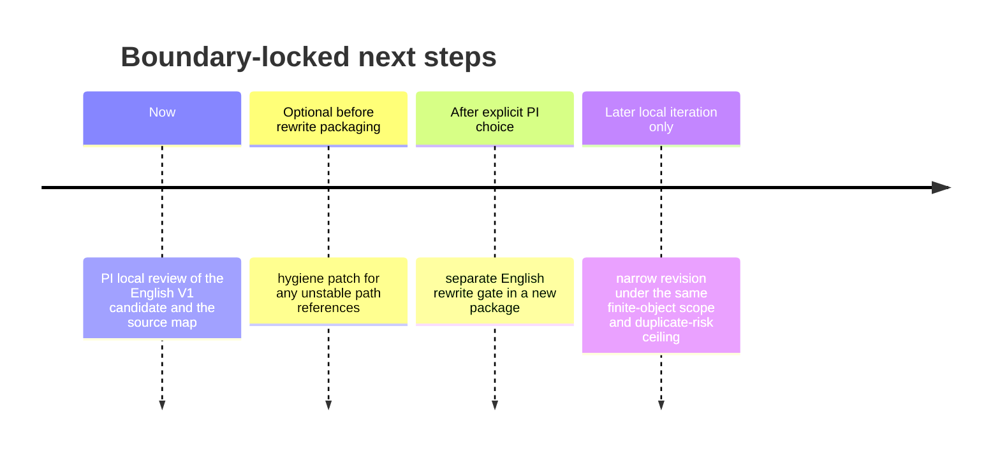

# Independent English Preprint Candidate V1 Review Package

## Executive summary

I verified the uploaded bundle locally before drafting. The required V13 files listed in the task were present and readable, and the internal checksum file `SHA256SUMS.txt` validated successfully against the extracted contents during this review. I therefore do **not** return `INSUFFICIENT_BUNDLE`.

The bundle itself makes two things clear. First, the underlying mathematical object is intentionally narrow: a finite positive weighted two-way table `X = Q x B`, its weighted inner-product space, the constant space `C`, the centered row-main-effect space `A`, the centered column-main-effect space `B0`, the additive nuisance space `N_add = C + A + B0`, the corresponding weighted orthogonal projections, the two ordered stripping operators, the order-defect operator `D_w`, and the exact `2 x 2` rational witness. Second, the project status remains boundary-locked: the V13 package was originally assembled for a PI local-review decision under lock, not for public release, and it expressly preserved the existing live labels and the `insufficient_artifact` empirical status. `[Sources: PACKAGE_README.md, lines 3–23; from_repo/STATE.md, lines 16–28; from_repo/docs/infra/recovery/ORDER_DEFECT_D701_PI_LOCAL_REVIEW_DECISION_V13_TASKBOOK_20260701.md, lines 11–20 and 39–68; from_repo/docs/infra/DEBRANDED_RESIDUAL_TRANSPORT_19_PACKAGE_ORDER_DEFECT_PI_LOCAL_REVIEW_DECISION_V13_20260701.md, lines 24–27 and 87–116.]`

Within that boundary, the bundle supports a narrow English candidate built from the internal formal note, the proof-repair candidate, the exact witness certificate, the deterministic harness boundary, and the bibliography/positioning note. The core formal claims are: product weights are equivalent to `A ⟂ B0`; order-independence of the two sequential stripping maps is equivalent to product weights; and under non-product weights there exists a pure-main-effect witness whose true additive residual is zero while the wrong stripping order yields a nonzero artifact. The bundle also fixes a certificate-level `2 x 2` witness with exact rational coordinates and weighted norm squared `61/177408`. `[Sources: from_repo/docs/infra/debranded_residual_transport/FORMAL_NOTE_V1_3_ORDER_DEFECT_20260628.md, lines 104–149 and 154–322; from_repo/docs/infra/debranded_residual_transport/FORMAL_NOTE_V1_3_ORDER_DEFECT_PROOF_REPAIR_CANDIDATE_20260630.md, lines 71–239; from_repo/docs/infra/debranded_residual_transport/EXACT_WITNESS_V1_4_20260629.md, lines 30–66; from_repo/docs/infra/debranded_residual_transport/exact_witness_v1_4_20260629.json, lines 51–77 and 78–249.]`

The resulting English V1 below is therefore best understood as an **independent internal candidate** for PI-local consideration. It is **not** a release authorization, not a posting authorization, and not a status upgrade. Target journal, target venue, and target posting path are unspecified in the bundle. `[Sources: from_repo/docs/infra/recovery/ORDER_DEFECT_D701_PI_LOCAL_REVIEW_DECISION_V13_TASKBOOK_20260701.md, lines 39–68; from_repo/docs/infra/gpt_deep_research/ORDER_DEFECT_PI_DECISION_V12_REPORT17_ADOPTION_NOTE_20260701.md, lines 32–52 and 68–89.]`

## Bundle verification and locked scope

The bundle’s own package materials consistently define the current local state as `PI_LOCAL_REVIEW_ONLY_KEEP_LOCK`, maintain the overall status `BOUNDARY_LOCKED_LOCAL_DRAFT_CANDIDATE_ONLY`, and preserve `Mode B MaoField empirical status: insufficient_artifact`. The same package materials also say that the original V13 task should not itself generate an English draft, which matters here because it means the English text below must be treated as a **fresh internal candidate derived from the bundle**, not as a V13-authorized release artifact. `[Sources: PACKAGE_README.md, lines 9–23; from_repo/STATE.md, lines 16–28; from_repo/docs/infra/DEBRANDED_RESIDUAL_TRANSPORT_19_PACKAGE_ORDER_DEFECT_PI_LOCAL_REVIEW_DECISION_V13_20260701.md, lines 89–116.]`

The live labels that must remain unchanged are the following:

```text
Proposition 1: COMPLETE_LOCAL_DRAFT
Proposition 2: COMPLETE_LOCAL_DRAFT
Proposition 3: COMPLETE_LOCAL_DRAFT
Exact 2 x 2 rational witness: CERTIFICATE
Deterministic harness: HARNESS_ONLY
Bibliography/positioning: COMPLETE_LOCAL_DRAFT with MEDIUM duplicate risk
Overall status: BOUNDARY_LOCKED_LOCAL_DRAFT_CANDIDATE_ONLY
Mode B MaoField empirical status: insufficient_artifact
```

These labels appear in the project state record, in the package record, and in the V12/V13 adoption chain. They are stable bundle constraints, not optional editorial choices. `[Sources: from_repo/STATE.md, lines 16–28; from_repo/docs/infra/DEBRANDED_RESIDUAL_TRANSPORT_19_PACKAGE_ORDER_DEFECT_PI_LOCAL_REVIEW_DECISION_V13_20260701.md, lines 98–109; from_repo/docs/infra/gpt_deep_research/ORDER_DEFECT_PI_DECISION_V12_REPORT17_ADOPTION_NOTE_20260701.md, lines 68–82.]`

The scope must also remain mathematically narrow. The formal note and its repair candidate define the only admissible object: finite positive weights on `Q x B`, the weighted inner product, the subspaces `C`, `A`, `B0`, `N_add`, the projections `P_C`, `P_A`, `P_B0`, `P_N`, the operators
`R_Q_then_B = (I-P_B0)(I-P_A)(I-P_C)`,
`R_B_then_Q = (I-P_A)(I-P_B0)(I-P_C)`,
and the order-defect operator `D_w`. The bibliography/positioning note explicitly forbids inflating this into a broad ANOVA theory, a broad dependent-input decomposition theory, or a broad noncommuting-projection theory. `[Sources: from_repo/docs/infra/debranded_residual_transport/FORMAL_NOTE_V1_3_ORDER_DEFECT_20260628.md, lines 41–100 and 154–175; from_repo/docs/infra/debranded_residual_transport/FORMAL_NOTE_V1_3_ORDER_DEFECT_PROOF_REPAIR_CANDIDATE_20260630.md, lines 34–69; from_repo/docs/infra/debranded_residual_transport/BIBLIOGRAPHY_AND_POSITIONING_V1_5_20260629.md, lines 17–31 and 53–80.]`

I also reran, locally and inside the extracted bundle, the exact-witness script and the deterministic harness script. The exact-witness rerun returned `all_checks_passed=True`, and the harness rerun returned `all_synthetic_controls_passed=True` with the threshold-contract hash recorded in the bundle verification note. Those reruns support consistency, but they do not change the hierarchy of evidence established in the bundle.

## Core formal content extracted from the bundle

The formal setup is straightforward but important. On the finite table `X = Q x B`, the bundle defines the weighted inner product
`<f,g>_w = Σ_{q,b} w(q,b) f(q,b) g(q,b)`,
the row and column marginals `w_Q` and `w_B`, the constant space `C`, the centered row-main-effect space `A`, the centered column-main-effect space `B0`, and the additive nuisance space `N_add = C direct-sum A direct-sum B0` as an algebraic direct sum. The formal note is explicit that this is **not** generally an orthogonal direct sum; orthogonality of `A` and `B0` is itself one of the key structural questions. `[Sources: from_repo/docs/infra/debranded_residual_transport/FORMAL_NOTE_V1_3_ORDER_DEFECT_20260628.md, lines 41–84; from_repo/docs/infra/debranded_residual_transport/FORMAL_NOTE_V1_3_ORDER_DEFECT_PROOF_REPAIR_CANDIDATE_20260630.md, lines 36–69.]`

The first proposition states that product weights are equivalent to orthogonality of the two centered main-effect spaces. The proof runs in both directions. Product weights immediately factor the inner product and force orthogonality. Conversely, orthogonality of `A` and `B0` applied to centered cell indicators reconstructs the cellwise identity `w(q,b) = w_Q(q) w_B(b)`. This proposition is the bridge between a concrete table-weight condition and the operator-algebra condition that governs the two stripping orders. `[Sources: from_repo/docs/infra/debranded_residual_transport/FORMAL_NOTE_V1_3_ORDER_DEFECT_20260628.md, lines 104–149; from_repo/docs/infra/debranded_residual_transport/FORMAL_NOTE_V1_3_ORDER_DEFECT_PROOF_REPAIR_CANDIDATE_20260630.md, lines 82–108.]`

The second proposition identifies the order defect exactly. Because `P_A 1 = P_B0 1 = 0`, the difference of the two sequential stripping operators simplifies to the commutator
`D_w = P_B0 P_A - P_A P_B0`.
The note then proves the equivalence
`D_w = 0  iff  w is product form`,
and therefore
`R_Q_then_B = R_B_then_Q  iff  w is product form`.
In the product-weight case, both ordered stripping maps reduce to the true additive residual projector `I - P_N`. `[Sources: from_repo/docs/infra/debranded_residual_transport/FORMAL_NOTE_V1_3_ORDER_DEFECT_20260628.md, lines 154–227; from_repo/docs/infra/debranded_residual_transport/FORMAL_NOTE_V1_3_ORDER_DEFECT_PROOF_REPAIR_CANDIDATE_20260630.md, lines 110–162.]`

The third proposition is where the bundle’s nontrivial witness lives. Under non-product weights, there exists a pure main-effect witness `K ∈ A` or `K ∈ B0` such that `(I-P_N)K = 0`, one ordered stripping residual vanishes, and the opposite order produces a nonzero output. Both the formal note and the repair candidate insist on the **existential** quantifier: the conclusion is not that every input differs under the two orders, only that there exists such a witness. Both documents also insist on the distinction between the true additive residual `(I-P_N)K` and the wrong-order sequential artifact. The latter is not a true interaction residual. `[Sources: from_repo/docs/infra/debranded_residual_transport/FORMAL_NOTE_V1_3_ORDER_DEFECT_20260628.md, lines 229–255 and 257–283; from_repo/docs/infra/debranded_residual_transport/FORMAL_NOTE_V1_3_ORDER_DEFECT_PROOF_REPAIR_CANDIDATE_20260630.md, lines 164–215.]`

The bundle then fixes a minimal exact witness on the non-product `2 x 2` table
`w = (1/11) [[1,2],[3,5]]`
with main `B0` witness
`K = (7/11, -4/11, 7/11, -4/11)`.
For this witness, the formal note, the exact certificate markdown, the exact certificate JSON, and the exact script all agree that `(I-P_N)K = 0`, `R_B_then_Q K = 0`, `R_Q_then_B K = (1/32, 5/168, -1/96, -1/84)`, and `||R_Q_then_B K||_w^2 = 61/177408`. `[Sources: from_repo/docs/infra/debranded_residual_transport/FORMAL_NOTE_V1_3_ORDER_DEFECT_20260628.md, lines 285–335; from_repo/docs/infra/debranded_residual_transport/FORMAL_NOTE_V1_3_ORDER_DEFECT_PROOF_REPAIR_CANDIDATE_20260630.md, lines 217–239; from_repo/docs/infra/debranded_residual_transport/EXACT_WITNESS_V1_4_20260629.md, lines 44–66; from_repo/docs/infra/debranded_residual_transport/exact_witness_v1_4_20260629.json, lines 51–77 and 243–249; from_repo/scripts/debranded_residual_transport_exact_witness_v1_4.py, lines 126–200.]`

A minimal derivation can be read directly off the exact JSON certificate. The JSON gives the exact `P_A` matrix, the exact `P_B0` matrix, and the main `B0` witness `K`. Using those data, one gets
`P_A K = (-1/33, -1/33, 1/88, 1/88)`,
then
`P_B0 P_A K = (1/1056, -1/1848, 1/1056, -1/1848)`,
and since `K ∈ B0` with `P_C K = 0`, the formula from Proposition 3 yields
`R_Q_then_B K = -(I-P_B0)P_A K = P_B0 P_A K - P_A K = (1/32, 5/168, -1/96, -1/84)`.
The weighted norm square then follows exactly:
\[
\frac{1}{11}\!\left(\frac1{32}\right)^2
+\frac{2}{11}\!\left(\frac5{168}\right)^2
+\frac{3}{11}\!\left(\frac1{96}\right)^2
+\frac{5}{11}\!\left(\frac1{84}\right)^2
= \frac{61}{177408}.
\]
The inputs for this derivation are bundle artifacts; the arithmetic reduction here is my own exact simplification from those certified inputs. `[Sources: from_repo/docs/infra/debranded_residual_transport/exact_witness_v1_4_20260629.json, lines 51–77 and 105–156; from_repo/docs/infra/debranded_residual_transport/FORMAL_NOTE_V1_3_ORDER_DEFECT_PROOF_REPAIR_CANDIDATE_20260630.md, lines 166–215.]`

The deterministic harness remains subordinate evidence. The harness note and harness script both say that it is zero-GPU synthetic regression support, that it reads no MaoField data, and that its role is to guard regressions in finite synthetic examples rather than prove the theorem. The wording lock then preserves this hierarchy across all bundle artifacts. `[Sources: from_repo/docs/infra/debranded_residual_transport/SYNTHETIC_HARNESS_V1_3_20260628.md, lines 5–18, 41–52, and 96–107; from_repo/scripts/debranded_residual_transport_harness_v1_3.py, lines 1–7, 198–225, and 320–423; from_repo/docs/infra/debranded_residual_transport/WORDING_LOCK_V1_6_20260629.md, lines 7–18 and 27–52.]`

Finally, the bibliography note deliberately narrows the contribution claim. It identifies neighboring literatures in dependent-variable ANOVA/Hoeffding decompositions and in classical two-projection theory, then instructs the draft to remain a “finite weighted projection-order artifact note” with `MEDIUM duplicate risk`. That is why the English V1 below avoids broad theory language and keeps the contribution at the level of this finite table object and its certificate-level witness. `[Sources: from_repo/docs/infra/debranded_residual_transport/BIBLIOGRAPHY_AND_POSITIONING_V1_5_20260629.md, lines 17–31, 33–49, 51–80.]`

## Draft preprint candidate V1

### Editorial status note

The text below is an **independent English preprint candidate V1 for local review only**, assembled from the uploaded bundle and kept within the same boundary-locked mathematical scope. It preserves the live labels outside the body of the draft and does **not** authorize posting, submission, or any empirical MaoField upgrade. `[Sources: from_repo/STATE.md, lines 16–28; from_repo/docs/infra/gpt_deep_research/ORDER_DEFECT_PI_DECISION_V12_REPORT17_ADOPTION_NOTE_20260701.md, lines 32–52 and 68–89.]`

### Draft text

**Title**

**Order Defect in Sequential Main-Effect Stripping for Finite Positive Weighted Two-Way Tables**

**Abstract**

We study a finite positive weighted two-way table `X = Q x B` equipped with its weighted Hilbert-space structure. Let `C` be the constant subspace, `A` the centered row-main-effect space, and `B0` the centered column-main-effect space. We compare two ordered nuisance-stripping maps,
`R_Q_then_B = (I-P_B0)(I-P_A)(I-P_C)` and
`R_B_then_Q = (I-P_A)(I-P_B0)(I-P_C)`,
where `P_C`, `P_A`, and `P_B0` are weighted orthogonal projections. The main observations are finite-dimensional and exact: product weights are equivalent to `A ⟂ B0`; equivalently, the two stripping orders agree exactly when the cell weights are of product form; and under non-product weights there exists a pure main-effect witness whose true additive residual is zero but whose wrong stripping order produces a nonzero output. A minimal `2 x 2` rational certificate is given explicitly, with weighted norm square `61/177408`. The note is intentionally narrow: it does not propose a general ANOVA theory, a general dependent-input decomposition theory, or a general noncommuting-projection theory. `[Sources: from_repo/docs/infra/debranded_residual_transport/FORMAL_NOTE_V1_3_ORDER_DEFECT_20260628.md, lines 41–100 and 104–322; from_repo/docs/infra/debranded_residual_transport/FORMAL_NOTE_V1_3_ORDER_DEFECT_PROOF_REPAIR_CANDIDATE_20260630.md, lines 34–239; from_repo/docs/infra/debranded_residual_transport/BIBLIOGRAPHY_AND_POSITIONING_V1_5_20260629.md, lines 17–31 and 51–80.]`

**Introduction**

The object of study is a finite positive weighted table rather than a broad statistical or functional-analytic program. Given a strictly positive normalized weight function `w(q,b)` on `Q x B`, one may remove constant, row-main-effect, and column-main-effect components in sequence using weighted orthogonal projection operators. Under product weights, the row and column centered main-effect spaces are orthogonal and the stripping order is immaterial. Under non-product weights, however, the ordered maps need not agree. The resulting order defect is a finite-dimensional commutator phenomenon internal to the weighted table, not an empirical claim about MaoField data and not a general decomposition theorem. `[Sources: from_repo/docs/infra/debranded_residual_transport/FORMAL_NOTE_V1_3_ORDER_DEFECT_20260628.md, lines 41–84 and 154–175; from_repo/docs/infra/debranded_residual_transport/BIBLIOGRAPHY_AND_POSITIONING_V1_5_20260629.md, lines 17–31 and 53–60.]`

A further point is conceptual. When the weights are non-product, a pure main effect can generate a nonzero output under the wrong stripping order even though the true additive residual is exactly zero. The bundle repeatedly warns that this nonzero output must be interpreted as a sequential stripping artifact rather than as a true interaction residual. That distinction is the center of the note. `[Sources: from_repo/docs/infra/debranded_residual_transport/FORMAL_NOTE_V1_3_ORDER_DEFECT_20260628.md, lines 241–255 and 257–283; from_repo/docs/infra/debranded_residual_transport/FORMAL_NOTE_V1_3_ORDER_DEFECT_PROOF_REPAIR_CANDIDATE_20260630.md, lines 166–215.]`

**Setup**

Let `Q` and `B` be finite sets, let `X = Q x B`, and let `w(q,b) > 0` with `Σ_{q,b} w(q,b) = 1`. Equip `R^{Q x B}` with the weighted inner product
\[
\langle f,g\rangle_w = \sum_{q,b} w(q,b) f(q,b) g(q,b).
\]
Define the marginals
\[
w_Q(q)=\sum_b w(q,b),\qquad
w_B(b)=\sum_q w(q,b).
\]
Let
\[
C=\mathrm{span}\{1\},
\]
\[
A=\{a(q):\sum_q w_Q(q)a(q)=0\},
\]
\[
B0=\{b(b):\sum_b w_B(b)b(b)=0\},
\]
and
\[
N_{\mathrm{add}} = C \oplus A \oplus B0
\]
as an algebraic direct sum. Let `P_C`, `P_A`, `P_B0`, and `P_N` denote the weighted orthogonal projections onto these spaces. In general one may not identify `P_N` with `P_C + P_A + P_B0`; that reduction is special to the orthogonal case. `[Sources: from_repo/docs/infra/debranded_residual_transport/FORMAL_NOTE_V1_3_ORDER_DEFECT_20260628.md, lines 41–84 and 86–100; from_repo/docs/infra/debranded_residual_transport/FORMAL_NOTE_V1_3_ORDER_DEFECT_PROOF_REPAIR_CANDIDATE_20260630.md, lines 36–55.]`

Define
\[
R_{Q\to B}=(I-P_{B0})(I-P_A)(I-P_C),\qquad
R_{B\to Q}=(I-P_A)(I-P_{B0})(I-P_C),
\]
and
\[
D_w = R_{Q\to B} - R_{B\to Q}.
\]
Because `P_A 1 = P_B0 1 = 0`, the order-defect operator simplifies to the commutator
\[
D_w = P_{B0}P_A - P_A P_{B0}.
\]
The rest of the note analyzes exactly when this commutator vanishes and what happens when it does not. `[Sources: from_repo/docs/infra/debranded_residual_transport/FORMAL_NOTE_V1_3_ORDER_DEFECT_20260628.md, lines 154–175; from_repo/docs/infra/debranded_residual_transport/FORMAL_NOTE_V1_3_ORDER_DEFECT_PROOF_REPAIR_CANDIDATE_20260630.md, lines 57–69.]`

**Main statements**

*Proposition 1.* For finite positive weights on `Q x B`, the following are equivalent:
\[
w(q,b)=w_Q(q)w_B(b)\quad\text{for all }q,b,
\]
and
\[
A \perp B0 \text{ under } \langle\cdot,\cdot\rangle_w.
\]

The forward implication is immediate from factorization of the weighted inner product. The reverse implication uses centered indicator functions
\[
a_{q_0}(q)=1_{q=q_0}-w_Q(q_0),\qquad
b_{b_0}(b)=1_{b=b_0}-w_B(b_0),
\]
whose inner product expands to
\[
\langle a_{q_0},b_{b_0}\rangle_w
= w(q_0,b_0)-w_Q(q_0)w_B(b_0).
\]
Orthogonality for all such pairs recovers the product formula cell by cell. `[Sources: from_repo/docs/infra/debranded_residual_transport/FORMAL_NOTE_V1_3_ORDER_DEFECT_20260628.md, lines 104–149; from_repo/docs/infra/debranded_residual_transport/FORMAL_NOTE_V1_3_ORDER_DEFECT_PROOF_REPAIR_CANDIDATE_20260630.md, lines 82–108.]`

*Proposition 2.* For finite positive weights, the following are equivalent:
\[
w \text{ is product form},
\qquad
D_w=0,
\qquad
R_{Q\to B}=R_{B\to Q}.
\]
When they hold,
\[
R_{Q\to B}=R_{B\to Q}=I-P_N.
\]

If the weights are product, Proposition 1 gives `A ⟂ B0`, so the centered spaces are orthogonal and the commutator vanishes. Conversely, if `D_w = 0`, then for any `b ∈ B0`,
\[
0=D_w b=P_{B0}P_A b - P_A b.
\]
Hence `P_A b` lies in both `A` and `B0`. The repair candidate proves separately that `A ∩ B0 = {0}`, so `P_A b = 0` for every `b ∈ B0`, which yields `A ⟂ B0` and therefore product weights by Proposition 1. `[Sources: from_repo/docs/infra/debranded_residual_transport/FORMAL_NOTE_V1_3_ORDER_DEFECT_20260628.md, lines 177–227; from_repo/docs/infra/debranded_residual_transport/FORMAL_NOTE_V1_3_ORDER_DEFECT_PROOF_REPAIR_CANDIDATE_20260630.md, lines 71–80 and 110–162.]`

*Proposition 3.* If the weights are not product form, then there exists a pure main-effect witness `K ∈ A` or `K ∈ B0` such that
\[
(I-P_N)K=0,
\]
one ordered stripping residual is zero, and the opposite ordered stripping residual is nonzero.

The statement is existential, not universal. The bundle’s preferred proof chooses `K ∈ B0`. Non-product weights imply that `A` and `B0` are not orthogonal, hence there is a `b ∈ B0` with `P_A b \neq 0`; setting `K=b`, one gets
\[
R_{B\to Q}K=(I-P_A)(I-P_{B0})(I-P_C)K=0
\]
because `K ∈ B0` and has mean zero, while
\[
R_{Q\to B}K = -(I-P_{B0})P_A K
\]
cannot vanish without forcing `P_A K ∈ A \cap B0 = \{0\}`, contradicting the choice of `K`. Since `K ∈ N_{\mathrm{add}}`, the true additive residual remains zero throughout:
\[
(I-P_N)K=0.
\]
Thus the nonzero wrong-order output is a sequential artifact, not a true interaction residual. `[Sources: from_repo/docs/infra/debranded_residual_transport/FORMAL_NOTE_V1_3_ORDER_DEFECT_20260628.md, lines 229–255 and 257–283; from_repo/docs/infra/debranded_residual_transport/FORMAL_NOTE_V1_3_ORDER_DEFECT_PROOF_REPAIR_CANDIDATE_20260630.md, lines 164–215.]`

**Exact `2 x 2` witness**

Consider the non-product weight matrix
\[
w=\frac1{11}
\begin{bmatrix}
1 & 2\\
3 & 5
\end{bmatrix},
\]
written in row-major order `((q1,b1),(q1,b2),(q2,b1),(q2,b2))`, and the `B0` witness
\[
K=\left(\frac7{11},-\frac4{11},\frac7{11},-\frac4{11}\right).
\]
The exact certificate in the bundle records
\[
(I-P_N)K=0,
\qquad
R_{B\to Q}K=0,
\]
and
\[
R_{Q\to B}K=
\left(\frac1{32},\frac5{168},-\frac1{96},-\frac1{84}\right),
\qquad
\|R_{Q\to B}K\|_w^2=\frac{61}{177408}.
\]
These values appear consistently in the formal note, the proof-repair candidate, the certificate markdown, the exact JSON artifact, and the exact script. `[Sources: from_repo/docs/infra/debranded_residual_transport/FORMAL_NOTE_V1_3_ORDER_DEFECT_20260628.md, lines 285–335; from_repo/docs/infra/debranded_residual_transport/FORMAL_NOTE_V1_3_ORDER_DEFECT_PROOF_REPAIR_CANDIDATE_20260630.md, lines 217–239; from_repo/docs/infra/debranded_residual_transport/EXACT_WITNESS_V1_4_20260629.md, lines 44–66; from_repo/docs/infra/debranded_residual_transport/exact_witness_v1_4_20260629.json, lines 51–77 and 243–249; from_repo/scripts/debranded_residual_transport_exact_witness_v1_4.py, lines 143–165.]`

A useful exact derivation is short. The certificate JSON provides the exact `P_A` matrix and the witness `K`; multiplying them gives
\[
P_A K=\left(-\frac1{33},-\frac1{33},\frac1{88},\frac1{88}\right).
\]
Applying `P_B0` to that vector yields
\[
P_{B0}P_A K=\left(\frac1{1056},-\frac1{1848},\frac1{1056},-\frac1{1848}\right).
\]
Hence
\[
R_{Q\to B}K = -(I-P_{B0})P_A K
           = P_{B0}P_A K - P_A K
           = \left(\frac1{32},\frac5{168},-\frac1{96},-\frac1{84}\right).
\]
Substituting this vector into the weighted norm formula gives exactly `61/177408`. `[Sources: from_repo/docs/infra/debranded_residual_transport/exact_witness_v1_4_20260629.json, lines 51–77 and 105–156; from_repo/docs/infra/debranded_residual_transport/FORMAL_NOTE_V1_3_ORDER_DEFECT_PROOF_REPAIR_CANDIDATE_20260630.md, lines 166–215.]`

**Scope and positioning**

This note does not claim a new broad ANOVA theory, a new broad dependent-input decomposition theory, or a new broad noncommuting-projection theory. Its safe claim level is the one fixed by the internal bibliography note: a compact finite weighted projection-order artifact note with an exact `2 x 2` witness. The same note places the nearest neighbors in dependent-variable ANOVA/Hoeffding decomposition and classical projection theory, and it explicitly preserves `MEDIUM duplicate risk`. `[Sources: from_repo/docs/infra/debranded_residual_transport/BIBLIOGRAPHY_AND_POSITIONING_V1_5_20260629.md, lines 17–31, 33–49, and 65–80.]`

The deterministic harness is not part of the theorem’s proof authority. Its function is regression protection in finite synthetic examples, and the exact rational certificate is the stronger computational anchor. The bundle’s wording lock exists precisely to prevent the float-based harness from being mistaken for proof. `[Sources: from_repo/docs/infra/debranded_residual_transport/SYNTHETIC_HARNESS_V1_3_20260628.md, lines 5–18 and 96–107; from_repo/docs/infra/debranded_residual_transport/WORDING_LOCK_V1_6_20260629.md, lines 7–18 and 27–52.]`

**Internal bibliography**

Because this review is bundle-only, the bibliography below is limited to bundle documents rather than external publications.

1. *Finite Weighted Residual Transport — Formal Note v1.3* (`FORMAL_NOTE_V1_3_ORDER_DEFECT_20260628.md`). `[Source: from_repo/docs/infra/debranded_residual_transport/FORMAL_NOTE_V1_3_ORDER_DEFECT_20260628.md, lines 1–369.]`  
2. *Order-Defect Proof Repair Candidate* (`FORMAL_NOTE_V1_3_ORDER_DEFECT_PROOF_REPAIR_CANDIDATE_20260630.md`). `[Source: from_repo/docs/infra/debranded_residual_transport/FORMAL_NOTE_V1_3_ORDER_DEFECT_PROOF_REPAIR_CANDIDATE_20260630.md, lines 1–240.]`  
3. *Exact Witness Certificate v1.4 — Order Defect* (`EXACT_WITNESS_V1_4_20260629.md`) and exact JSON artifact. `[Sources: from_repo/docs/infra/debranded_residual_transport/EXACT_WITNESS_V1_4_20260629.md, lines 1–66; from_repo/docs/infra/debranded_residual_transport/exact_witness_v1_4_20260629.json, lines 1–249.]`  
4. *Debranded Residual Transport Synthetic Harness v1.3* (`SYNTHETIC_HARNESS_V1_3_20260628.md`) and harness script. `[Sources: from_repo/docs/infra/debranded_residual_transport/SYNTHETIC_HARNESS_V1_3_20260628.md, lines 1–126; from_repo/scripts/debranded_residual_transport_harness_v1_3.py, lines 1–604.]`  
5. *Order-Defect Bibliography and Positioning v1.5* (`BIBLIOGRAPHY_AND_POSITIONING_V1_5_20260629.md`). `[Source: from_repo/docs/infra/debranded_residual_transport/BIBLIOGRAPHY_AND_POSITIONING_V1_5_20260629.md, lines 1–80.]`

### End of draft text

## Self-review, source map, blockers, and risks

The English V1 above respects the existential form of Proposition 3, keeps the distinction between the true additive residual and the wrong-order stripping artifact, reproduces the exact `2 x 2` witness values, and treats the deterministic harness as `HARNESS_ONLY`. It also avoids positive uses of forbidden claims such as readiness language, broad-theory novelty language, empirical MaoField success language, or any claim that the harness or JSON floats prove the theorem. `[Sources: from_repo/docs/infra/debranded_residual_transport/FORMAL_NOTE_V1_3_ORDER_DEFECT_PROOF_REPAIR_CANDIDATE_20260630.md, lines 166–215 and 239–240; from_repo/docs/infra/debranded_residual_transport/WORDING_LOCK_V1_6_20260629.md, lines 27–52; from_repo/docs/infra/recovery/ORDER_DEFECT_D701_PI_LOCAL_REVIEW_DECISION_V13_TASKBOOK_20260701.md, lines 39–52.]`

The main hygiene issue remains the archived package-external path `/tmp/orderdefect_v10/rerun/harness.json` that appears in report(15). The dedicated hygiene note says not to edit the archived report(15) itself, but to replace that path with stable bundle-internal references in any future rewrite or package-facing text. Since the present English V1 does **not** rely on that scratch path, it is already written to the stable internal sources instead. `[Sources: from_repo/docs/infra/gpt_deep_research/ORDER_DEFECT_REPORT15_PATH_HYGIENE_NOTE_20260701.md, lines 8–44; from_repo/docs/infra/gpt_deep_research/deep_research_order_defect_draft_candidate_review_v11_report16_20260701.md, lines 20–27 and 32–40; from_repo/docs/infra/gpt_deep_research/ORDER_DEFECT_PI_DECISION_V12_REPORT17_ADOPTION_NOTE_20260701.md, lines 49–66.]`

The biggest substantive editorial caution is duplicate risk. The bundle’s own recommendation is to keep the note extremely narrow and to avoid drifting into already occupied broad literatures. That remains the right constraint on any future version. `[Sources: from_repo/docs/infra/debranded_residual_transport/BIBLIOGRAPHY_AND_POSITIONING_V1_5_20260629.md, lines 17–31, 33–49, and 65–80; from_repo/docs/infra/gpt_deep_research/deep_research_order_defect_draft_candidate_review_v11_report16_20260701.md, lines 24–27.]`

### Self-review checklist

| Item | Status | Note |
|---|---|---|
| Bundle completeness for required V13 files | Passed | Required files were present and readable in the extracted bundle; internal SHA check passed in this review. |
| Mathematical scope kept finite and local | Passed | No generalization beyond the specified two-way-table object. `[Formal Note, lines 41–100 and 154–175; Bibliography Note, lines 17–31 and 53–80.]` |
| Proposition 1/2/3 labels preserved | Passed | Kept externally exactly as `COMPLETE_LOCAL_DRAFT`. `[STATE.md, lines 16–28.]` |
| Exact witness preserved | Passed | Main witness and `61/177408` retained exactly. `[Exact Witness MD, lines 44–52; JSON, lines 51–77.]` |
| Harness treated as `HARNESS_ONLY` | Passed | Explained as deterministic regression support only. `[Harness MD, lines 5–18 and 96–107; Wording Lock, lines 7–18.]` |
| Duplicate risk stated | Passed | `MEDIUM duplicate risk` kept explicitly. `[Bibliography Note, lines 65–80.]` |
| Path hygiene issue noted | Passed | Scratch-path issue recorded; stable bundle paths used in V1. `[Path Hygiene Note, lines 8–44.]` |
| Target journal / venue | Unspecified | The bundle does not specify one. |
| Posting / submission authorization | Not present | Deliberately omitted. `[V13 Taskbook, lines 39–68.]` |

### Source map

| Draft section or claim | Bundle source(s) and exact line ranges |
|---|---|
| Locked scope and live labels | `PACKAGE_README.md`, lines 3–23; `from_repo/STATE.md`, lines 16–28; `from_repo/docs/infra/DEBRANDED_RESIDUAL_TRANSPORT_19_PACKAGE_ORDER_DEFECT_PI_LOCAL_REVIEW_DECISION_V13_20260701.md`, lines 89–116 |
| Admissible finite mathematical object | `from_repo/docs/infra/debranded_residual_transport/FORMAL_NOTE_V1_3_ORDER_DEFECT_20260628.md`, lines 41–100 and 154–175; `from_repo/docs/infra/debranded_residual_transport/FORMAL_NOTE_V1_3_ORDER_DEFECT_PROOF_REPAIR_CANDIDATE_20260630.md`, lines 34–69 |
| Proposition 1 | `from_repo/docs/infra/debranded_residual_transport/FORMAL_NOTE_V1_3_ORDER_DEFECT_20260628.md`, lines 104–149; `from_repo/docs/infra/debranded_residual_transport/FORMAL_NOTE_V1_3_ORDER_DEFECT_PROOF_REPAIR_CANDIDATE_20260630.md`, lines 82–108 |
| Proposition 2 and commutator identity | `from_repo/docs/infra/debranded_residual_transport/FORMAL_NOTE_V1_3_ORDER_DEFECT_20260628.md`, lines 154–227; `from_repo/docs/infra/debranded_residual_transport/FORMAL_NOTE_V1_3_ORDER_DEFECT_PROOF_REPAIR_CANDIDATE_20260630.md`, lines 110–162 |
| Proposition 3 and existential quantifier guard | `from_repo/docs/infra/debranded_residual_transport/FORMAL_NOTE_V1_3_ORDER_DEFECT_20260628.md`, lines 229–255 and 257–283; `from_repo/docs/infra/debranded_residual_transport/FORMAL_NOTE_V1_3_ORDER_DEFECT_PROOF_REPAIR_CANDIDATE_20260630.md`, lines 164–215 |
| Minimal `2 x 2` witness | `from_repo/docs/infra/debranded_residual_transport/FORMAL_NOTE_V1_3_ORDER_DEFECT_20260628.md`, lines 285–335; `from_repo/docs/infra/debranded_residual_transport/EXACT_WITNESS_V1_4_20260629.md`, lines 44–66 |
| Exact matrices and exact arithmetic inputs | `from_repo/docs/infra/debranded_residual_transport/exact_witness_v1_4_20260629.json`, lines 51–77, 78–156, and 243–249; `from_repo/scripts/debranded_residual_transport_exact_witness_v1_4.py`, lines 126–200 |
| Harness boundary | `from_repo/docs/infra/debranded_residual_transport/SYNTHETIC_HARNESS_V1_3_20260628.md`, lines 5–18, 41–52, and 96–107; `from_repo/docs/infra/debranded_residual_transport/WORDING_LOCK_V1_6_20260629.md`, lines 7–18 and 27–52; `from_repo/scripts/debranded_residual_transport_harness_v1_3.py`, lines 1–7, 198–225, and 320–423 |
| Duplicate-risk positioning | `from_repo/docs/infra/debranded_residual_transport/BIBLIOGRAPHY_AND_POSITIONING_V1_5_20260629.md`, lines 17–31, 33–49, and 65–80 |
| Rewrite hygiene and bundle-safe rewrite rule | `from_repo/docs/infra/gpt_deep_research/ORDER_DEFECT_REPORT15_PATH_HYGIENE_NOTE_20260701.md`, lines 8–44; `from_repo/docs/infra/gpt_deep_research/deep_research_order_defect_draft_candidate_review_v11_report16_20260701.md`, lines 20–27 and 32–40; `from_repo/docs/infra/gpt_deep_research/ORDER_DEFECT_PI_DECISION_V12_REPORT17_ADOPTION_NOTE_20260701.md`, lines 49–66 |
| English rewrite must be separate from PI choice in the original chain | `from_repo/docs/infra/recovery/ORDER_DEFECT_D701_PI_LOCAL_REVIEW_DECISION_V13_TASKBOOK_20260701.md`, lines 15–20 and 56–68; `from_repo/docs/infra/recovery/ORDER_DEFECT_D701_PI_DECISION_AND_ENGLISH_REWRITE_GATE_V12_TASKBOOK_20260701.md`, lines 14–20 and 53–71 |

### Remaining hard blockers and soft risks

| Type | Item | Assessment |
|---|---|---|
| Hard blocker | Missing bundle evidence | None found in this review. |
| Hard blocker | Mathematical inconsistency inside the finite object | None found in this review. |
| Hard blocker | Stable-path hygiene for future package-facing rewrite | Still relevant, but already handled here by citing stable bundle paths instead of the archived scratch path. |
| Soft risk | `MEDIUM duplicate risk` | Still real; language must remain narrow. `[Bibliography Note, lines 65–80.]` |
| Soft risk | Bundle pedigree | The V13 package originally prohibited English drafting inside its own task, so this V1 must remain an internal candidate rather than a status-changing artifact. `[PACKAGE_README.md, lines 19–23; V13 Taskbook, lines 11–20 and 66–68.]` |
| Soft risk | Harness misinterpretation | Readers may overread the deterministic harness unless the subordinate role is kept explicit. `[Harness MD, lines 5–18 and 96–107; Wording Lock, lines 7–18.]` |
| Soft risk | Venue ambiguity | Journal, archive path, and submission destination are unspecified in the bundle. |

## Next-step timeline and closing boundary

The next steps implied by the bundle’s governance chain are simple: PI local review first, optional hygiene patch if any bundle-facing text still carries unstable paths, and only then—if the human PI explicitly chooses it—a separate English rewrite gate in a new package. That sequence comes directly from the V12/V13 taskbooks and the V12 adoption note. `[Sources: from_repo/docs/infra/recovery/ORDER_DEFECT_D701_PI_LOCAL_REVIEW_DECISION_V13_TASKBOOK_20260701.md, lines 11–20 and 56–68; from_repo/docs/infra/recovery/ORDER_DEFECT_D701_PI_DECISION_AND_ENGLISH_REWRITE_GATE_V12_TASKBOOK_20260701.md, lines 11–20 and 53–71; from_repo/docs/infra/gpt_deep_research/ORDER_DEFECT_PI_DECISION_V12_REPORT17_ADOPTION_NOTE_20260701.md, lines 39–52 and 91–100.]`



This remains a boundary-locked PI local-review decision gate only. Node36 and the human PI retain final authority. This is not paper-ready, preprint-ready, posted, or submission-authorized.