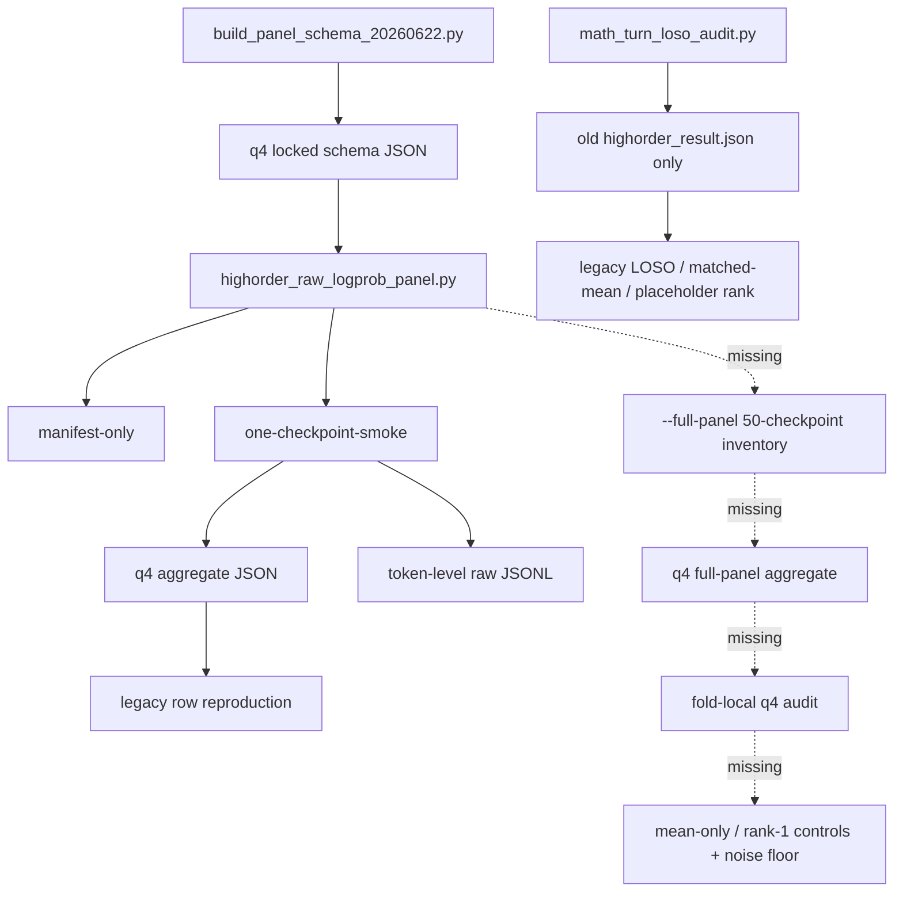

# MaoField q4 严格数学审计报告

## Executive summary

本次审计的结论是：**拒绝将当前 q4 对象视为“已经形成的数学推进候选”**。更准确地说，当前包内已经有一个**被锁定的 q4 观测载体**，也有**schema/来源/provenance 的部分门禁**与**若干 smoke 复现**，但**尚没有**那个真正需要被证明存在的对象：一个在 **fold-local** 设定下、在去除均值模与单调 slope 标量后，仍能跨 seed/generation 稳定存活的 **非标量残差场**。因此，当前状态最多只是“**可进入 full-panel 实现审查**”，不是“数学 advance 已出现”。〔证据：`repo_files/STATE.md` L16-L17, L24-L27；`repo_files/docs/infra/math_turn_20260622/PANEL_PRIMARY_ARTIFACT_RUNBOOK_20260622.md` L18-L24, L305-L315；`repo_files/docs/infra/gpt_deep_research/Q4_PANEL_STRICT_AUDIT_ADOPTION_NOTE_20260622.md` L31-L41, L60-L67〕

按用户要求的六个主问题，结论如下。

| 主问题 | 严格结论 | 证据类别 |
|---|---|---|
| 问题一 | 真正需要存在的对象不是 `P` 这个 q4 slope 标量，也不是 `D` 这个均值模；而是 **在 q4 mean-null 子空间中，再剔除主 slope 方向后仍保留下来的 fold-local 残差向量场**。 | 形式化定义 + runbook 约束 |
| 问题二 | 可观测量应是每个 `(seed, generation)` 的 `k∈R^4`，标量 nuisance 至少包括均值模 `D` 与锁定 slope `v`；残差算子应是加权 mean-null 投影后再剔除 `v` 分量。零假设应是“表观结构全部由 `D/g/g²` 驱动的标量平滑或 rank-1 阴影解释”；备择才是“存在超出噪声地板的非标量 residual”。 | 形式化定义 |
| 问题三 | 当前代码**没有**实现这个科学对象；它实现的是 **schema builder + one-checkpoint q4 生成器 + legacy aggregate LOSO 审计 + 负控 smoke + 多点 smoke**。其中真正的 q4 full-panel 生成与专用 fold-local 分析路径都缺失。 | 观察到的代码/数据 |
| 问题四 | 在 50-checkpoint panel 具有科学意义前，必须新增一个显式 `--full-panel` 生成模式，以及一个**独立于** `math_turn_loso_audit.py` 的 q4 专用分析脚本，后者必须实现 fold-local LOSO、fold-local pairing、fold-local projection fitting、mean-only/rank-1 synthetic controls、noise-floor/bootstrap。 | 观察到的代码/Runbook |
| 问题五 | 现在可以陈述的最强命题不是“场存活”，而是一个**不可识别性结论**：在现有证据下，q4 非标量残差场是否存在，**尚不可识别**；因为唯一的 50-row verdict 脚本仍消费旧的 rare/freq aggregate，而 q4 脚本只能做 smoke，并没有 full-panel mode。 | 观察到的代码 + 小定理 |
| 问题六 | 最快的 kill-tests 是：`mean+D/g/g²` fold-local 解释度、`u` 与 `r` 的 rank/noise-floor、matched-mean pair 的方向稳定性、global-fit 对比 fold-local-fit 的 leakage 检验、以及投影/切片 multiplicity 检验。任何一项失败，都应直接杀死“数学 advance”叙述。 | 可脚本化反证设计 |

还需要特别强调两点。第一，**当前包内的观测对象本身是 q4 切片平均 `mean_logprob`，不是训练时的 KL 矢量场**；runbook 明确把 `k_j` 定义为 `mean_logprob(slice_j)`，生成器也确实写出 `mean_logprob`、`u_values`、`primary_projection_P`。因此现在谈“矢量 KL 场已成立”在对象层面都越级了。〔证据：`repo_files/docs/infra/math_turn_20260622/PANEL_PRIMARY_ARTIFACT_RUNBOOK_20260622.md` L95-L106；`repo_files/experiments/exp020_metric_stress_test/scripts/highorder_raw_logprob_panel.py` L276-L326；`repo_files/experiments/exp020_metric_stress_test/panel_primary_20260622/one_checkpoint_smoke_seed1_gen0_aggregate.json` L1-L56〕 第二，**不能批准 full 50-checkpoint panel**。这不是保守措辞，而是当前本地状态文件、runbook、multi-smoke summary 和 adoption note 的共同明文约束。〔证据：`repo_files/STATE.md` L16-L17, L27；`repo_files/docs/infra/math_turn_20260622/PANEL_PRIMARY_ARTIFACT_MULTI_SMOKE_20260622.md` L46-L53；`repo_files/experiments/exp020_metric_stress_test/panel_primary_20260622/multi_checkpoint_smoke_20260622.json` L57-L61；`repo_files/docs/infra/gpt_deep_research/Q4_PANEL_STRICT_AUDIT_ADOPTION_NOTE_20260622.md` L33-L41〕

## Formal definitions

先把“可能的数学对象”写清楚。设锁定的 q4 bin 数为 `J=4`，四个 bin 的 token 权重由固定 audit blocks 决定：
\[
w_j=\frac{n_j}{\sum_{\ell=1}^4 n_\ell},
\qquad
(n_1,n_2,n_3,n_4)=(1374,2581,2020,2089).
\]
这些数不是推测，而是 schema JSON 与 runbook 锁死的固定数据。〔证据：`repo_files/docs/infra/math_turn_20260622/panel_schema_freq_q4_audit_targets_20260622.json` L9056-L9090；`repo_files/docs/infra/math_turn_20260622/PANEL_PRIMARY_ARTIFACT_RUNBOOK_20260622.md` L77-L93〕

对每一个 panel 行 \(i=(s,g)\)，即 seed \(s\) 与 generation \(g\)，定义**可观测量**
\[
k_i=(k_{i1},k_{i2},k_{i3},k_{i4})\in\mathbb R^4,
\]
其中 \(k_{ij}\) 是第 \(j\) 个 q4 slice 上的平均 token logprob。当前生成器就是按这个对象输出 `slice_rows[].mean_logprob` 与 `k_value`。〔证据：`repo_files/experiments/exp020_metric_stress_test/scripts/highorder_raw_logprob_panel.py` L289-L326；`repo_files/experiments/exp020_metric_stress_test/panel_primary_20260622/one_checkpoint_smoke_seed1_gen0_aggregate.json` L8-L44〕

定义加权内积
\[
\langle a,b\rangle_w=\sum_{j=1}^4 w_j a_j b_j,
\]
均值模
\[
D_i=\langle \mathbf 1,k_i\rangle_w=\sum_{j=1}^4 w_j k_{ij},
\]
以及加权 mean-null 投影
\[
\Pi_{\text{mean}}^\perp(k_i)=u_i:=k_i-D_i\mathbf 1.
\]
这与 runbook 的 `D = sum_j w_j k_j`、`u_j = k_j - D` 完全一致。〔证据：`repo_files/docs/infra/math_turn_20260622/PANEL_PRIMARY_ARTIFACT_RUNBOOK_20260622.md` L95-L104；`repo_files/experiments/exp020_metric_stress_test/scripts/highorder_raw_logprob_panel.py` L258-L273〕

再定义 runbook 锁定的主 slope 方向。先取
\[
v_{\text{raw}}=(-1.5,-0.5,0.5,1.5),
\]
然后做加权中心化并单位化，得到 \(v\)，满足
\[
\langle \mathbf 1,v\rangle_w=0,\qquad \langle v,v\rangle_w=1.
\]
当前生成器正是这样构造 `projection_weights_v`，再计算
\[
P_i=\langle v,u_i\rangle_w.
\]
因此当前脚本实际可观测到的是 \((D_i,P_i,u_i)\)，而不是任何更强的非标量结构。〔证据：`repo_files/docs/infra/math_turn_20260622/PANEL_PRIMARY_ARTIFACT_RUNBOOK_20260622.md` L95-L106；`repo_files/experiments/exp020_metric_stress_test/scripts/highorder_raw_logprob_panel.py` L258-L273〕

真正需要被证明存在的对象，是再进一步剔除 slope 后的残差
\[
r_i
=
\Pi_{\text{res}}(k_i)
:=
u_i-\langle v,u_i\rangle_w\,v
=
\bigl(I-\mathbf 1 w^\top-vv_w^\top\bigr)k_i,
\]
其中 \(vv_w^\top\) 表示相对于加权内积的 slope 投影算子。这个 \(r_i\) 落在二维子空间
\[
\mathcal R=\{x\in \mathbb R^4:\langle \mathbf 1,x\rangle_w=0,\ \langle v,x\rangle_w=0\},
\]
它才是“超出标量平滑/单调 slope 之后剩下的东西”。如果 \(r_i\) 在 fold-local 审计下消失、低于噪声地板或退化成 rank-1 阴影，那么 MaoField 在这个 q4 turn 上就**没有**数学推进对象。这个结论不是我附会出来的，而是 runbook 对 nuisance-leakage、rank/noise-floor、matched-mean、multiplicity 四个 gate 的自然合取。〔证据：`repo_files/docs/infra/math_turn_20260622/PANEL_PRIMARY_ARTIFACT_RUNBOOK_20260622.md` L238-L275；`repo_files/docs/infra/EXPERIMENT_CONVERGENCE_AND_MATH_TURN_20260622.md` L83-L85, L131-L153〕

零假设与备择应当写成下面这样。

\[
H_0:\quad
u_i=\alpha_f(D_i,g_i,g_i^2)\,v+\varepsilon_i,
\]
这里 \(\alpha_f\) 必须在 held-out seed 外 **fold-local** 拟合；并且中心化后的 \(u\)-matrix 或 \(r\)-matrix 满足
\[
\sigma_2/\sigma_1<0.25
\]
或残差振幅低于锁定噪声地板
\[
2\max(\text{bootstrap p90},\text{rank1-control p90}).
\]
在这个零假设下，表观 q4 效应只是均值模、generation 或 rank-1 阴影的再表达。〔证据：`repo_files/docs/infra/math_turn_20260622/PANEL_PRIMARY_ARTIFACT_RUNBOOK_20260622.md` L210-L269〕

备择不是“F3 看起来不错”，而是：
\[
H_1:\quad
\exists\ \text{fold-local residual }r_i\in\mathcal R
\]
使得它在 held-out seed 上仍然保留超噪声幅度，matched-mean 方向稳定，并且 LOSO 下不能被 \(D/g/g^2\) 的 nuisance-only 模型吞掉。即便这样，runbook 允许的最强结论也只是 `eligible_for_next_design_review_only`，不是训练授权。〔证据：`repo_files/docs/infra/math_turn_20260622/PANEL_PRIMARY_ARTIFACT_RUNBOOK_20260622.md` L224-L236, L253-L315〕

因此，本报告采用的接受/拒绝准则是：**只要任何一个 gate 失败，就拒绝“数学推进”口径；全部都通过，也只能进入 next design review**。这是项目自己写下的上界，不是我额外抬高了门槛。〔证据：`repo_files/docs/infra/math_turn_20260622/PANEL_PRIMARY_ARTIFACT_RUNBOOK_20260622.md` L179-L315；`repo_files/STATE.md` L27, L84-L86〕

## Evidence

下表严格区分四类证据。RAG/index 与 GPT/PRO 报告只被当作定位器或 claim-source；真正落地结论优先依赖代码、JSON、smoke 记录与状态文件。`EXPERIMENT_CONVERGENCE...` 已明确规定这一点。〔证据：`repo_files/docs/infra/EXPERIMENT_CONVERGENCE_AND_MATH_TURN_20260622.md` L11-L23〕

| 证据类 | 本次可用内容 | 结论边界 |
|---|---|---|
| 观察到的代码 / 日志 / 数据 | `STATE.md`、runbook、schema JSON、`highorder_raw_logprob_panel.py`、`build_panel_schema_20260622.py`、`math_turn_loso_audit.py`、各类 smoke JSON | 这是主证据 |
| 派生计算 | 由三个 q4 smoke aggregate 计算出的 \(u\) / \(r\) 分解、残差范数比例、临时 SVD 比例 | 只能作为附加不利迹象，不能替代 full-panel 审计 |
| 解释 | “真正需要的对象是二维 residual field”“当前仅是载体+smoke” | 必须受前两类约束 |
| 被阻断的 claim | `LOSO passed`、`F3 positive`、`mean-null vector field survives`、`glass box broken`、`training authorized`、`new loss authorized` | 不得复活 |

先看最硬的本地状态。`STATE.md` 把当前状态写得很清楚：当前 aggregate audit verdict 仍是 `insufficient_artifact`，q4 只有 schema/runbook/smoke，`未运行 full panel、未训练、未生成新实验结果`，剩余 blocker 明写为 “`full-panel generator mode 未实现`” 和 “`separate fold-local q4 analysis path 未实现`”。因此任何“已经形成数学 advance”的表述都直接违背 canonical state。〔证据：`repo_files/STATE.md` L16-L17, L24-L27, L84-L86〕

再看 q4 观测载体本身。builder 脚本确实锁住了训练 split、128 个 audit blocks、3 个来源哈希、q4 edges=`[2,10,73]` 与固定 bin sizes=`[1374,2581,2020,2089]`；同时 q8 因 empty bin 被降为 `not_locked_empty_bin`，这一步是干净的。这里没有偷修 bin，也没有把 q8 硬升为 primary。〔证据：`repo_files/scripts/build_panel_schema_20260622.py` L65-L85, L86-L168；`repo_files/docs/infra/math_turn_20260622/panel_schema_freq_q4_audit_targets_20260622.json` L1-L15, L147-L152, L9056-L9165〕

生成器脚本也确实做了几件真实的事：它重建固定 blocks、校验 `source_split=train` 与 तीन个 source hashes、复核 q4 bin sizes、输出每个 q4 slice 的 `mean_logprob/var_logprob/u_value` 与 `primary_projection_P`，并且能把某一个 `(seed,generation)` checkpoint 的原始 token 行写成 JSONL。它还把 old aggregate 的六个旧字段做了 `1e-5` 绝对误差的 reproduction gate。也就是说，**现在存在的不是“理论证明”，而是“一个单 checkpoint q4 观测管线”**。〔证据：`repo_files/experiments/exp020_metric_stress_test/scripts/highorder_raw_logprob_panel.py` L99-L168, L258-L326, L329-L372, L380-L470；`repo_files/docs/infra/math_turn_20260622/PANEL_PRIMARY_ARTIFACT_SMOKE_20260622.md` L8-L15, L71-L112〕

同时，也必须承认两项工程进展是真实发生的，不应被旧 prose 遮蔽。包内已经有 `negative_smoke_20260622.json`，其中 schema hash、builder hash、wrong source split、source hash mismatch、q4 bin-size mismatch 五类 fail-fast 负控全部 `pass`；也已经有 `multi_checkpoint_smoke_20260622.json`，覆盖 seed1/gen0、seed2/gen5、seed42/gen9 三个点，并且三点都 `old_aggregate_reproduction = pass`。如果某篇 prose 报告说这些还没做完，那是过时 claim-source；本地 JSON 和更新后的 adoption note 才是优先证据。〔证据：`repo_files/experiments/exp020_metric_stress_test/panel_primary_20260622/negative_smoke_20260622.json` L1-L71；`repo_files/experiments/exp020_metric_stress_test/panel_primary_20260622/multi_checkpoint_smoke_20260622.json` L1-L62；`repo_files/docs/infra/gpt_deep_research/Q4_PANEL_STRICT_AUDIT_ADOPTION_NOTE_20260622.md` L23-L29〕

但真正决定性的不利事实也同样来自代码：`highorder_raw_logprob_panel.py` 的 CLI 只允许二选一 `--manifest-only` 或 `--one-checkpoint-smoke`；它没有 `--full-panel`，也没有枚举 50 个 checkpoint 的循环，更没有缺失 checkpoint 时全局 abort 的 inventory gate。`math_turn_loso_audit.py` 虽然会对 50 行旧 aggregate 做 LOSO，但它读的是历史 `highorder_result.json` 的 `mean_lp/F1/F3` 标量行，而不是 q4 panel；更致命的是，它自己明写 `rank_residual_audit` 只是“two-slice aggregate 的 diagnostic placeholder”，不能认证 `J>=4` 的 mean-null field。〔证据：`repo_files/experiments/exp020_metric_stress_test/scripts/highorder_raw_logprob_panel.py` L4-L12, L473-L519；`repo_files/scripts/math_turn_loso_audit.py` L1-L8, L21-L37, L91-L114, L161-L187, L190-L227, L323-L339〕

这里还有一个必须按“代码/数据胜过 prose”处理的冲突。runbook 要求“**Every generated manifest must include** `builder_script_sha256`” 等 provenance 字段；但包内 `manifest_only_20260622.json` 和 `one_checkpoint_smoke_seed1_gen0_manifest.json` 两个 v1 manifest 并**没有**这些字段，而后来的 `one_checkpoint_smoke_seed2_gen5_manifest.json` v3 才补进来。这说明 provenance cleanup 是**部分完成**，不是 uniformly locked。任何声称“manifest provenance 已全部锁死”的 prose 都必须被实际 JSON 纠正。〔证据：`repo_files/docs/infra/math_turn_20260622/PANEL_PRIMARY_ARTIFACT_RUNBOOK_20260622.md` L158-L177；`repo_files/experiments/exp020_metric_stress_test/panel_primary_20260622/manifest_only_20260622.json` L1-L75；`repo_files/experiments/exp020_metric_stress_test/panel_primary_20260622/one_checkpoint_smoke_seed1_gen0_manifest.json` L1-L122；`repo_files/experiments/exp020_metric_stress_test/panel_primary_20260622/one_checkpoint_smoke_seed2_gen5_manifest.json` L1-L15, L72-L89〕

最后给出一个**派生计算**，但我故意把它放在“派生”而不是“观察”层。把三个 smoke aggregate 解构为 \(u_i=P_i v+r_i\) 以后，三个点的残差范数占 mean-null 范数的大约 14.8%、15.7%、16.8%；这说明 \(u\) 不是字面上的纯 slope 一维向量。但如果仅用这三个 smoke 点做一个**不正式**的中心化 SVD，`u` 的 \(\sigma_2/\sigma_1\approx 0.242\)，已经略低于 runbook 锁定阈值 0.25；而剔除 slope 后的残差矩阵 \(r\) 则只有约 0.095。这一计算既不能“证明存活”，也不能取代 full-panel gate，但它对强 claim 是不利的。这里我只把它当作早杀指标，而不是正式 verdict。〔派生自：`repo_files/experiments/exp020_metric_stress_test/panel_primary_20260622/one_checkpoint_smoke_seed1_gen0_aggregate.json` L1-L56；`.../one_checkpoint_smoke_seed2_gen5_aggregate.json` L1-L56；`.../one_checkpoint_smoke_seed42_gen9_aggregate.json` L1-L56；runbook 阈值见 `repo_files/docs/infra/math_turn_20260622/PANEL_PRIMARY_ARTIFACT_RUNBOOK_20260622.md` L253-L269〕

## Code audit

下面按文件做严格审计，不讲鼓励性语言，只讲“实现了什么”和“缺了什么”。

| 文件 | 已实现 | 缺失 / 问题 | 审计结论 |
|---|---|---|---|
| `repo_files/STATE.md` | 明确 canonical state，明示 full panel 未批准、训练未授权、blocked claims 不得复活 | 不是证据生成器，只是项目状态约束 | 必须服从 |
| `repo_files/GPT55_PRO_RESEARCH_INDEX_20260622.md` | 导航、定位 | 不是证据 | 仅作 locator |
| `repo_files/docs/infra/EXPERIMENT_CONVERGENCE_AND_MATH_TURN_20260622.md` | 给出 math turn 的理论边界与 Stage A/B/C | 只是 gate 设计，不是观测结果 | 可作解释边界 |
| `repo_files/docs/infra/math_turn_20260622/PANEL_PRIMARY_ARTIFACT_RUNBOOK_20260622.md` | 锁 q4 schema、主投影、gate 词表、noise/rank 阈值、multiplicity 边界 | 仍只是规范文本，不是执行实现 | 规范有效，但不能当成果 |
| `repo_files/docs/infra/math_turn_20260622/PANEL_PRIMARY_ARTIFACT_SMOKE_20260622.md` | 证明 seed1/gen0 对齐 old aggregate | 仅单点 smoke | 只能证明生成器对齐 |
| `repo_files/docs/infra/math_turn_20260622/PANEL_PRIMARY_ARTIFACT_NEGATIVE_SMOKE_20260622.md` | 证明 fail-fast 负控已跑且通过 | 只覆盖 schema/provenance 级别，不触及科学 null | 工程门禁有进展 |
| `repo_files/docs/infra/math_turn_20260622/PANEL_PRIMARY_ARTIFACT_MULTI_SMOKE_20260622.md` | 证明不是只会跑 seed1/gen0 | 仍非 full panel，仅 3 点 | 只能降工程风险 |
| `repo_files/docs/infra/gpt_deep_research/Q4_PANEL_STRICT_AUDIT_ADOPTION_NOTE_20260622.md` | 把 claim-source 收缩为本地采用边界 | 不是原始实验数据 | 只能当 adopted interpretation |
| `repo_files/docs/infra/gpt_deep_research/deep_research_q4_panel_strict_audit_20260622.md` | claim-source | 不是主证据 | 只能用于查找与对照 |
| `repo_files/experiments/exp020_metric_stress_test/scripts/highorder_raw_logprob_panel.py` | schema/source hash 校验、one-checkpoint q4 aggregate、raw JSONL、legacy reproduction gate、v3 provenance 字段 | **没有 full-panel mode**；没有 50 checkpoint inventory；没有 q4 fold-local analysis；没有 mean-only/rank-1 controls | 只是观测管线，不是科学 verdict 引擎 |
| `repo_files/scripts/build_panel_schema_20260622.py` | 用固定 train blocks 生成 q4/q8 schema；诚实暴露 q8 empty bin | 不参与 checkpoint panel 分析 | 合格的 schema builder |
| `repo_files/scripts/math_turn_loso_audit.py` | 对旧 `highorder_result.json` 做 legacy LOSO / matched-mean / placeholder rank audit | **不是 q4 面板分析**；matched-mean 非 fold-local；rank gate 仅 two-slice placeholder | 不能拿来证明 q4 非标量对象 |
| `panel_primary_20260622/*.json` | 提供单点/多点 smoke 事实与 provenance 片段 | manifest 版本混杂；部分旧 manifest 不满足最新 provenance 要求；**没有 full-panel aggregate** | 只支持“实现审查”，不支持“科学 advance” |
| `raw_wip/*.jsonl` | 证明三份 smoke raw rows 确实存在 | 仅 smoke rows；不是 full panel | 只能作冒烟核验 |

最关键的代码结论只有三条。

第一，`highorder_raw_logprob_panel.py` **确实**实现了 q4 观测对象的最小载体：重建固定 train blocks，计算每个 q4 切片的 `mean_logprob`，做 mean-null 与 primary slope 投影，并写出单 checkpoint raw rows。这一点不能否认。〔证据：`repo_files/experiments/exp020_metric_stress_test/scripts/highorder_raw_logprob_panel.py` L107-L168, L258-L326, L380-L470〕

第二，这个脚本**没有**实现 scientific panel。CLI 只允许 `--manifest-only` 与 `--one-checkpoint-smoke` 二选一，主函数也只会走这两条路径，并没有任何 50 checkpoint 遍历、缺失路径检查、统一 panel manifest、统一 full-panel aggregate 或 full-panel raw shard 逻辑。〔证据：`repo_files/experiments/exp020_metric_stress_test/scripts/highorder_raw_logprob_panel.py` L473-L519〕

第三，`math_turn_loso_audit.py` 不能挪用为 q4 分析脚本。它的 design matrix 基于 `mean_lp` 与 `gen/gen^2`，其 `METRICS` 仅有 `F1_var/F1_tail/F3_slice_gap`；它的 `rank_residual_audit` 自己承认只有 rare/freq 两切片，因此 `passes_rank_gate=False` 是写死的 placeholder，而不是 q4 rank/noise-floor gate 的实现。更糟的是，`matched_mean_audit` 在全体行上直接配对，没有按 held-out seed 做 fold-local pairing。〔证据：`repo_files/scripts/math_turn_loso_audit.py` L21-L37, L91-L114, L117-L158, L161-L187〕

下面这张流程图概括了当前代码路径与缺口。



还有一个需要点名的 provenance 问题。runbook 要求“每个 manifest”都有 `builder_script_sha256`，但现存 artifact 中同时混有 `generator.v1` 与 `generator.v3`；`multi_checkpoint_smoke_20260622.json` 也明写第一点是 v1，后两点是 v3。这说明 artifact bundle 不是一套单版本、单 provenance 的整洁产物。它并不致命，但足以阻止现在就批准 full panel。〔证据：`repo_files/docs/infra/math_turn_20260622/PANEL_PRIMARY_ARTIFACT_RUNBOOK_20260622.md` L158-L177；`repo_files/experiments/exp020_metric_stress_test/panel_primary_20260622/multi_checkpoint_smoke_20260622.json` L13-L55〕

## Falsification tests

下面给出最快的 kill-tests。它们不是为了“证明成功”，而是为了尽快杀死伪对象。对 MaoField 当前状态，这才是正确优先级。各测试都默认输入应该是**未来的 full q4 panel aggregate**，而不是当前 3 个 smoke 点。

| 测试 | 要杀死的伪对象 | 最小实现 | 预期杀伤结果 |
|---|---|---|---|
| mean+slope 残差测试 | 纯标量 smoother / 单调 slope 伪影 | 在每个 LOSO fold 上拟合 \(\hat\alpha_f(D,g,g^2)\)，计算 \(r_i=u_i-\hat\alpha_f v\) | 若 held-out \(\|r_i\|_w\) 大多低于噪声地板，直接 kill |
| rank/noise-floor 测试 | matched-mean 或 rank-1 阴影 | 对中心化后的 \(u\)-matrix 与 \(r\)-matrix 做 SVD + bootstrap | 若 \(\sigma_2/\sigma_1<0.25\) 或振幅低于 floor，kill |
| fold-local leakage 测试 | 先看全局再配对/投影导致的假阳性 | 比较 global-fit 与 strict fold-local fit 的过关率 | 若全局过、fold-local 不过，按 leakage kill |
| matched-mean 方向稳定性 | matched-mean confound | 固定 tolerance=`0.02,0.04`，按 held-out seed 外配对 | 任一容差不稳，不能 strongest verdict；双容差都不稳时 kill |
| multiplicity 压力测试 | 投影搜索 / 切片搜索带来的故事化 | q4 primary 对比随机 mean-null 投影、旧 rare/freq mask、post-hoc slices | 若 q4 不比随机/旧 mask 稳健，kill 强 claim |
| permutation/control 测试 | generation 标签伪解释 | permute generation labels；再做 mean-only / rank-1 synthetic data | 若 controls 也能通过 gate stack，kill |

下面给出最小可运行伪代码。第一段直接检验“是否只是 mean+slope artifact”。

```python
# q4_kill_scalar_only.py
import json, numpy as np

def wproj(v, w):
    v = v - np.sum(w * v)
    return v / np.sqrt(np.sum(w * v * v))

def fit_alpha(train_D, train_g, train_P):
    X = np.c_[np.ones_like(train_D), train_D, train_D**2, train_g, train_g**2]
    beta, *_ = np.linalg.lstsq(X, train_P, rcond=None)
    return beta

def pred_alpha(beta, D, g):
    X = np.c_[np.ones_like(D), D, D**2, g, g**2]
    return X @ beta

# rows: full q4 panel aggregate rows, one per (seed, generation)
# each row contains mean_mode_D, primary_projection_P, u_values, projection_weights_v
rows = load_full_q4_rows()

seeds = sorted(set(r["seed"] for r in rows))
all_resid_norm = []
for heldout in seeds:
    tr = [r for r in rows if r["seed"] != heldout]
    te = [r for r in rows if r["seed"] == heldout]

    D_tr = np.array([r["mean_mode_D"] for r in tr], float)
    g_tr = np.array([r["generation"] for r in tr], float)
    P_tr = np.array([r["primary_projection_P"] for r in tr], float)
    beta = fit_alpha(D_tr, g_tr, P_tr)

    for r in te:
        w = np.array([x["weight"] for x in r["slice_rows"]], float)
        u = np.array(r["u_values"], float)
        v = np.array(r["projection_weights_v"], float)
        alpha_hat = pred_alpha(beta,
                               np.array([r["mean_mode_D"]], float),
                               np.array([r["generation"]], float))[0]
        resid = u - alpha_hat * v
        all_resid_norm.append(np.sqrt(np.sum(w * resid * resid)))

# compare against locked noise floor from bootstrap/rank1 control
if np.quantile(all_resid_norm, 0.9) < residual_amplitude_floor:
    verdict = "killed"
```

如果这个测试杀不死，还要立刻做 rank/noise-floor 与 leakage 测试。

```python
# q4_kill_rank_leakage.py
U = np.stack([np.array(r["u_values"], float) for r in rows])         # full panel
Uc = U - U.mean(axis=0, keepdims=True)
s = np.linalg.svd(Uc, compute_uv=False)
ratio = s[1] / s[0]
if ratio < 0.25:
    verdict = "killed"

# leakage: global pairing/projection vs fold-local pairing/projection
res_global = run_analysis(rows, fold_local=False)
res_fold   = run_analysis(rows, fold_local=True)
if res_global["passes"] and not res_fold["passes"]:
    verdict = "killed"
```

这些测试的预期结果必须写死。如果 effect 只是 scalar-only artifact，那么第一段会给出极低的 held-out residual norm；如果只是 rank-1 shadow，那么第二段的 `sigma2/sigma1` 会跌破 0.25；如果只是 leakage，人为全局拟合会看起来“有效”，而严格 fold-local 会坍塌。runbook 已经把这些方向写成 gate，只是当前代码还没把它们做出来。〔证据：`repo_files/docs/infra/math_turn_20260622/PANEL_PRIMARY_ARTIFACT_RUNBOOK_20260622.md` L210-L269〕

还必须补一个最简单、最残酷的 multiplicity 杀伤脚本：固定 q4 primary 不变，然后随机抽一批 mean-null 投影 \(v^{(b)}\)，比较它们在同一 fold-local pipeline 下的通过率。如果 q4 primary 只是诸多投影中运气较好的一个，而不是明显稳健的 carrier，那么“数学 advance”叙述应立即死亡。runbook 虽然把其他投影都压成 sensitivity-only，但在审计上，**你仍然有责任证明 primary 不是任意投影搜索的幸存者**。〔证据：`repo_files/docs/infra/math_turn_20260622/PANEL_PRIMARY_ARTIFACT_RUNBOOK_20260622.md` L271-L307；`repo_files/docs/infra/gpt_deep_research/Q4_PANEL_STRICT_AUDIT_ADOPTION_NOTE_20260622.md` L43-L50〕

## Theorem/lemma/impossibility from existing evidence

可以现在就给出一个小而硬的结论。

**不可识别性定理。**
在 commit `57fc6b1` 的本地包证据下，命题“存在一个跨 seed/generation 稳定、超出均值模与主 slope 标量的 q4 非标量残差场”目前**不可识别**。因此，任何形式的 `mean-null vector field survives`、`glass box broken`、`training authorized` 都无效。

**证明思路。**
一方面，唯一真正产生 q4 向量观测的脚本 `highorder_raw_logprob_panel.py` 只支持 `--manifest-only` 与 `--one-checkpoint-smoke`，并没有 full-panel mode；所以它不能给出完整 50 行 q4 panel，更谈不上在 50 行上做 fold-local gate。另一方面，唯一真正产出 50-row verdict 的脚本 `math_turn_loso_audit.py` 读的是旧 `highorder_result.json`，其指标仍是 `F1_var/F1_tail/F3_slice_gap` 三个标量，而它的 rank audit 明确承认当前对象只是 rare/freq 两切片 aggregate，因此“不能认证 `J>=4` 的 mean-null vector field”。两边合起来，观测载体与 panel-level verdict 根本没有在同一对象上闭合，因此该命题当前不可识别。〔证据：`repo_files/experiments/exp020_metric_stress_test/scripts/highorder_raw_logprob_panel.py` L4-L12, L473-L519；`repo_files/scripts/math_turn_loso_audit.py` L21-L37, L161-L187, L323-L339〕

这个定理还有一个直接推论。

**推论。** 当前 q4 方案即便工程上继续推进，也只能被视为“一个 prospective-locked diagnostic carrier”，而不是已经成立的理论对象。因为 runbook 自己已经把 strongest possible outcome 上界锁成 `eligible_for_next_design_review_only`。换句话说，**就算未来 full panel 全过，也仍然不是训练授权，更不是范式突破**。〔证据：`repo_files/docs/infra/math_turn_20260622/PANEL_PRIMARY_ARTIFACT_RUNBOOK_20260622.md` L305-L315；`repo_files/docs/infra/gpt_deep_research/Q4_PANEL_STRICT_AUDIT_ADOPTION_NOTE_20260622.md` L45-L50, L60-L67〕

还可以给一个非常小的分解引理。

**分解引理。** 对任意 q4 行 \(k_i\in\mathbb R^4\)，都唯一分解为
\[
k_i=D_i\mathbf 1+P_i v+r_i,
\qquad
\langle \mathbf 1,r_i\rangle_w=0,\quad \langle v,r_i\rangle_w=0.
\]
因此，真正的“超出 scalar collapse/smoothing 的对象”不是 \(D_i\) 也不是 \(P_i\)，而只可能是 \(r_i\)。如果没有对 \(r_i\) 的 panel-level、fold-local、noise-floor-aware 证据，那么项目仍停留在标量与单调 slope 诊断层，而不是进入新数学对象层。这个引理不是猜测，而是 runbook 与生成器代码共同内含的线性代数。〔证据：`repo_files/docs/infra/math_turn_20260622/PANEL_PRIMARY_ARTIFACT_RUNBOOK_20260622.md` L95-L106；`repo_files/experiments/exp020_metric_stress_test/scripts/highorder_raw_logprob_panel.py` L258-L273〕

最后给一条**非正式但不利**的补充。若仅用三个 smoke row 粗暴计算，中心化 `u`-matrix 的 \(\sigma_2/\sigma_1\) 约为 0.242，已经略低于 runbook 锁定阈值 0.25；而去除 slope 后的残差矩阵 \(r\) 大约只有 0.095。这个数值**不能**作正式 verdict，因为样本只有三个 smoke 点，也没有 bootstrap/noise-floor 控制；但它足以说明：目前没有任何理由朝“强 object 已出现”的方向说话，相反，现有少量可见结构更像是接近 rank-1 的东西。〔派生自：`repo_files/experiments/exp020_metric_stress_test/panel_primary_20260622/one_checkpoint_smoke_seed1_gen0_aggregate.json` L1-L56；`.../one_checkpoint_smoke_seed2_gen5_aggregate.json` L1-L56；`.../one_checkpoint_smoke_seed42_gen9_aggregate.json` L1-L56；阈值见 `repo_files/docs/infra/math_turn_20260622/PANEL_PRIMARY_ARTIFACT_RUNBOOK_20260622.md` L258-L269〕

## Next actions for node36

在 node36 上，下一步不该是“开跑 50-checkpoint panel”，而该是把**会杀死 claim 的路径**先补齐。下面给出具体文件与函数级动作。

第一，修改 `repo_files/experiments/exp020_metric_stress_test/scripts/highorder_raw_logprob_panel.py`。必须新增显式 `--full-panel` 模式，并把当前 smoke 路径与 full-panel 路径严格分离。最少需要新增这些函数：`enumerate_expected_checkpoints()`、`verify_checkpoint_inventory_or_abort()`、`run_full_panel()`、`write_full_panel_manifest()`、`write_full_panel_aggregate()`。其中 inventory 必须枚举 `5 x 10 = 50` 个 `(seed,generation)` 路径，任一缺失即 abort；manifest 必须统一写出 `builder_script_sha256`、`generator_script_sha256`、`artifact_generation_repo_head`、`schema_sha256`、三类 source hashes，以及 panel size=50。当前脚本只会单点跑 smoke，不具备这个能力。〔证据：`repo_files/experiments/exp020_metric_stress_test/scripts/highorder_raw_logprob_panel.py` L171-L238, L408-L519；`repo_files/docs/infra/math_turn_20260622/PANEL_PRIMARY_ARTIFACT_RUNBOOK_20260622.md` L125-L177, L316-L335〕

第二，**新增**一个 q4 专用分析脚本，不要复用 `math_turn_loso_audit.py`。文件名建议直接落在 `repo_files/scripts/q4_foldlocal_panel_audit.py`。最少实现以下函数：`load_q4_panel_rows()`、`fit_foldlocal_primary_scalar()`、`fit_foldlocal_pairing()`、`fit_foldlocal_projection_residual()`、`run_mean_only_control()`、`run_rank1_control()`、`bootstrap_noise_floor()`、`rank_noise_floor_gate()`、`multiplicity_guard()`、`write_panel_verdict_json()`。输出 JSON 的 verdict 词表必须只使用 `invalid_artifact / killed / insufficient_artifact / eligible_for_next_design_review_only`。`survives` 这类词根不应出现在代码路径里。〔证据：`repo_files/docs/infra/math_turn_20260622/PANEL_PRIMARY_ARTIFACT_RUNBOOK_20260622.md` L181-L307；`repo_files/docs/infra/gpt_deep_research/Q4_PANEL_STRICT_AUDIT_ADOPTION_NOTE_20260622.md` L36-L41〕

第三，把 `repo_files/scripts/math_turn_loso_audit.py` 明确降格为 legacy-only。最稳妥的做法是加一个 header 注释和 CLI guard：如果输入含 q4 panel 字段（如 `slice_rows/u_values/primary_projection_P`），直接报错，提示“请改用 q4_foldlocal_panel_audit.py”。因为这个脚本现在做的并不是 q4 专用分析，而是旧 aggregate 的过渡性审计。继续混用只会制造对象漂移。〔证据：`repo_files/scripts/math_turn_loso_audit.py` L1-L8, L161-L187, L310-L345〕

第四，回补 provenance 一致性。必须用当前 v3 代码**重跑并覆盖** `manifest_only_20260622.json` 与 `one_checkpoint_smoke_seed1_gen0_manifest.json`，让它们也包含 runbook 要求的 `builder_script_sha256` 与 `generator_script_sha256`。否则现有 bundle 会长期混有部分不满足最新 manifest 规范的 v1 artifact。这里不是“美观问题”，而是 provenance 完整性问题。〔证据：`repo_files/docs/infra/math_turn_20260622/PANEL_PRIMARY_ARTIFACT_RUNBOOK_20260622.md` L158-L177；`repo_files/experiments/exp020_metric_stress_test/panel_primary_20260622/manifest_only_20260622.json` L1-L75；`repo_files/experiments/exp020_metric_stress_test/panel_primary_20260622/one_checkpoint_smoke_seed1_gen0_manifest.json` L1-L122；`repo_files/experiments/exp020_metric_stress_test/panel_primary_20260622/one_checkpoint_smoke_seed2_gen5_manifest.json` L1-L15〕

第五，把“会误导的措辞”提前从代码与模板里清走。adoption note 已经明确禁止 `LOSO passed`、`F3 positive`、`mean-null vector field survives`、`glass box broken`、`training authorized`、`new loss authorized`，而 runbook 也把它们列为 forbidden wording。负控 JSON 里虽然有 wording guard 成功，但在本次必读文件集合里，负责生成 wording guard 的脚本并未出现，因此其实现细节仍是 **unspecified**。这部分需要在 node36 上补成一个可审的脚本，而不是只留结果文件。〔证据：`repo_files/docs/infra/math_turn_20260622/PANEL_PRIMARY_ARTIFACT_RUNBOOK_20260622.md` L283-L303；`repo_files/docs/infra/gpt_deep_research/Q4_PANEL_STRICT_AUDIT_ADOPTION_NOTE_20260622.md` L52-L58；`repo_files/experiments/exp020_metric_stress_test/panel_primary_20260622/negative_smoke_20260622.json` L66-L70〕

第六，也是最后一条：**在上述动作完成前，不要生成 full panel，不要训练，不要设计新 loss。** 这不是风格建议，而是项目当前本地 canonical state。若先跑 50-checkpoint panel，再回头补 fold-local residual path，那只是在把 leakage 与 post-hoc 工程故事写进主证据。〔证据：`repo_files/STATE.md` L16-L17, L27；`repo_files/docs/infra/math_turn_20260622/PANEL_PRIMARY_ARTIFACT_MULTI_SMOKE_20260622.md` L46-L53；`repo_files/docs/infra/gpt_deep_research/Q4_PANEL_STRICT_AUDIT_ADOPTION_NOTE_20260622.md` L33-L41〕