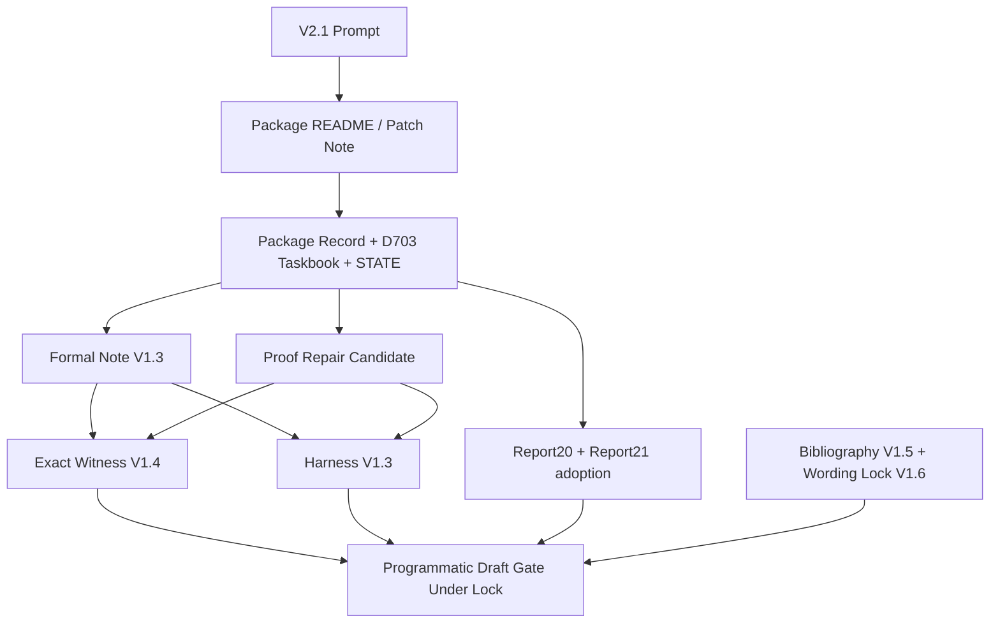
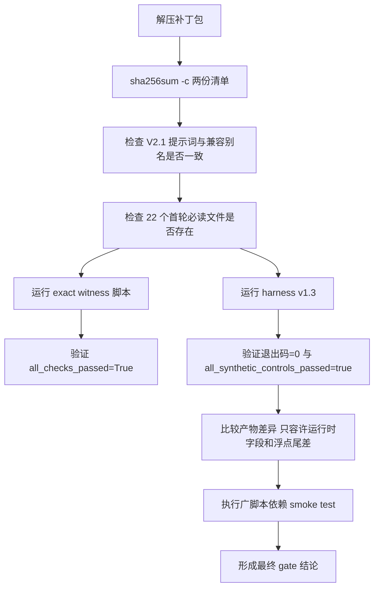

# V2.1 提示词与 V2.1 补丁包使用深度研究报告

## 执行摘要

本次审查把**上传的 V2.1 独立提示词文件**与**V2.1 补丁包 ZIP**作为唯一项目证据来源，不使用先前对话记忆；对外部文献部分，仅使用本会话可访问的学术主源进行相关工作核验。结论是：**V2.1 补丁包在“作为受限草稿门控包使用”这一目标上是可用的，且比原始 V2 方案更稳健**。它已经把最关键的误判源——**自指校验文件导致的 checksum 失败**——从“会误伤会话判断的包一致性问题”改造成了**可直接 `sha256sum -c` 通过**的补丁实现；同时，V2.1 提示词新增了证据边界、必读顺序、包前置检查、读写禁区、完整证明脊柱、相关工作核验规则以及更严格的最终 gate 输出约束。（包内证据：`PACKAGE_README.md:1-25`；`PACKAGE_PATCH_NOTE_20260703.md:16-67`；`from_repo/docs/infra/MAOFIELD_METRIC_FIELD_PROGRAMMATIC_PREPRINT_V2_PACKAGE_20260703.md:43-117`）

从包结构看，ZIP 共 **361 个条目**，其中 **339 个文件、22 个目录**；未压缩总大小约 **3,571,907 字节**。其中 `PACKAGE_FILE_MANIFEST.sha256` 与 `SHA256SUMS.txt` 在当前补丁包中**字节级一致**，各自包含 **337 条非自指文件校验记录**；本地实测两者均可完整通过 `sha256sum -c`。这意味着 V2.1 包已经兑现了读我文档中“排除自指校验条目”的承诺。（包内证据：`PACKAGE_README.md:23-25`；`PACKAGE_PATCH_NOTE_20260703.md:18-29`；本地核验：`zipinfo -l`、`sha256sum -c`）

从内容与实现看，**主工作流已经显著聚焦**。真正的“最小闭环”不再是整个仓库，而是以下链条：**V2.1 提示词 → 包记录/任务书 → 形式化说明与修补说明 → 精确有理数见证 → 浮点回归 harness → bibliography/wording lock**。这条链条是自洽的；其中数学习题层面要求保持在“有限正权二向表、主效应空间、正交投影、顺序缺陷、精确 `2×2` 证书”这一窄边界，明确禁止把 MaoField 写成已证经验结果。（包内证据：`prompt/GPT55_PRO_MAOFIELD_METRIC_FIELD_PROGRAMMATIC_PREPRINT_V2_1_PROMPT_20260703.md`；`from_repo/docs/infra/debranded_residual_transport/FORMAL_NOTE_V1_3_ORDER_DEFECT_20260628.md`；`FORMAL_NOTE_V1_3_ORDER_DEFECT_PROOF_REPAIR_CANDIDATE_20260630.md`；`EXACT_WITNESS_V1_4_20260629.md`；`WORDING_LOCK_V1_6_20260629.md`）

从静态分析看，**主路径脚本的安全面较小**：精确见证脚本只用 Python 标准库与 `fractions.Fraction`；harness 只额外依赖 `numpy`，且主路径未见 `eval`、`exec`、`pickle`、网络访问、Shell 拼接执行等高风险模式。但整个补丁包并非完全“开箱即跑”：一方面，**更广泛的 repo 脚本没有随包提供依赖锁文件**；另一方面，至少 `build_panel_schema_20260622.py` 与 `build_hypercube_schema_20260623.py` 在本环境中会因缺少 `transformers` 而直接失败，并且脚本树中还存在未随包提供的 `data_pipeline` 依赖痕迹。再加上 ZIP 内权限普遍较严格（大量文件为 `0600`、目录为 `0700`），这会给跨用户、CI、共享环境带来可移植性摩擦。（包内证据：`from_repo/scripts/debranded_residual_transport_exact_witness_v1_4.py`；`from_repo/scripts/debranded_residual_transport_harness_v1_3.py`；本地核验：导入扫描、`python3 script.py --help`、`zipinfo -l`）

从动态验证看，**主路径实际可跑**：精确见证脚本在本地重跑后输出 `all_checks_passed=True`；harness v1.3 在本地重跑后返回退出码 0，生成 JSON/Markdown 摘要，且数学指标均保持在阈值内。需要注意的是，这两类产物并非字节级可复现：JSON 中的 `created_utc`、`platform`、`python`、`numpy` 等运行时字段会导致重跑文件与包内文件出现自然差异。因此，它们更适合作为**语义回归/阈值回归**，不适合作为**全文件 bitwise reproducibility** 基准。（包内证据：`EXACT_WITNESS_V1_4_20260629.md:44-65`；`SYNTHETIC_HARNESS_V1_3_20260628.md:5-12,105-107`；本地实测：重跑脚本并与包内 JSON diff）

从相关工作边界看，包内“应当保持窄贡献”的判断是合理的。数学邻域中，至少有**依赖输入下的广义 Hoeffding-Sobol 分解、广义 Sobol 数值方法、依赖输入的 Shapley 重要性、正交投影乘积**等直接近邻；LLM 评估邻域中，至少有**多指标整体评估（HELM）、大规模任务集（BIG-bench）、LLM-as-a-judge 偏差分析、TruthfulQA、数据污染/基准污染分析**等成熟脉络。因此，**把当前包定位为“有限 obstruction + programme statement”，而不是广义理论或经验发现**，是外部文献上也站得住脚的。citeturn2academia2turn2academia0turn2academia1turn14academia0turn7academia0turn12academia2turn12academia1turn12academia0turn13academia1turn13academia2

## 证据边界与包清点

本报告使用的项目证据边界非常明确：**只采纳上传 ZIP 与上传独立提示词文件**，不把 GitHub、历史对话、仓库外 URL、未上传 Zenodo 材料当作项目证据。对外相关工作仅用学术主源核验；Sider Scholar 在本会话中**未直接提供可调用入口**，因此本报告仅使用可访问的 arXiv 等学术源完成可核验部分，对无法独立核验的条目保留 `metadata_unverified` 标记建议。（包内证据：`prompt/GPT55_PRO_MAOFIELD_METRIC_FIELD_PROGRAMMATIC_PREPRINT_V2_1_PROMPT_20260703.md` 的 “Evidence and Source Policy”；`PACKAGE_PATCH_NOTE_20260703.md:31-49`）

包层面，本地核验到：

- ZIP：`MaoField_PRO_MetricField_ProgrammaticPreprint_V2_1_20260703(1).zip`
- 独立提示词：`GPT55_PRO_MAOFIELD_METRIC_FIELD_PROGRAMMATIC_PREPRINT_V2_1_PROMPT_20260703(1).md`
- ZIP 条目数：361
- 文件数：339
- 目录数：22
- 未压缩总大小：3,571,907 字节
- 文件类型分布：314 个 Markdown、14 个 Python、6 个 JSON、2 个 TXT、1 个 SHA256、1 个 TEX、1 个 PDF
- `PACKAGE_FILE_MANIFEST.sha256` 与 `SHA256SUMS.txt`：**当前包内内容完全一致**，且都能通过 `sha256sum -c`
- 提示词副本关系：上传独立提示词、`prompt/...V2_1...`、`from_repo/docs/.../V2_1...` 三者 **SHA-256 完全一致**；同时，`prompt/GPT55_PRO_MAOFIELD_METRIC_FIELD_PROGRAMMATIC_PREPRINT_V2_PROMPT_20260703.md` 实际也是 **V2.1 内容的兼容别名**，而真正的原始 V2 被单独保存在 `prompt/ORIGINAL_...` 中。（包内证据：`PACKAGE_README.md:11-25`；`PACKAGE_PATCH_NOTE_20260703.md:51-67`；`from_repo/docs/infra/MAOFIELD_METRIC_FIELD_PROGRAMMATIC_PREPRINT_V2_PACKAGE_20260703.md:110-117`；本地核验：`zipinfo -l`、`sha256sum`、`cmp -s`）独立提示词文件可直接作为外部入口使用。fileciteturn0file0

下表列出**主路径文件**的精确清点。为避免表格过宽，SHA-256 只展示前 12 位；完整值已在本地核对，可由包内 `PACKAGE_FILE_MANIFEST.sha256` / `SHA256SUMS.txt` 追溯。

| 文件 | 大小 | SHA-256 前缀 | 角色 | 结论 |
|---|---:|---|---|---|
| `PACKAGE_README.md` | 1,225 B | `d9611ba1616a` | 包入口与使用顺序 | 明确 V2.1 用途、边界、checksum 策略 |
| `PACKAGE_PATCH_NOTE_20260703.md` | 2,970 B | `2d14e5ac3386` | 补丁说明 | 明确 V2→V2.1 修补点 |
| `PACKAGE_FILE_MANIFEST.sha256` | 53,579 B | `4c953e81e5c7` | 主校验清单 | 当前可直接 `sha256sum -c` |
| `SHA256SUMS.txt` | 53,579 B | `4c953e81e5c7` | 兼容校验清单 | 与上表完全相同，存在冗余 |
| `PACKAGE_FILE_LIST.txt` | 31,381 B | `30b50e0c2bf1` | 完整文件列表 | 便于离线盘点 |
| `prompt/GPT55_PRO_MAOFIELD_METRIC_FIELD_PROGRAMMATIC_PREPRINT_V2_1_PROMPT_20260703.md` | 14,424 B | `8407602f7d00` | 推荐入口提示词 | 正式 V2.1 提示 |
| `prompt/GPT55_PRO_MAOFIELD_METRIC_FIELD_PROGRAMMATIC_PREPRINT_V2_PROMPT_20260703.md` | 14,424 B | `8407602f7d00` | 兼容别名 | 文件名写 V2，内容其实是 V2.1 |
| `prompt/ORIGINAL_GPT55_PRO_MAOFIELD_METRIC_FIELD_PROGRAMMATIC_PREPRINT_V2_PROMPT_20260703.md` | 8,379 B | `6fe62c3cfdb2` | 原始 V2 保存副本 | 用于回溯差异 |
| `from_repo/docs/infra/MAOFIELD_METRIC_FIELD_PROGRAMMATIC_PREPRINT_V2_PACKAGE_20260703.md` | 4,652 B | `9d3b4c4a7b1a` | 包记录 | 说明原 V2 包与 V2.1 patch 的关系 |
| `from_repo/docs/infra/recovery/ORDER_DEFECT_D703_FORMAL_PREPRINT_DRAFT_GATE_TASKBOOK_20260703.md` | 5,110 B | `4661aa4e7b7f` | D703 草稿 gate 任务书 | 锁定“仅本地 gate”用途 |
| `from_repo/STATE.md` | 39,001 B | `0726a50f73ab` | 当前项目状态单一真相源 | 明确 `FORMAL_PREPRINT_DRAFT_GATE_UNDER_LOCK` |
| `from_repo/MD_CATALOG.md` | 79,031 B | `c57ac0342f1b` | 文档目录总索引 | 便于追踪 provenance |
| `incoming/report21_metric_field_programme_reframe_pasted_text.md` | 13,986 B | `747423c7808d` | programme 重构源 | 提供“wedge / programme”重定位 |
| `incoming/preprint_candidate_from_user/maofield_order_defect_final_candidate.tex` | 21,900 B | `9657aec2bf7b` | 用户候选稿 | 待 V2.1 审查/重写对象 |
| `from_repo/docs/infra/debranded_residual_transport/FORMAL_NOTE_V1_3_ORDER_DEFECT_20260628.md` | 8,507 B | `01a15f3ae597` | 原始形式化主说明 | 命题、算子与空间定义主源 |
| `FORMAL_NOTE_V1_3_ORDER_DEFECT_PROOF_REPAIR_CANDIDATE_20260630.md` | 5,591 B | `ff23dae3abbb` | 数学修补说明 | 修补交集引理、Prop2/Prop3 |
| `EXACT_WITNESS_V1_4_20260629.md` | 1,587 B | `744496e5a6de` | 精确见证摘要 | 锁定 `2×2` 证书坐标与范数 |
| `exact_witness_v1_4_20260629.json` | 4,040 B | `0a786eff756f` | 精确见证 JSON | exact certificate 机读产物 |
| `debranded_residual_transport_exact_witness_v1_4.py` | 10,220 B | `b7025988a934` | 精确见证脚本 | 只依赖标准库，使用 `Fraction` |
| `SYNTHETIC_HARNESS_V1_3_20260628.md` | 4,723 B | `361e55f4ae81` | harness 摘要 | 浮点 harness 的边界说明 |
| `synthetic_harness_v1_3_20260628.json` | 8,916 B | `283378e1d5f5` | harness 机读结果 | 阈值合同与 block 结果 |
| `debranded_residual_transport_harness_v1_3.py` | 25,953 B | `917dfefaee04` | harness 脚本 | 依赖 `numpy`，负责回归校验 |
| `BIBLIOGRAPHY_AND_POSITIONING_V1_5_20260629.md` | 5,879 B | `3c54cdce90e1` | 参考文献与 novelty ceiling | 规定 `MEDIUM duplicate risk` |
| `WORDING_LOCK_V1_6_20260629.md` | 1,304 B | `04565a27643b` | 文案封印 | 锁定 harness canonical sentence |

进一步地，V2.1 要求的**首轮必读文件**共 22 个，已全部在包中找到且可读，没有缺失项。（包内证据：V2.1 prompt 的 “Required Initial Read Order”；本地核验：逐文件存在性检查）



## 代码与文档审查

V2.1 最大的文档级变化，不是“多写了一些要求”，而是**把会话行为本身制度化**。原始 V2 提示词只有较少的顶层章节；V2.1 显式新增了 `Evidence and Source Policy`、`First Package Checks`、`Required Initial Read Order`、`Strategic Direction To Preserve`、`Title Policy`、`Mathematical Spine That Must Be Complete`、`Harness Boundary Sentence`、`Bibliography Floor`、`Required Safe MaoField Wording` 等多个结构块，并把可能的 gate verdict 扩展为包含 `REQUEST_PACKAGE_PATCH_BEFORE_DRAFT`、`REQUEST_BIBLIOGRAPHY_PATCH_BEFORE_DRAFT` 等更细的失败类型。这使 V2.1 不只是“提示词更强”，而是**审稿协议更完整**。（包内证据：`prompt/ORIGINAL_...V2_PROMPT_20260703.md` 顶层标题结构；`prompt/GPT55_PRO_MAOFIELD_METRIC_FIELD_PROGRAMMATIC_PREPRINT_V2_1_PROMPT_20260703.md` 顶层标题结构；`PACKAGE_PATCH_NOTE_20260703.md:31-49`）

文档链条上的核心变化可以概括为三条。第一，**证据边界被收紧**：V2.1 明令禁止使用历史聊天记忆、包外 GitHub/connector 内容作为项目证据，只允许把外部学术检索用于 bibliography/related work。第二，**数学脊柱被补全**：从空间定义、交集引理、`A ⟂ B_0` 与 product weights 的充要关系、顺序缺陷算子 `D_w`、到 pure-main-effect witness 的存在性，都被写成必须显式给出的证明层。第三，**programme 层语言被重新校准**：报告 21 只被采纳为“programmatic reframing prompt source”，不是 MaoField 经验性证据；整个包持续保留 `insufficient_artifact`、`MEDIUM duplicate risk`、`PROGRAMMATIC_PREPRINT_DRAFT_CANDIDATE_UNDER_LOCK` 这些边界标签。（包内证据：`ORDER_DEFECT_METRIC_FIELD_PROGRAMME_REFRAME_REPORT21_ADOPTION_NOTE_20260703.md:9-49`；`PACKAGE_README.md:3-25`；`MAOFIELD_METRIC_FIELD_PROGRAMMATIC_PREPRINT_V2_PACKAGE_20260703.md:82-117`）

形式化文档方面，`FORMAL_NOTE_V1_3_ORDER_DEFECT_20260628.md` 负责给出基本对象：有限正权二向表、加权内积、`C`、`A`、`B0/B_0`、`N_add`、三类投影以及两个 stripping 算子；`FORMAL_NOTE_V1_3_ORDER_DEFECT_PROOF_REPAIR_CANDIDATE_20260630.md` 则对 **Lemma 0（`A ∩ B_0 = {0}`）**、**Prop2（顺序独立性与 product weights 等价）**、**Prop3（非 product 情形下存在 pure-main-effect witness）**进行了修补与显式化。换句话说，V2.1 真正倚赖的“数学主源”已从一份单文档，升级为**原始 note + repair candidate** 的双文档结构。（包内证据：`FORMAL_NOTE_V1_3_ORDER_DEFECT_20260628.md:69-220`；`FORMAL_NOTE_V1_3_ORDER_DEFECT_PROOF_REPAIR_CANDIDATE_20260630.md:71-219`）

精确见证与 harness 的职责分工也更加清楚。`EXACT_WITNESS_V1_4_20260629.md` 与对应 JSON/脚本把主证书锁定为：

- `w = (1/11)[[1,2],[3,5]]`
- `K = (7/11,-4/11,7/11,-4/11) ∈ B_0`
- `(I-P_N)K = 0`
- `R_B_then_Q K = 0`
- `R_Q_then_B K = (1/32, 5/168, -1/96, -1/84)`
- `||R_Q_then_B K||_w^2 = 61/177408`

而 `SYNTHETIC_HARNESS_V1_3_20260628.md` 与 `debranded_residual_transport_harness_v1_3.py` 明确规定：**harness 只是 deterministic regression support，不承载证明责任**。这一 canonical sentence 还被 `WORDING_LOCK_V1_6_20260629.md` 要求必须在多个文件中原样出现，属于文案与证据层级的硬约束。（包内证据：`EXACT_WITNESS_V1_4_20260629.md:44-65`；`SYNTHETIC_HARNESS_V1_3_20260628.md:5-12,96-107`；`WORDING_LOCK_V1_6_20260629.md:7-25`）

接口与配置方面，主路径实际只有两个可执行脚本接口。精确见证脚本 `debranded_residual_transport_exact_witness_v1_4.py` 暴露单一参数 `--out-dir`，会输出 `exact_witness_v1_4_20260629.json` 与 `EXACT_WITNESS_V1_4_20260629.md`，并打印 `json=...`、`json_sha256=...`、`markdown=...`、`all_checks_passed=...`。harness 脚本 `debranded_residual_transport_harness_v1_3.py` 暴露 `--out`、`--summary-md`、可选 `--json-rel` 三个参数，并以 `build_threshold_contract` 作为**单一阈值合同源**，把 pass/fail 判定统一集中到 `evaluate_test`。这是一个很好的设计变化：**阈值定义与评价逻辑已不再散落**。（包内证据：`debranded_residual_transport_exact_witness_v1_4.py:291-313`；`debranded_residual_transport_harness_v1_3.py:198-220,591-620`）

但也要指出两个兼容性上的“微妙点”。其一，`prompt/GPT55_PRO_MAOFIELD_METRIC_FIELD_PROGRAMMATIC_PREPRINT_V2_PROMPT_20260703.md` 虽然名字仍写 `V2`，内容其实已是 V2.1；这显然是为了兼容旧入口，但**命名会误导人工使用者**。其二，包内 Python 脚本虽然都有 shebang，但 ZIP 权限并未给出可执行位，因此**应始终用 `python3 script.py ...` 调用，而不是依赖 `./script.py`**。（包内证据：`MAOFIELD_METRIC_FIELD_PROGRAMMATIC_PREPRINT_V2_PACKAGE_20260703.md:110-117`；本地核验：`sha256sum`、`cmp -s`、`zipinfo -l`）

## 静态分析、兼容性与风险

就**主路径脚本**而言，我没有看到高危远程执行面。精确见证脚本只使用 `argparse`、`hashlib`、`json`、`platform`、`Fraction`、`Path` 等标准库；harness 只额外依赖 `numpy`。本地 grep 也未在这两份脚本中发现 `eval`、`exec`、`pickle`、`requests`、`os.system`、`subprocess` 等高风险模式。因此，如果使用场景限于“本地生成见证/回归摘要”，安全风险总体偏低。（包内证据：`debranded_residual_transport_exact_witness_v1_4.py`；`debranded_residual_transport_harness_v1_3.py`；本地静态扫描）

真正的问题主要是**工程可复现性风险**，而不是典型安全漏洞。最突出的有五项。

第一，**依赖未锁定**。包内没有 `requirements.txt`、`pyproject.toml`、`environment.yml` 等标准依赖声明。主路径还能靠“文档 + import”勉强推断出来，但更广脚本（如 `build_panel_schema_20260622.py`）依赖 `transformers`，而且还引用了包内并不存在的 `data_pipeline`。这意味着包虽然足以支撑“受限数学草稿 gate”，但**不足以无歧义支撑整个 repo 脚本层的重跑**。（包内证据：全包缺失依赖清单；本地核验：AST 导入扫描、`python3 build_panel_schema_20260622.py --help` 失败）

第二，**文件权限过于严格**。ZIP 中大量目录为 `0700`，文件为 `0600`。这种权限对单用户本地环境问题不大，但在共享服务器、CI runner、解压到非 root 用户的目录、或需要组内协作时，都会增加不可读/不可执行概率。尤其是脚本缺少执行位，意味着文档若写成 `./script.py` 会误导用户。（本地核验：`zipinfo -l`）

第三，**再生 JSON 不是 bitwise-deterministic**。精确见证 JSON 会写入当前 `platform` 与 `python` 版本；harness JSON 还会写入 `created_utc`、`numpy` 版本等运行时字段。结果是：即便数学结果完全一致，重跑文件也很容易和包内工件产生 diff。这不是数学错误，但如果未来想做供应链签名、固定产物对比、CI artifacts 断言，就会变成噪音源。（包内证据：`debranded_residual_transport_exact_witness_v1_4.py` 的 `runtime` 输出；`debranded_residual_transport_harness_v1_3.py` 的 `environment` / `created_utc` 字段定义；本地重跑 diff）

第四，**许可与元数据有不闭环之处**。`from_repo/README.md` 宣称采用 Apache 2.0，并指向 `LICENSE`；同样提到 `CITATION.cff`。但在当前补丁包中，我没有检索到对应文件。这不会影响数学 gate 的局部使用，却会影响**再分发、引用元数据、法律边界和自动化索引一致性**。（包内证据：`from_repo/README.md:163-168`；本地核验：全包搜索未找到 `LICENSE`/`CITATION.cff`）

第五，**校验清单双份并存但内容重复**。`PACKAGE_FILE_MANIFEST.sha256` 与 `SHA256SUMS.txt` 当前完全相同、都能通过校验，这比原包安全得多；但从维护角度看，双份文件意味着未来有人只更新其中一份时，反而增添新的漂移风险。对长期维护而言，更好的做法通常是**保留一个真源，另一个作为构建产物自动生成**。（包内证据：本地 `cmp -s`、`sha256sum -c`）

综合后，我建议把风险优先级这样理解。**高优先级**是“依赖与权限可移植性”；**中优先级**是“名字/别名混淆与 JSON 不可 bitwise 重现”；**低优先级**才是主路径脚本本身的安全面。也就是说，这个包目前更像一个**研究 gate 包**，而不是一个已经产品化的可移植 reproducibility bundle。

下面给出面向迁移和使用的兼容矩阵。

| 组合 | 兼容性判断 | 建议等级 | 说明 |
|---|---|---|---|
| **V2.1 补丁包 + `prompt/...V2_1...`** | 完全兼容 | 推荐 | 最符合 `PACKAGE_README` 与 patch note 的预期入口 |
| **V2.1 补丁包 + 上传独立 V2.1 提示词** | 完全兼容 | 推荐 | 独立提示词与包内 V2.1 文件逐字节一致 |
| **V2.1 补丁包 + `prompt/...V2_PROMPT...`** | 条件兼容 | 可用但不推荐 | 该文件内容其实是 V2.1，只是名称会误导人工审阅 |
| **原始 V2 包 + 独立 V2.1 提示词** | 条件兼容 | 仅应急 | 需显式接受“checksum 自指失配为预期”这一补丁规则 |
| **原始 V2 包 + 原始 V2 提示词** | 不建议 | 不推荐 | 缺失 V2.1 的证据边界、包前检查、读序、bibliography gate 等制度化约束 |
| **直接 `./script.py` 执行主脚本** | 低兼容 | 不推荐 | ZIP 不带执行位；应统一使用 `python3 script.py ...` |
| **广脚本层（schema/hypercube 等）在干净 Python 环境重跑** | 不兼容 | 需补丁 | 当前缺 `transformers`，且存在未随包提供的 `data_pipeline` 依赖 |
| **只使用 exact witness + harness 主路径** | 高兼容 | 推荐 | 这是当前包最稳固、最小闭环的执行路径 |

缓解建议也很清楚。若继续沿 V2.1 路线推进，最值得优先做的不是增添更多文案，而是：补 `requirements.txt`/`pyproject.toml`；在包根加入 `LICENSE` 与 `CITATION.cff`；把双份 checksum 清单改成单一源；把 `created_utc`/环境字段从“强工件”抽到单独 `runtime.json`；把 `prompt/...V2_PROMPT...` 重命名为显式别名，比如 `...V2_COMPAT_ALIAS...`；并在打包时统一文件模式为最小必要可读，而不是 `0600/0700`。

## 动态测试与迁移建议

我对主路径做了本地可执行性验证，结果总体积极。

首先，**包校验通过**。在解压后的目录执行：

```bash
cd /path/to/maofield_v21
sha256sum -c PACKAGE_FILE_MANIFEST.sha256
sha256sum -c SHA256SUMS.txt
```

当前补丁包都应该返回 0，且所有已列文件为 `OK`。这一点正是 V2.1 相对原始 V2 的最关键改进之一。（包内证据：`PACKAGE_README.md:23-25`；`PACKAGE_PATCH_NOTE_20260703.md:18-29`；本地实测）

其次，**精确见证脚本可运行**。本地实测命令：

```bash
python3 from_repo/scripts/debranded_residual_transport_exact_witness_v1_4.py \
  --out-dir /tmp/mf_test/exact
```

预期标准输出应包含：

```text
json=...
json_sha256=...
markdown=...
all_checks_passed=True
```

本地得到的确是 `all_checks_passed=True`。与包内 JSON 对比后，差异只出现在 `platform`、`python` 等运行时元数据上，说明**数学证书层面稳定，环境字符串层面不稳定**。（包内证据：`EXACT_WITNESS_V1_4_20260629.md:44-65`；`debranded_residual_transport_exact_witness_v1_4.py:291-309`；本地实测）

再次，**harness v1.3 可运行**。本地实测命令：

```bash
python3 from_repo/scripts/debranded_residual_transport_harness_v1_3.py \
  --out /tmp/mf_test/harness/synthetic_harness_v1_3_20260628.json \
  --summary-md /tmp/mf_test/harness/SYNTHETIC_HARNESS_V1_3_20260628.md
```

预期行为是：退出码为 0，且 JSON 中 `all_synthetic_controls_passed` 为 `true`。本地结果符合预期。与包内 JSON 的差异主要来自 `created_utc`、`python`、`numpy`、`platform` 以及极小的浮点舍入尾差。由于这些尾差仍远小于阈值合同，**该脚本适合作阈值回归，不适合做产物逐字节比较**。（包内证据：`SYNTHETIC_HARNESS_V1_3_20260628.md:5-12,41-52,96-107`；`debranded_residual_transport_harness_v1_3.py:198-220,591-620`；本地实测）

最后，**广脚本层并不随主路径一起“自动可跑”**。例如：

```bash
python3 from_repo/scripts/build_panel_schema_20260622.py --help
python3 from_repo/scripts/build_hypercube_schema_20260623.py --help
```

本地会因 `ModuleNotFoundError: No module named 'transformers'` 直接失败。这不是 V2.1 prompt/workflow 的主 blocker，但它意味着：如果把包误当作“全仓可复现 bundle”，结论会过于乐观。更精确的说法应是：**V2.1 包能支撑 order-defect / programmatic-preprint 的受限 gate，不足以自足支撑全 repo 的实验脚本层。**（本地实测）

下面给出一个推荐的测试工作流。



下表给出建议保留的**可复现测试用例**。

| 用例 | 命令 | 预期输出 | 失败模式 | 价值 |
|---|---|---|---|---|
| 包完整性校验 | `sha256sum -c PACKAGE_FILE_MANIFEST.sha256` | 所有文件 `OK`，退出码 0 | 任一非自指文件失配/损坏 | 最基本供应链检查 |
| 双清单一致性 | `cmp -s PACKAGE_FILE_MANIFEST.sha256 SHA256SUMS.txt` | 返回 0 | 两份清单未来漂移 | 防止双源失配 |
| 入口提示词一致性 | `sha256sum external_prompt internal_v2_1 internal_repo_copy` | 三者 hash 相同 | 外部提示词与包内提示不一致 | 防提示漂移 |
| V2 兼容别名审计 | `cmp -s prompt/...V2_PROMPT... prompt/...V2_1...` | 返回 0 | 名称兼容但内容漂移 | 防旧入口失真 |
| 首轮必读文件存在性 | 逐项 `test -r <file>` | 全部存在且可读 | 缺文件或权限问题 | 防读序失效 |
| 精确见证重跑 | `python3 ...exact_witness... --out-dir ...` | `all_checks_passed=True` | 算术或写入异常 | 验证 exact certificate |
| harness 重跑 | `python3 ...harness_v1_3.py --out ... --summary-md ...` | 退出码 0；`all_synthetic_controls_passed=true` | 阈值合同失配、写回 hash 失配、数值回归失败 | 验证 regression harness |
| 见证产物对比 | `diff -u packaged.json rerun.json` | 只出现运行时字段差异 | 数学坐标或 exact checks 漂移 | 区分“语义差异”和“环境差异” |
| 负例阈值测试 | 手工篡改 harness JSON 中阈值/向量后再校验 | 应出现 `pass=false` 或退出码非 0 | 仍然通过 | 防评估逻辑旁路 |
| 广脚本依赖 smoke test | `python3 build_panel_schema_20260622.py --help` | 当前预期失败并明确报缺依赖 | 静默失败或行为不明 | 明确包边界 |

关于迁移，我的建议很直接：**如果目标是“严格按 V2.1 制度操作”，就不要把 V2.1 仅当作文案升级，而应把它当作新的入口协议。** 实操上，最稳妥的是始终上传/挂载 **V2.1 补丁包 + 独立 V2.1 提示词**，并把 `prompt/...V2_1...` 作为主入口；只有在必须兼容旧自动化路径时，才使用 `prompt/...V2_PROMPT...` 这个名字仍是 V2 的兼容别名。（包内证据：`PACKAGE_README.md:11-25`；`PACKAGE_PATCH_NOTE_20260703.md:51-61`）

## 参考文献与相关工作核验

包内 bibliography/positioning 文件已经把“贡献上限”设得很清楚：它要求把本文定位为**有限加权投影顺序伪影说明**，而不是新的广义 ANOVA、依赖输入 Hoeffding 理论、Sobol/Shapley 替代方案或新的非交换投影理论。（包内证据：`BIBLIOGRAPHY_AND_POSITIONING_V1_5_20260629.md:17-31,33-49,51-80`）

就本会话可独立核验到的**数学邻域**而言，至少有四条直接支撑这一保守姿态的学术主线。Chastaing、Gamboa、Prieur 的工作已经覆盖了**依赖变量下的广义 Hoeffding-Sobol 分解**与后续**广义 Sobol 数值方法**；Owen 与 Prieur 的工作则将讨论推进到**依赖输入下的 Shapley 重要性分配**；Corach 与 Maestripieri 则提供了**正交投影乘积/极分解**的背景。因此，把当前包的数学习题写成“有限 obstruction 与 exact witness”，而不是写成“广义依赖输入分解理论”，是与已有文献版图一致的。citeturn2academia2turn2academia0turn2academia1turn14academia0

就本会话可独立核验到的**LLM 评估邻域**而言，HELM 已经明确把语言模型评估视作**多场景、多指标、强调覆盖与透明性**的框架；BIG-bench 则展示了大规模、多任务能力评估的横向广度；`Judging LLM-as-a-Judge with MT-Bench and Chatbot Arena` 直接讨论了 **position bias、verbosity bias、self-enhancement bias** 等 judge 侧偏差；TruthfulQA 则把**truthfulness/falsehood mimicry**单独抽出来评估；数据污染方向上，既有“memorization vs exploitation”的机制研究，也有专门的基准污染综述。这些文献都说明：把指标、评委、聚合、污染、真伪性视为耦合评估对象，而不是单一分数，具有充分动机。citeturn7academia0turn12academia2turn12academia1turn12academia0turn13academia1turn13academia2

因此，**report21 所主张的 programme 重定位——“有限 order-defect 定理只是 wedge，真正目标是 residual metric audit programme”——在外部相关工作语境中是可理解的；但它只能是 programme statement，不能被写成本包已经获得的 MaoField 经验结果。** 这恰好也与包内 adoption note 和 wording lock 的边界一致。（包内证据：`incoming/report21_metric_field_programme_reframe_pasted_text.md:125-421`；`ORDER_DEFECT_METRIC_FIELD_PROGRAMME_REFRAME_REPORT21_ADOPTION_NOTE_20260703.md:11-49`；`WORDING_LOCK_V1_6_20260629.md:27-52`）

对于 bibliography floor 中其余条目，本会话未能通过可访问学术接口全部独立拉取到结构化记录，尤其是：Hooker（2007）、Böttcher & Spitkovsky（2010）、Il Idrissi et al.（2025）、Lamboni（DOI `10.1137/24M1712680`）、Halmos（1969）。这些条目**在包内 DOI/标题记录中出现且定位合理**，但若要把文稿推进到更高等级的外部发布准备状态，我建议把它们在 reference manager 中标记为 `metadata_unverified`，直到由 Sider Scholar、OpenAlex、Crossref 或出版社正式页补齐完整元数据。（包内证据：`BIBLIOGRAPHY_AND_POSITIONING_V1_5_20260629.md:33-49`）

本次用于 bibliography / related-work verification 的**精确查询字符串**如下。为避免把失败查询误写成已核验结果，下列列表只保留了**用于最终核验或尝试定位最终条目**的实际检索语句原文：

```text
"Generalized Functional ANOVA Diagnostics for High-Dimensional Functions of Dependent Variables"
"Generalized Hoeffding-Sobol decomposition for dependent variables"
"Generalized Sobol sensitivity indices for dependent variables: numerical methods"
"On Shapley Value for Measuring Importance of Dependent Inputs"
"Products of orthogonal projections and polar decompositions" arXiv
"Holistic Evaluation of Language Models" arXiv
"Beyond the Imitation Game Benchmark" arXiv BIG-bench
"Judging LLM-as-a-Judge with MT-Bench and Chatbot Arena" arXiv
"The False Promise of Imitating Proprietary LLMs" contamination arXiv
"TruthfulQA: Measuring How Models Mimic Human Falsehoods" arXiv
"Data Contamination: From Memorization to Exploitation" arXiv
"Benchmark Data Contamination of Large Language Models: A Survey" arXiv
Hooker Generalized Functional ANOVA dependent variables Journal of Computational and Graphical Statistics
Bottcher Spitkovsky gentle guide basics of two projections theory
Il Idrissi Hoeffding decomposition of functions of random dependent variables Journal of Multivariate Analysis
HELM Holistic Evaluation of Language Models arXiv
```

如果把这些外部核验结果与包内 `BIBLIOGRAPHY_AND_POSITIONING_V1_5_20260629.md` 合并起来，最稳健的 bibliography 结论是：**当前稿件应当坚持“有限 weighted table obstruction + exact rational witness + programmatic MaoField framing”这一低姿态定位。** 外部文献足以说明：一旦把贡献写大，很快就会进入已有理论与评估文献的密集占位区。citeturn2academia2turn2academia0turn2academia1turn14academia0turn7academia0turn12academia2turn12academia1turn12academia0turn13academia1turn13academia2