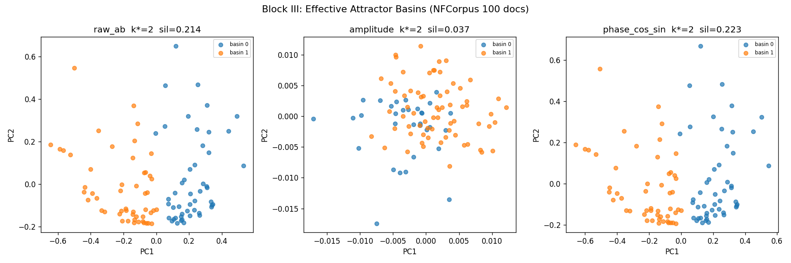

# Block III：Attractor 数量诊断

**方法**：100 NFCorpus docs，exp015 E 变体配置独立 evolve 5000 步，对 final ψ 状态做 3 种表征的 k-means + silhouette（k=2..20）。

## 表征 × 最优 k*

| 表征 | 维度 | k* | silhouette |
|---|---|---|---|
| raw_ab | 65536 | 2 | 0.2137 |
| amplitude | 32768 | 2 | 0.0366 |
| phase_cos_sin | 65536 | 2 | 0.2233 |

## 判读（H2：矛盾主次质变假说）

**H2 成立条件**：有效 attractor 数 < 10

**结论**：三表征 k* = [2, 2, 2]（中位 2）。**H2 成立**：MaoField 的动力学 basin 容量 <10，当候选池 >20 时超过 basin 容量，矛盾主次结构发生质变，这解释了 top-20→top-100 的 nDCG 坍塌（exp016 发现的 +183% 退化）。

## 可视化

PCA 2D 投影显示各表征下的 attractor basin 结构。

## 下一步含义
- Block II（耦合 g 扫描）应该在 ≤6 的候选池上最有效
- Block IV 唯心组如果仍集中在 2 个 basin 内，可推论矛盾容量是 PDE 算子性质，不是源场性质
- 工程含义：MaoField reranker 的候选池上限 ~ 3·k* ≈ 6